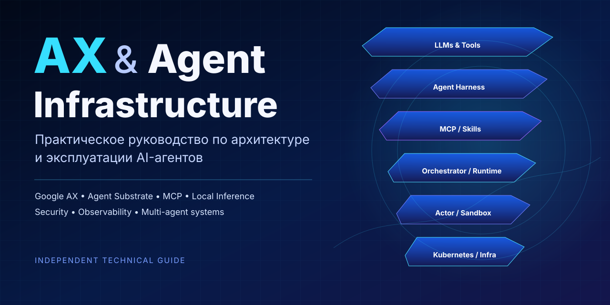

# AX & Agent Infrastructure

<p align="center">
  
</p>


> Практическое инженерное руководство по архитектуре, оркестрации и эксплуатации AI-агентов: от LLM и agent harness до MCP, Agent Substrate, Google AX, sandboxing, локального inference и production-эксплуатации.

**Язык книги:** русский  
**Формат:** PDF / исходный HTML / GitBook-ready web edition  
**Объём:** 100 страниц, 44 главы, 33 технические схемы, 14 лабораторных работ  
**Целевая аудитория:** системные и сетевые инженеры, SRE/DevOps, архитекторы инфраструктуры, разработчики agentic-платформ и технические руководители.

[Скачать PDF](book/AX_Agent_Infrastructure_Book_RU.pdf) · [Исходный HTML](book/AX_Agent_Infrastructure_Book_RU.html) · [Web-book source](docs/README.md) · [Google AX](https://github.com/google/ax) · [Agent Substrate](https://github.com/agent-substrate/substrate)

---

## О книге

Современный AI-агент — это не просто LLM с большим system prompt. Практическая агентная система включает модель, контекст, agent loop, инструменты, MCP, skills, состояние, policy/approval layer, sandbox, runtime, оркестратор, наблюдаемость и инфраструктуру выполнения.

Эта книга собирает эти слои в одну инженерную картину и использует **Google AX** и **Agent Substrate** как основной практический пример современной инфраструктуры для stateful и multi-agent workloads.

Главная задача книги — дать не набор команд, а рабочую mental model:

```text
LLM
 ↓
Agent
 ↓
Agent Harness
 ↓
Tools / MCP / Skills
 ↓
Runtime / Orchestrator
 ↓
Sandbox / Actor
 ↓
Kubernetes / Compute / Storage / Network
```

После чтения материал должен позволять:

- понимать, где заканчивается LLM и начинается агентная система;
- проектировать agent harness и multi-agent topology;
- понимать MCP, Skills, tool calling и trust boundaries;
- различать context, memory, persistent state и runtime snapshot;
- понимать containers, gVisor и microVM как разные уровни изоляции;
- понимать необходимую для AX/Substrate часть Kubernetes и distributed systems;
- разворачивать и эксплуатировать Agent Substrate и AX;
- подключать cloud- и local-LLM inference;
- проектировать безопасные actions через MCP с approval gates;
- диагностировать failures на слоях Kubernetes → Substrate → AX → agent → LLM;
- оценивать performance, concurrency, GPU memory и capacity;
- понимать, когда AX действительно оправдан, а когда проще использовать обычный worker queue, Kubernetes Job или workflow engine.

## Почему появилась эта книга

Документация agentic-stack часто разбита между несколькими дисциплинами:

- LLM и inference;
- agent frameworks;
- MCP и tool execution;
- Kubernetes;
- sandboxing;
- actor model;
- state/checkpointing;
- distributed control plane;
- security;
- GPU serving;
- observability.

Из-за этого отдельные технологии понятны сами по себе, но неясно, **как именно они соединяются в эксплуатируемую систему**.

Книга построена в формате *just-in-time fundamentals*: фундаментальная тема объясняется непосредственно перед тем местом, где она нужна для понимания AX, Agent Substrate или production-архитектуры. Это не учебник Kubernetes и не академический обзор LLM.

## Версионная база исследования

Проекты AX и Agent Substrate находятся в активной разработке, поэтому книга использует фиксированные baseline-ревизии.

| Проект | Baseline | Commit |
|---|---:|---|
| Google AX | `v0.3.1` | `e70162a` |
| Agent Substrate | `v0.3.0` | `ccecc78` |

При анализе различаются три категории:

- **Release baseline** — поведение, относящееся к зафиксированной версии;
- **Current main** — изменения, которые уже находятся в основной ветке после baseline;
- **Roadmap / planned** — заявленные направления, которые нельзя считать реализованной production-функциональностью.

Это важно: архитектура и документация проектов меняются быстро, а некоторые design-документы описывают целевую модель раньше, чем она полностью появляется в коде.

## Что внутри

### Agent fundamentals

LLM как вычислительный компонент, agent loop, structured output, tool calling, planner/executor, ReAct, router, supervisor/worker, hierarchical agents, fan-out/fan-in, evaluator/critic и event-driven patterns.

### Agent Harness

Отдельно разобрана инфраструктура вокруг модели:

- model adapter;
- context assembly;
- tool executor;
- permission layer;
- state/memory;
- retry и budget policies;
- scheduler;
- approval system;
- logging/tracing;
- sandbox integration.

### Context, state и memory

Почему это разные вещи:

```text
LLM context ≠ agent memory ≠ process RAM ≠ filesystem state ≠ runtime snapshot
```

Разобраны working context, persistent memory, RAG, compaction, checkpoints и external state.

### MCP и Skills

MCP рассматривается не только как протокол, но и как trust boundary:

```text
Agent → MCP client → MCP server → External system
```

Разобраны capability discovery, auth, secrets, read/write actions, injection risks и least privilege. Skills рассматриваются отдельно от tools, prompts и MCP.

### Multi-agent systems

Coordinator/worker, delegation, task trees, parallel execution, shared/isolated state, failure propagation, cancellation, budgets и защита от runaway agent trees.

### Sandboxing

Последовательно разбирается путь:

```text
Linux process
  → namespaces/cgroups
  → container
  → hardened container
  → gVisor
  → microVM/KVM
```

С объяснением trade-offs между isolation, compatibility, latency и operational complexity.

### Kubernetes и distributed systems

Только тот уровень, который нужен для понимания системы: Pod, Service, Namespace, Secret, RBAC, NetworkPolicy, CRD/controller, scheduler, etcd, reconciliation, desired/actual state, eventual consistency, gRPC/protobuf и state stores.

### Agent Substrate

Подробно рассматриваются:

- Actor и Worker;
- WorkerPool;
- ActorTemplate;
- SandboxConfig;
- placement;
- multiplexing;
- routing;
- golden snapshots;
- suspend/resume;
- checkpoint semantics;
- networking;
- snapshot ownership и lifecycle;
- observability;
- failure modes.

Особое внимание уделено различию между **logical actor** и **physical worker**.

### Google AX

Разбираются назначение AX, control plane, API/CLI, state/reconciliation, интеграция с Agent Substrate, runner и пользовательские primitives.

Отдельно рассмотрены:

- Task;
- Workspace;
- Model;
- Gateway в более новых ревизиях;
- Task lifecycle;
- Workspace bootstrap;
- runner/PID 1;
- suspend/resume semantics;
- расхождения между release, current main и roadmap.

### Local inference

Отдельный блок посвящён эксплуатации локальных моделей:

- CPU inference;
- NVIDIA GPU;
- vLLM;
- llama.cpp;
- Qwen;
- OpenAI-compatible API;
- prefill/decode;
- KV cache;
- continuous batching;
- quantization;
- tensor parallelism;
- TTFT / ITL / tokens/s;
- throughput vs latency;
- GPU memory sizing;
- concurrency.

### Security и governance

Threat model рассматривает:

- untrusted agent;
- prompt/tool injection;
- malicious MCP server;
- malicious repository/skill;
- secret leakage;
- sandbox escape;
- SSRF;
- unrestricted egress;
- supply-chain risk;
- runaway execution.

Есть отдельная модель controlled actions:

```text
observe → diagnose → propose → approve → execute → verify
```

### Observability и operations

Наблюдаемость разделена на четыре слоя:

1. infrastructure;
2. sandbox/runtime;
3. agent events/tools;
4. LLM requests/tokens/latency.

Также есть production engineering, HA, backup/restore, disaster recovery, capacity planning, performance и большой troubleshooting/runbook-раздел.

## Практические лабораторные

Книга содержит последовательный lab track:

1. подготовка Linux VM в Proxmox/KVM;
2. Kind и необходимый минимум Kubernetes;
3. Agent Substrate;
4. WorkerPool / ActorTemplate / Actor;
5. suspend → snapshot → resume;
6. gVisor и microVM;
7. AX и первый Task;
8. Workspace + Git + Skills + MCP;
9. network/egress restrictions;
10. cloud LLM;
11. CPU local inference;
12. NVIDIA + vLLM + Qwen;
13. software-engineering multi-agent workflow;
14. infrastructure/network workflow с read-only diagnostics → approval → restricted action → verification.

## Два практических multi-agent сценария

### Software Engineering

```text
Coordinator
 ├─ Researcher
 ├─ Implementer
 ├─ Tester
 └─ Reviewer
```

### Infrastructure / Network Operations

```text
Intake / Coordinator
        ↓
Telemetry Collector
        ↓
Network Diagnostic Agent
        ↓
Logs / Config Analyst
        ↓
Validator
        ↓
Action Planner
        ↓
Approval Gate
        ↓
Restricted MCP Action
        ↓
Verification Agent
```

Второй сценарий показывает переход от безопасной read-only диагностики к контролируемым изменениям инфраструктуры.

## Структура репозитория

```text
.
├── README.md
├── CONTRIBUTING.md
├── CHANGELOG.md
├── book/
│   ├── AX_Agent_Infrastructure_Book_RU.html
│   ├── AX_Agent_Infrastructure_Book_RU.pdf
│   └── CHECKSUMS.sha256
└── .github/
    └── workflows/
        └── build-pdf.yml
```

PDF собирается автоматически из HTML через **WeasyPrint 68.0**, что позволяет хранить текстовый источник в Git и воспроизводимо получать публикуемый документ.

## Web-книга / GitBook

Каталог `docs/` генерируется из HTML-источника как отдельная веб-редакция: одна тема — одна Markdown-страница, с отдельным `SUMMARY.md`, SVG-схемами и конфигурацией `.gitbook.yaml`.

GitBook Git Sync использует корень:

```yaml
root: ./docs/
structure:
  readme: README.md
  summary: SUMMARY.md
```

Изменения печатного HTML автоматически обновляют и PDF, и web edition через GitHub Actions.

## Статус

**Initial public release / living document.**

AX и Agent Substrate активно развиваются. Ошибки, расхождения с новой upstream-версией и предложения по улучшению лучше оформлять через GitHub Issues.

## Upstream

- [google/ax](https://github.com/google/ax)
- [agent-substrate/substrate](https://github.com/agent-substrate/substrate)
- [Model Context Protocol](https://modelcontextprotocol.io/)
- [Kubernetes](https://kubernetes.io/)
- [vLLM](https://github.com/vllm-project/vllm)
- [llama.cpp](https://github.com/ggml-org/llama.cpp)

## Disclaimer

Это **независимое учебно-техническое издание**. Репозиторий не является официальной документацией Google, Google AX, Agent Substrate или других упомянутых проектов и не аффилирован с их разработчиками.

Некоторые характеристики и roadmap-функции upstream-проектов могут изменяться. Для production-решений необходимо проверять поведение на актуальной выбранной версии.

## English abstract

**AX & Agent Infrastructure** is a Russian-language engineering guide to modern AI-agent infrastructure. It covers LLM and agent fundamentals, agent harnesses, context and state, MCP, skills, multi-agent patterns, sandboxing, Kubernetes, distributed systems, Agent Substrate, Google AX, local inference with vLLM/llama.cpp/Qwen, security, observability, performance and production operations.

The project focuses on the **platform/operations perspective**, not on ML research or the internal development of AX itself.

---

If this material helped you, a GitHub star makes the project easier to discover.
