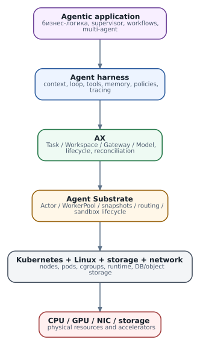

# Карта современной агентной системы: от модели до кластера

  
*Карта стека: где заканчивается LLM и начинается инфраструктура*

Самая полезная отправная точка - перестать использовать слово «агент» для всего стека сразу. LLM генерирует продолжение последовательности токенов и может структурированно предложить вызов инструмента. Агент появляется тогда, когда вокруг модели есть цикл исполнения: получить состояние, сформировать контекст, запросить модель, разобрать действие, выполнить его, вернуть observation, решить, продолжать ли работу. Но даже это ещё не платформенная система.

Надёжный agent workload требует как минимум: lifecycle, изоляции, долговременного состояния, секретов, сетевой политики, бюджетов, наблюдаемости и механизма восстановления. Multi-agent система добавляет делегирование, координацию, ограничения дерева задач и агрегацию результатов. Поэтому удобнее мыслить слоями.

**LLM** отвечает за вероятностное решение внутри шага. **Harness** превращает модель в выполняющий цикл. **Agent framework** может задавать граф состояний, supervisor/worker или другой pattern. **AX** предоставляет декларативные ресурсы и lifecycle для agent workloads. **Agent Substrate** даёт logical Actor, физические WorkerPool, sandbox, suspend/resume и routing. **Kubernetes/Linux** управляют узлами, контейнерными workload'ами и базовыми ресурсами. Inference при этом вообще может жить как рядом с AX, так и снаружи кластера.

Ключевой практический вывод: проблемы разных слоёв выглядят одинаково на поверхности. «Агент завис» может означать GPU saturation, таймаут MCP, запрет egress, остановившийся child process при живом runner, застрявший Actor resume или логическую петлю planner'а. Диагностика начинается не с prompt'а, а с определения слоя отказа.

### Что AX добавляет поверх обычного Kubernetes

Kubernetes превосходно управляет Pods, Services и декларативными объектами инфраструктуры. Но population agent workloads может быть намного больше числа реально активных процессов. Агент способен простаивать минуты и часы, а затем быстро просыпаться с сохранённым состоянием. Хранить миллионы краткоживущих объектов в Kubernetes API также не всегда разумно. AX потому отделяет своё control-plane состояние и использует Substrate как специализированный runtime.

Это не означает, что AX «лучше Kubernetes». Он занимает другой уровень. Аналогично LangGraph или собственный Python harness не конкурирует с Kubernetes: один описывает логику агента, другой - физическое выполнение и изоляцию.

### Источники и дальнейшее чтение

- [AX design](https://github.com/google/ax/blob/main/DESIGN.md)
- [Substrate README](https://github.com/agent-substrate/substrate/blob/main/README.md)
- [Kubernetes concepts](https://kubernetes.io/docs/concepts/)
