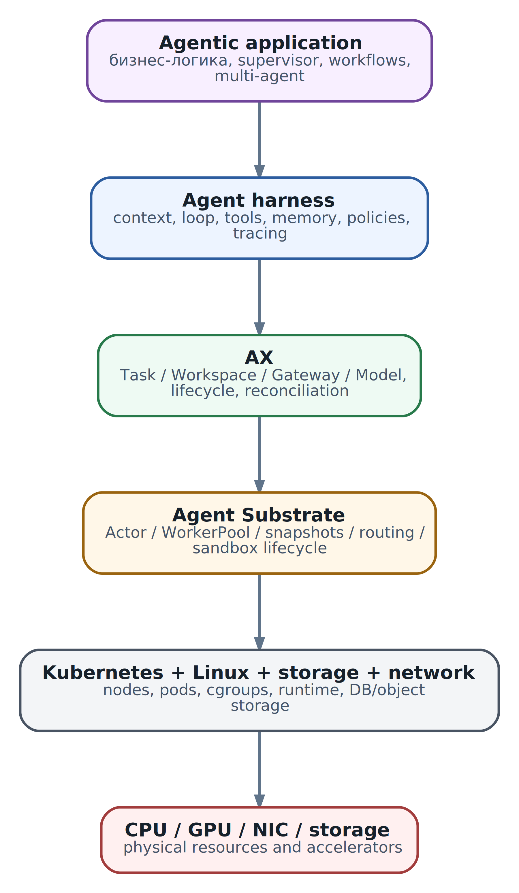
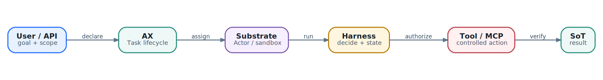

# Карта современной агентной системы: от модели до кластера

  
*Карта стека: где заканчивается LLM и начинается инфраструктура*

Представим не демонстрационного чат-бота, а рабочую инженерную задачу. Ночью часть клиентов теряет доступ к сервису. Дежурный инженер просит агента собрать метрики, проверить DNS и TLS, сопоставить событие с последним изменением конфигурации, предложить безопасное исправление и после подтверждения выполнить его. На экране это может выглядеть как один диалог. Внутри участвует целая система.

Кто-то должен принять цель и определить границы работы. Кто-то — собрать контекст для модели. Кто-то — дать модели список доступных инструментов. До выполнения команды необходимо проверить полномочия, объект воздействия и необходимость подтверждения. После вызова инструмента нужно сохранить результат, отличить временную ошибку от окончательной, решить, продолжать ли работу, и не повторить уже выполненное изменение. Сам процесс должен где-то запуститься, получить CPU и память, доступ к нужным файлам и сети, но не получить доступ ко всему кластеру. Если работа прервётся, её состояние потребуется восстановить. Все действия должны остаться в журналах и трассировках.

Большая языковая модель решает лишь часть этой задачи. Она способна проанализировать переданный ей контекст, сформулировать следующий шаг или предложить вызов инструмента. Всё остальное создаётся вокруг неё. Поэтому первая полезная привычка при проектировании агентных систем — не называть словом «агент» весь стек целиком.

## Одно слово скрывает несколько разных систем

В повседневной речи агентом могут назвать и prompt с циклом, и Python-программу, и контейнер, и Task в AX, и всю multi-agent платформу. Пока система работает, такая неточность кажется безобидной. Во время проектирования или инцидента она мешает определить владельца проблемы.

Удобнее разделять систему на уровни ответственности.

| Уровень | Главный вопрос | Примеры обязанностей |
| --- | --- | --- |
| LLM / inference | Как получить вероятностное решение или текст? | generation, structured output, tool proposal, embeddings |
| Agent loop и harness | Как превратить отдельные вызовы модели в управляемую работу? | context assembly, tools, state, policy, budgets, retries, stop conditions |
| Agent framework | Как описать сложную логику и координацию? | граф состояний, planner/executor, supervisor/worker, fan-out/fan-in |
| Orchestrator | Как управлять множеством отдельных выполнений? | создание, наблюдение, приостановка, возобновление, удаление, quotas |
| Execution runtime | Где и с какими гарантиями выполняется workload? | sandbox, process lifecycle, workspace, snapshots, routing |
| Infrastructure | На каких физических и кластерных ресурсах всё работает? | Linux, Kubernetes, nodes, storage, network, GPU |
| External systems | Где происходят реальные действия и хранится бизнес-состояние? | Git, CMDB, router API, ticket system, database, cloud API |

Границы могут проходить немного иначе в разных продуктах. Важно не название слоя, а явное распределение обязанностей. Если retry одновременно реализован в model client, harness, очереди, orchestrator и внешнем proxy, одна временная ошибка способна породить несколько одинаковых действий. Если ни один слой не считает себя владельцем retry, задача остановится после первого сетевого сбоя.

## Соглашение терминов этой книги

Одни и те же слова часто используют для разных уровней системы. Дальше книга придерживается следующего соглашения:

| Термин | Что он означает в этой книге |
| --- | --- |
| задача | Пользовательская или бизнес-цель: что должно измениться или какой результат нужно получить. |
| `run` | Одно логическое выполнение harness: последовательность состояний от принятия цели до завершения, ожидания или ошибки. |
| `Task` | Долговечная единица orchestration. В AX это конкретный ресурс со своим spec, status и lifecycle. |
| `execution` | Физическая попытка выполнить `run` или `Task`: process, container, Actor placement или другой workload instance. |
| coordinator | Прикладная роль: декомпозирует цель, делегирует части работы, собирает evidence и решает, выполнена ли бизнес-задача. |
| orchestrator | Инфраструктурный слой: размещает workloads, управляет их lifecycle, ресурсами, restart и recovery. |
| validation | Проверка формы, schema, аргументов, полномочий и preconditions до действия. |
| verification | Проверка фактического результата во внешней системе после действия. |

Перезапуск process создаёт новое `execution`, но не обязан создавать новый `run` или `Task`. Coordinator отвечает за смысл работы, orchestrator - за надёжное выполнение выделенной единицы. Validation отвечает на вопрос «можно ли и корректно ли вызвать операцию?», verification - «получен ли требуемый результат?».

## Что на самом деле делает LLM

LLM получает конечную последовательность токенов и вычисляет вероятное продолжение. Современный model API может вернуть обычный текст, структурированный объект или предложение вызвать инструмент. Модель может написать:

```
{
  "tool": "restart_service",
  "arguments": {
    "service": "edge-gateway",
    "region": "eu-1"
  }
}
```

Этот ответ ещё не является перезапуском. Он выражает решение модели на основании того контекста, который ей показали. Модель сама по себе не доказывает, что сервис существует, что регион выбран правильно, что пользователь имеет соответствующие полномочия, что изменение разрешено сейчас и что такой вызов не был выполнен минуту назад.

Между предложением модели и реальным воздействием должна находиться обычная проверяемая программа. Она валидирует schema и значения, определяет требуемое разрешение, запрашивает approval, добавляет idempotency key, вызывает инструмент, сохраняет внешний идентификатор операции и затем проверяет результат. Фраза в system prompt «не перезапускай production без разрешения» полезна как инструкция модели, но не является технической границей безопасности.

Поэтому LLM разумно считать заменяемым вычислительным компонентом. Она помогает выбирать следующий шаг, классифицировать данные, строить гипотезы и формировать объяснения. Authoritative state, полномочия и подтверждение side effects должны находиться вне неё.

## Когда появляется агент

Минимальный агент возникает тогда, когда отдельные вызовы модели соединяются в цикл обратной связи:

```
получить цель
    ↓
прочитать состояние и наблюдения
    ↓
собрать контекст
    ↓
получить решение модели
    ↓
проверить и выполнить действие
    ↓
зафиксировать результат
    ↓
продолжить, приостановиться или завершить работу
```

В этом цикле могут присутствовать и полностью детерминированные ветви. Например, превышение бюджета не обсуждается с моделью: программа завершает задачу. Операция, требующая подтверждения, переводит работу в состояние `WaitingForApproval`. Повторный ответ внешней системы с тем же operation ID не должен восприниматься как новое действие.

Чтобы цикл был эксплуатационно пригодным, для него необходимо определить как минимум:

- цель и входные данные;
- допустимые действия;
- текущее состояние;
- правила формирования контекста;
- бюджеты времени, токенов и шагов;
- обработку ошибок и повторов;
- критерии остановки;
- место хранения результатов;
- правила выполнения внешних изменений;
- способ наблюдения и аварийной остановки.

Программа с одним вызовом модели может быть полезной, но ей не обязательно становиться агентом. Если задача решается детерминированным parser, SQL-запросом или обычным workflow, добавление цикла с LLM увеличит стоимость и число вариантов отказа, не дав полезной адаптивности.

## Harness: система, которая делает цикл управляемым

**Agent harness** — это программный слой вокруг модели, который реализует цикл агента и превращает вероятностные ответы в контролируемое выполнение. Это не обязательно отдельный продукт. Для небольшого агента harness может быть несколькими модулями собственного приложения. Для сложной платформы — большим набором сервисов и библиотек.

У harness обычно есть несколько обязанностей.

**Context assembly** решает, что попадёт в следующий model request: system policy, цель, актуальное состояние, недавняя история, найденные документы и результаты инструментов. Он же должен не допустить, чтобы случайный README или ответ внешнего MCP server получил тот же уровень доверия, что и platform policy.

**Model adapter** скрывает технические различия model providers и локальных inference servers: форматы сообщений, tool schemas, streaming, лимиты, ошибки, timeouts и метрики. Замена модели не должна требовать переписывания всей бизнес-логики.

**Tool executor** принимает предложение модели, валидирует аргументы и выполняет реальный вызов. Он связывает запрос модели с operation ID, timeout, журналом и результатом.

**State manager** хранит progression задачи. В нём находятся факты, уже принятые решения, открытые вопросы, выполненные side effects и данные, необходимые после перезапуска.

**Policy и approval layer** определяет, может ли действие быть выполнено. Read-only запрос метрик и изменение маршрутизации — разные классы полномочий, даже если оба представлены как tools.

**Budget и retry control** ограничивает число шагов, время, стоимость и глубину делегирования. Он отличает повтор безопасного чтения от повтора операции, которая могла уже изменить внешнюю систему.

**Observability** связывает task ID, model request, tool call, approval и внешний operation ID. Без такой корреляции инженер видит пять разрозненных журналов и не может восстановить ход работы.

**Termination logic** отвечает на неудобный, но обязательный вопрос: когда работа завершена? Ответ модели «готово» недостаточен. Критерий должен проверяться по результату: тесты прошли, устройство вернуло ожидаемую конфигурацию, артефакт создан, итог подтверждён независимым чтением.

Harness управляет шагами внутри одного выполнения. Он не обязан создавать контейнеры, выбирать Kubernetes node или восстанавливать sandbox после потери Worker. Эти задачи относятся к другим слоям.

## Harness и agent framework — не синонимы

Agent framework предоставляет готовые абстракции для построения логики: граф состояний, роли, messages, planner/executor, supervisor/worker, сохранение checkpoints или интеграции с tools. Harness — эксплуатационная оболочка, которая должна существовать независимо от того, используется framework или нет.

Framework может стать частью harness, но не заменяет автоматически policy enforcement, секреты, сетевую изоляцию, бюджеты или end-to-end observability. И наоборот, простой агент иногда не нуждается в тяжёлом framework. Цикл из нескольких явно написанных состояний легче проверить и сопровождать, чем универсальный граф, если задача небольшая и хорошо определена.

Выбирать framework стоит, когда его модель действительно совпадает с задачей: требуется ветвящийся workflow, долговременное состояние, человеческие подтверждения, повторное выполнение отдельных узлов или сложная координация ролей. Если нужен один model call, три deterministic проверки и один API-запрос, собственный небольшой harness обычно прозрачнее.

## Tools и MCP: доступ к возможностям, а не передача власти модели

Tool — это операция, которую harness умеет предложить модели и затем выполнить. MCP стандартизует способ обнаружить такие возможности и обмениваться запросами с внешними серверами. Ни tool schema, ни MCP сами по себе не решают вопрос доверия.

Рассмотрим диагностический MCP server. Он предлагает tools `get_interface_counters` и `set_interface_state`. Первый читает telemetry, второй меняет состояние порта. Если агенту передать оба инструмента с одними и теми же credentials, различие между чтением и изменением останется лишь в описании, которое видит модель. Надёжная система выдаёт разные capabilities, проверяет объект и scope операции, требует approval для write и использует краткоживущие полномочия.

Результат tool call также нельзя автоматически считать истинным. Сервер может вернуть устаревшие данные, ошибку внутри поля `result`, неполный ответ или вредоносный текст. Harness сохраняет provenance: какой источник дал факт, когда он был получен и каким запросом. Внешнее действие завершается не успешным HTTP-ответом, а проверкой intended outcome.

## Состояние существует сразу в нескольких местах

Фраза «агент помнит задачу» слишком неоднозначна. В реальной системе есть несколько типов состояния.

**Model context** — токены конкретного запроса. Он ограничен и пересобирается.

**Working state** — текущая стадия задачи, накопленные факты, план, счётчики и ожидаемые события.

**Persistent memory** — долговременные записи, которые можно найти и использовать позже.

**Workspace** — файлы, репозитории, конфигурация инструментов и создаваемые артефакты.

**Process state** — память и открытые ресурсы конкретного процесса.

**Runtime snapshot** — технический checkpoint, который runtime способен сохранить для ускоренного resume.

**External state** — реальные изменения в Git, базе, тикетной системе или сетевом устройстве. Он не откатывается восстановлением локального snapshot.

Это различие определяет архитектуру восстановления. Если процесс запускается заново, working state должен быть прочитан из durable store или workspace. Если восстанавливается RAM image, внешнее TCP-соединение всё равно может оказаться закрытым, а token — просроченным. После любого resume программа обязана перепроверить внешние предположения.

## Orchestrator управляет выполнениями, а не мыслями модели

Когда один harness нужно запускать много раз, появляется следующий класс задач:

- создать изолированное выполнение;
- назначить ему ресурсы и Workspace;
- выдать секреты и сетевые правила;
- отслеживать lifecycle;
- приостанавливать idle workload;
- восстанавливать его по событию;
- ограничивать число дочерних задач;
- удалять завершённые окружения;
- связывать их журналы и стоимость.

Это обязанности orchestrator и execution runtime. Они не должны зависеть от конкретного reasoning pattern агента. Один Task может запускать собственный Python harness, CLI-agent или приложение на framework. Платформа управляет workload, но не обязана понимать внутренний plan модели.

Multi-agent система добавляет ещё один уровень. Coordinator может создать Researcher, Diagnostic и Validator, но техническая возможность создать дочерний Task не отвечает на вопросы: кто имеет право делегировать, какой максимальный depth дерева, кто наследует credentials, как отменяются дочерние работы и что происходит при частичном успехе. Эти правила относятся к harness/governance и orchestrator contract одновременно, поэтому граница должна быть явной.

## Runtime и sandbox отвечают за место выполнения

Контейнер упаковывает приложение и его зависимости, но сам по себе не определяет всю security model. Для agent workload важны:

- изоляция процессов и файловой системы;
- CPU, память и disk quotas;
- capabilities и системные вызовы;
- доступ к секретам;
- разрешённые сетевые направления;
- lifecycle дочерних процессов;
- durable и ephemeral storage;
- способ диагностики;
- поведение при suspend/resume;
- очистка после завершения.

Обычный container может быть достаточен для доверенного внутреннего агента с read-only инструментами. Для выполнения непроверенного кода из пользовательского репозитория граница может потребовать gVisor или microVM. Более сильная изоляция обычно означает дополнительную сложность, ограничения совместимости и стоимость запуска. Правильный выбор зависит от threat model, а не от моды.

Kubernetes находится ещё ниже. Он управляет nodes, Pods, Services, volumes и инфраструктурными политиками. Kubernetes не знает, что процесс внутри Pod выполняет agent loop, ожидает approval или исчерпал token budget. Специализированная платформа использует Kubernetes там, где сильны его механизмы, и добавляет agent-aware lifecycle выше.

## Сквозной путь одной задачи

Вернёмся к инциденту с недоступностью сервиса.

1. Пользователь или automation создаёт задачу и задаёт допустимый scope.
2. Orchestrator создаёт execution и связывает его с Workspace, моделью и политикой.
3. Runtime назначает sandbox, подготавливает filesystem, identity и network access.
4. Runner запускает команду агента и сообщает readiness.
5. Harness загружает objective и durable state, затем собирает первый context.
6. LLM предлагает собрать telemetry.
7. Policy разрешает read-only tools; executor вызывает MCP server.
8. Harness сохраняет observations и provenance, после чего модель формирует гипотезу.
9. Модель предлагает изменение. Policy переводит задачу в ожидание approval.
10. После подтверждения executor выполняет idempotent write с ограниченной capability.
11. Отдельное чтение проверяет реальное состояние системы.
12. Harness завершает работу и создаёт итоговый отчёт.
13. Orchestrator сохраняет артефакты и освобождает runtime resources.

  
*Жизнь Task: от декларации до проверенного внешнего результата*

Эта цепочка показывает, почему «ответ модели был правильным» не равнозначно «задача успешно выполнена». Успех является end-to-end свойством всей системы.

## Три плоскости, которые полезно не смешивать

**Control plane** хранит desired state и управляет lifecycle: создать Task, назначить runtime, изменить статус, приостановить или удалить.

**Execution plane** выполняет код: runner, harness, процессы, filesystem и model/tool clients.

**Side-effect plane** включает системы, где происходят реальные изменения: Git provider, network controller, cloud API, ticketing или production database.

Разделение особенно полезно при повторах и восстановлении. Control plane может повторно отправить событие после сбоя. Execution может не знать, успел ли внешний API завершить операцию до timeout. Side-effect plane должен поддерживать idempotency или предоставлять operation status, а harness — хранить ledger вызовов.

## Как выбирать уровень инструмента

Инженерный выбор начинается не с названия продукта, а со свойств задачи.

| Ситуация | Обычно достаточно | Почему |
| --- | --- | --- |
| Один предсказуемый шаг | Скрипт или обычный сервис | Минимум состояния и вариантов отказа |
| Надёжная последовательность известных шагов | Workflow engine | Нужны durable retries и orchestration, но не вероятностное планирование |
| Короткая изолированная вычислительная работа | Kubernetes Job | Хорошо известный lifecycle run-to-completion |
| Один адаптивный цикл с несколькими tools | Собственный небольшой harness | Логику можно сделать явной и проверяемой |
| Сложный граф, branching и human approval | Agent framework + harness | Готовые state/checkpoint abstractions сокращают собственную реализацию |
| Много изолированных, stateful и часто idle executions | Специализированный orchestrator/runtime | Нужны lifecycle, multiplexing, suspend/resume и policy на уровне платформы |
| Непроверенный код и сильная tenant boundary | Усиленный sandbox, возможно gVisor/microVM | Обычного process/container boundary может быть недостаточно |

Эта таблица не является автоматическим решателем. Она заставляет сформулировать требования. Например, пять доверенных внутренних агентов можно запускать обычными deployments или worker queue. Специализированная платформа становится интереснее, когда executions много, они stateful, долго простаивают, запускают непроверенный код, требуют независимых workspaces или должны быстро приостанавливаться и возобновляться.

Не стоит выбирать AX только потому, что задача содержит LLM. Не стоит выбирать multi-agent только потому, что можно создать несколько ролей. Каждый новый слой должен устранять конкретное ограничение более простой архитектуры.

## Что AX и Agent Substrate добавляют к этой карте

В зафиксированном baseline AX `v0.3.1` пользователь декларативно описывает `Task`, `Workspace` и `Model`. AX принимает эти ресурсы, хранит собственное control-plane состояние и через Agent Substrate приводит Task к исполняемому состоянию. Внутри Task запускается runner, который подготавливает Workspace и стартует команду пользователя.

AX не определяет reasoning strategy. Он не превращает любой container в качественного агента, не реализует за приложение надёжные tools и не решает автоматически governance. Harness остаётся ответственностью приложения или выбранного framework.

Agent Substrate находится ниже AX. Его основная модель отделяет logical Actor от физического Worker. Большая совокупность actors может отображаться на меньший pool заранее подготовленных workers. Runtime управляет lifecycle, sandbox, placement, suspend/resume и routing. Kubernetes при этом продолжает управлять узлами и worker Pods.

Такое разделение полезно для workloads, которые активны всплесками и долго ждут событий. Но оно создаёт новые задачи: хранение snapshots, совместимость при restore, data locality, correlation logs между разными workers и собственный control plane. Архитектура выбирается не бесплатно: плотность и быстрый resume оплачиваются дополнительной системой, которую потребуется эксплуатировать.

Проекты остаются pre-1.0, а часть архитектурных документов описывает целевое состояние раньше полной реализации. Поэтому конкретные возможности нужно проверять по зафиксированной версии, API guide и реальному стенду. В книге design goals, реализованное поведение и roadmap рассматриваются отдельно.

## Почему симптом «агент завис» ничего не объясняет

Один пользовательский симптом может иметь причины на любом уровне.

- **LLM/inference:** очередь на GPU, oversized context, rate limit или model timeout.
- **Harness:** потерян stop condition, повторяется один plan, ожидается approval, исчерпан budget.
- **Tool/MCP:** сервер недоступен, schema изменилась, credential просрочен, операция осталась в неизвестном состоянии.
- **Runner:** служебный процесс жив, но child agent завершился.
- **Network policy:** DNS работает, но TLS или конкретный egress destination запрещён.
- **Runtime:** Actor не получил Worker, snapshot несовместим или restore слишком медленный.
- **AX control plane:** событие не обработано, controller отстаёт, ссылка на Workspace не разрешена.
- **Kubernetes:** node pressure, image pull, storage или CNI.
- **Внешняя система:** действие принято асинхронно и ещё не завершилось либо было отвергнуто собственной policy.

Поэтому диагностика начинается с correlation identity и определения последнего подтверждённого перехода. Получил ли Task desired state? Назначен ли Actor? Готов ли runner? Жив ли child process? Был ли отправлен model request? Какой tool call выполняется? Есть ли внешний operation ID? Только после ответа на эти вопросы имеет смысл изменять prompt.

## Метод выбора архитектуры

Перед добавлением очередного слоя полезно письменно ответить на восемь вопросов.

1. Какая неопределённость требует LLM, а что можно решить детерминированно?
2. Как выглядит проверяемый результат работы?
3. Где находится authoritative state?
4. Какие действия имеют side effects и как обеспечивается idempotency?
5. Какой код считается недоверенным и какая нужна граница изоляции?
6. Сколько executions одновременно активно, сколько простаивает и как долго?
7. Что должно пережить restart, suspend и потерю node?
8. Кто будет наблюдать, обновлять и восстанавливать каждый новый компонент?

Если ответы не требуют долговременного агента, отдельного sandbox runtime и массового lifecycle, более простая система почти всегда лучше. Если же нужны stateful executions, независимые workspaces, управляемая приостановка, строгие policies и большое число idle workloads, специализированный стек становится обоснованным.

## Практическое упражнение

Возьмите задачу: «агент проверяет pull request, запускает тесты и при необходимости предлагает исправление». Разложите её на таблицу:

- где выполняется agent loop;
- что входит в context;
- где хранится progression;
- кто запускает тесты;
- имеет ли агент право писать в branch;
- кто подтверждает merge;
- какой уровень изоляции нужен для кода из pull request;
- что произойдёт после restart;
- как проверить, что результат действительно опубликован;
- нужен ли здесь AX или достаточно CI runner и небольшого harness.

Затем измените условие: одновременно работают десять тысяч таких задач, большинство ждёт ревью несколько часов, а код считается недоверенным. Посмотрите, какие ответы изменятся. Именно изменение требований, а не наличие слова «agent», приводит к выбору другой архитектуры.

## Если запомнить только главное

- LLM предлагает решения; система вокруг неё отвечает за выполнение и последствия.
- Агент появляется как цикл с состоянием, действиями и критерием остановки.
- Harness управляет внутренним execution loop; orchestrator управляет множеством executions.
- Framework помогает описывать логику, но не заменяет security, runtime и operations.
- Context, working state, workspace, snapshot и external state — разные сущности.
- AX управляет декларативным lifecycle agent workloads, но не пишет harness за приложение.
- Agent Substrate управляет Actor/Worker, sandbox и suspend/resume поверх инфраструктуры Kubernetes.
- Выбирать инструмент нужно по требованиям к state, isolation, lifecycle, scale и side effects.
- «Агент завис» — симптом, а не диагноз.

**Дальше.** Карта стека готова. В следующей главе мы увеличим один её участок - model request - и разберём, какие гарантии LLM действительно даёт системе.

## Источники и дальнейшее чтение

- [AX README, baseline e70162a](https://github.com/google/ax/blob/e70162a/README.md)
- [AX Design, baseline e70162a](https://github.com/google/ax/blob/e70162a/DESIGN.md)
- [AX Core concepts, baseline e70162a](https://github.com/google/ax/blob/e70162a/docs/concepts.md)
- [Agent Substrate README, baseline ccecc78](https://github.com/agent-substrate/substrate/blob/ccecc78/README.md)
- [Agent Substrate architecture, baseline ccecc78](https://github.com/agent-substrate/substrate/blob/ccecc78/docs/architecture.md)
- [Kubernetes Concepts](https://kubernetes.io/docs/concepts/)
- [Model Context Protocol specification](https://modelcontextprotocol.io/specification/2026-07-28)
- [gVisor documentation](https://gvisor.dev/docs/)
