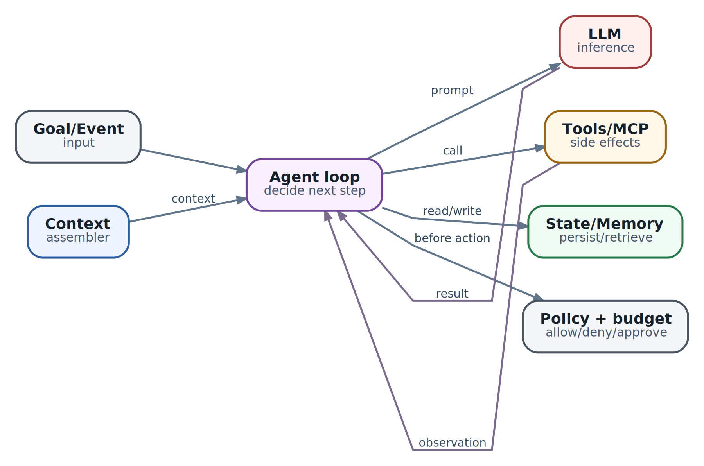

# Что такое агент: цикл, границы и критерии остановки

  
*Agent loop: цель, контекст, решение, действие и обратная связь*

Представим задачу: проверить, почему после изменения DNS часть клиентов не может подключиться к сервису. Обычный workflow можно заранее расписать: получить записи, проверить propagation, выполнить TLS probe, сравнить конфигурацию, сформировать отчёт. Но реальный инцидент быстро выходит за рамки одного сценария. В одном случае обнаружится stale resolver cache, в другом - неправильный CNAME, в третьем - доступ к нужной зоне отсутствует и потребуется запросить помощь.

Агент нужен не потому, что задача содержит текст или LLM. Он нужен тогда, когда следующий полезный шаг нельзя полностью выбрать заранее и его приходится определять по наблюдаемому состоянию среды.

Минимальное инженерное определение можно сформулировать так:

**Агент - это ограниченный процесс, который получает цель, наблюдает состояние, выбирает допустимое действие, фиксирует результат и повторяет цикл до проверяемого завершения, паузы или контролируемого отказа.**

В этом определении важны все слова. Без цели получается бесконечный исследователь. Без наблюдений - генератор предположений. Без ограничений - источник неконтролируемых side effects. Без сохранённого состояния - чат, который забывает progression. Без критериев остановки - цикл, способный расходовать ресурсы неограниченно.

### Не всё, что вызывает LLM, является агентом

Термин «агент» часто применяют слишком широко. Для выбора архитектуры полезно различать несколько классов систем.

| Система | Кто выбирает следующий шаг | Есть ли цикл | Когда использовать |
| --- | --- | --- | --- |
| Один model call | Приложение | Нет | Классификация, извлечение, генерация ограниченного результата |
| Prompt chain | Заранее написанный код | Фиксированная последовательность | Известные стадии с проверками между ними |
| Workflow | State machine или workflow engine | Возможны повторы и ожидания по заданным правилам | Предсказуемый процесс, durable retries, human tasks |
| Router | Правило, classifier или LLM | Обычно нет собственного длинного цикла | Выбор специализированного пути |
| Agent | Модель в заданных границах | Да, следующий шаг зависит от observations | Неопределённая последовательность исследований или действий |
| Multi-agent system | Несколько ограниченных loops и coordinator | Граф или дерево | Независимые contexts, authorities или параллельная работа |

Граница не всегда бинарна. Production-система часто сочетает deterministic workflow и agentic nodes. Например, state machine жёстко задаёт этапы `collect - diagnose - propose - approve - execute - verify`, а LLM внутри этапа diagnose выбирает, какие read-only проверки выполнить.

Такой гибрид обычно надёжнее идеи «пусть модель сама решит всё». Свобода остаётся там, где полезна адаптивность, а переходы с высоким риском контролирует обычный код.

### У автономности есть несколько независимых измерений

Слово «автономный» ничего не говорит без уточнения. Агент может иметь высокую свободу планирования, но не иметь права на внешние изменения. Или работать часами, но каждый write требовать подтверждения.

Полезно оценивать автономность по отдельным осям:

- **decision autonomy** - насколько свободно выбирается следующий шаг;
- **action authority** - какие side effects разрешены;
- **time horizon** - сколько времени процесс может работать без участия человека;
- **resource budget** - сколько steps, tokens, денег и compute доступно;
- **delegation depth** - может ли агент создавать дочерние работы;
- **environment scope** - какие данные, tools и systems видимы;
- **reversibility** - насколько легко отменить последствия;
- **human checkpoints** - где требуется approval или уточнение.

Агент для исследования документации может иметь широкую decision autonomy и почти нулевой blast radius. Агент с одним разрешённым API-вызовом в production может иметь узкую логику, но высокий риск. Поэтому security review должен начинаться не с вопроса «насколько умна модель», а с authority, scope и reversibility.

### Минимальный agent loop

Поведение агента удобно представить как цикл observe - decide - act - verify. В production между этими словами появляются дополнительные gates.

1. Принять objective, scope и initial state.
2. Загрузить policy, budgets и durable progression.
3. Получить observations, необходимые для текущего шага.
4. Собрать context из state и trusted/untrusted evidence.
5. Попросить модель предложить следующий шаг или итог.
6. Разобрать structured decision.
7. Проверить schema, domain rules, policy и approval requirement.
8. Выполнить действие с operation ID и timeout.
9. Сохранить observation, provenance и возможный side effect.
10. Проверить postcondition и progress.
11. Перейти к следующему состоянию, приостановиться или завершиться.

Упрощённый skeleton выглядит так:

```
while true:
    state = load_durable_state(task_id)

    terminal = evaluate_terminal_conditions(state)
    if terminal:
        return finalize(terminal, state)

    context = assemble_context(state)
    proposal = model.decide(context)

    decision = validate_proposal(proposal, state.policy)

    if decision.requires_approval:
        checkpoint(state, waiting_for_approval(decision))
        return PAUSED

    operation = execute_idempotently(decision, state.operation_ledger)
    observation = verify_operation(operation)

    state = apply_observation(state, observation)
    checkpoint(state)
```

Это не готовая реализация. Важна форма: модель не исполняет действие напрямую, terminal conditions проверяются вне модели, а state сохраняется до следующего шага.

### Observation, state и plan - разные сущности

Эти три понятия часто смешивают, из-за чего агент становится трудно восстанавливать и диагностировать.

**Observation** - результат конкретного чтения или действия. Например: «resolver 10.0.0.5 вернул старый IP в 12:04 UTC». Observation содержит источник, время, request ID и raw artifact.

**State** - компактное представление progression. Например: текущая стадия diagnosis, подтверждённые факты, отклонённые гипотезы, оставшийся budget, ожидаемый approval и ledger операций.

**Plan** - текущая гипотеза о будущих шагах. Он может измениться после нового observation и не является authoritative truth.

Если plan хранится как state без различия статусов, восстановившийся агент способен принять старое намерение за уже выполненное действие. Если observations хранятся только внутри model context, они исчезнут после compaction. Если state состоит из свободного текста, программе трудно проверить invariant.

Практичная модель данных разделяет как минимум:

| Поле | Пример |
| --- | --- |
| objective | восстановить доступность клиентов, не меняя authoritative DNS без approval |
| phase | diagnosing |
| verified facts | origin healthy; resolver A stale; resolver B current |
| hypotheses | cache propagation delay; split-horizon mismatch |
| open questions | какой TTL был до изменения |
| operations | read-17 completed; change-3 proposed, not approved |
| budgets | 8 из 20 steps, 4 минуты из 15 |
| waiting for | none |
| expected outcome | два независимых probes возвращают новый IP и успешный TLS |

Модель получает проекцию этого state, но не должна быть единственным компонентом, который умеет его интерпретировать.

### Детерминированная оболочка вокруг вероятностного решения

LLM полезна для классификации неоднозначных данных, построения гипотез и выбора исследования. Но многие решения должны оставаться обычным кодом.

| Решение | Предпочтительный владелец |
| --- | --- |
| Достигнут ли timeout | Runtime или harness |
| Остался ли budget | Budget controller |
| Существует ли tool | Tool registry |
| Допустимы ли аргументы | Schema и domain validator |
| Имеет ли identity право на действие | Authorization service |
| Нужен ли approval | Policy engine |
| Выполнялась ли операция раньше | Operation ledger |
| Достигнут ли измеримый postcondition | Deterministic verifier |
| Какую гипотезу проверить следующей | LLM в разрешённых границах |
| Как объяснить вывод человеку | LLM на основе проверенных facts |

Это разделение называется не недоверием к модели, а корректным распределением обязанностей. Даже очень сильная модель не должна вычислять, истёк ли wall-clock deadline, если это может сделать таймер. И не должна подтверждать успешность собственного изменения без независимого чтения.

### Agent execution лучше моделировать как state machine

Цикл `while true` скрывает важные operational states. Явная state machine делает паузы, восстановление и терминальные исходы видимыми.

| Состояние | Значение | Допустимый следующий переход |
| --- | --- | --- |
| Created | objective принят, выполнение ещё не началось | Running, Cancelled |
| Running | агент выбирает или выполняет безопасный шаг | WaitingForTool, WaitingForApproval, Verifying, Failed |
| WaitingForTool | внешний read/operation ещё не завершён | Running, Verifying, Failed, Cancelled |
| WaitingForApproval | требуется решение человека или policy owner | Running, Cancelled, Failed |
| Verifying | проверяется итог или postcondition | Succeeded, Running, Failed |
| Succeeded | доказан expected outcome | терминальное |
| Failed | продолжение невозможно или исчерпан допустимый budget | терминальное либо явный operator retry |
| Cancelled | выполнение остановлено владельцем или системой | терминальное |

Waiting не равно failure. Task, который ожидает approval два часа, не должен занимать активный worker и не должен каждые десять секунд повторно спрашивать модель. Он сохраняет checkpoint и возобновляется по событию.

Failed также не означает «модель однажды ошиблась». Локальная ошибка может привести к repair или альтернативному пути. Terminal failure наступает, когда классифицированная ошибка неисправима в текущем scope, исчерпан budget либо нарушен invariant.

### Критерий успеха должен существовать до запуска

Фраза «сделай так, чтобы всё работало» не задаёт проверяемого результата. Если success condition не определён, агенту остаётся доверять собственному ощущению завершённости.

Хороший expected outcome отвечает на вопросы:

- что именно должно стать истинным;
- каким инструментом это измеряется;
- сколько независимых подтверждений требуется;
- какое состояние не должно измениться;
- в течение какого окна результат считается стабильным;
- какой artifact нужно сохранить.

Для задачи с DNS критерий может выглядеть так:

- authoritative zone содержит ожидаемую запись и serial;
- два независимых resolver возвращают новый адрес после TTL window;
- TLS probe на hostname успешен;
- origin health не ухудшился;
- итоговый отчёт содержит timestamps и raw probe IDs.

Ответ модели «готово» не входит в этот список.

Success condition полезно отделять от completion report. Сначала код проверяет outcome, затем модель объясняет человеку, что произошло. Если объяснение не сгенерировалось, технический результат может оставаться успешным, а report generation - отдельной repairable задачей.

### Остановка бывает успешной, ожидающей и аварийной

У agent loop должно быть несколько явных путей выхода.

**Success** - postcondition подтверждён.

**Needs input** - отсутствует факт, который может предоставить пользователь или другая система. Это pause, а не догадка.

**Needs approval** - следующий допустимый шаг имеет side effect выше текущего authority.

**Blocked** - требуемый ресурс недоступен, а альтернативный путь отсутствует.

**Budget exhausted** - достигнут лимит steps, времени, tokens, tool calls, денег или delegation depth.

**No progress** - новые iterations не меняют state и не добавляют evidence.

**Cancelled** - владелец задачи или control plane запросил остановку.

**Safety stop** - policy или invariant запрещает продолжение.

Для каждого исхода задают machine-readable reason и human-readable summary. Иначе operator увидит общий статус Failed и снова запустит тот же процесс, не понимая, что агент на самом деле ждал недостающий credential или упёрся в policy.

### Budget - не одна цифра

Ограничение только по maximum steps недостаточно. Один step может быть дешёвым read-only запросом, а другой - часовым job или вызовом дорогой модели.

Budget обычно включает:

- wall-clock deadline;
- maximum active execution time;
- maximum model requests;
- input и output tokens;
- monetary cost;
- tool calls по классам;
- число write proposals;
- retries каждого operation;
- объём созданных artifacts;
- число и depth дочерних задач.

Budgets должны уменьшаться монотонно и храниться в durable state. Restart процесса не должен обнулять счётчики. Child task получает долю оставшегося parent budget, а не новый безграничный лимит.

При исчерпании budget агент не обязан просто оборваться. Он может сохранить partial result, перечислить подтверждённые facts, незакрытые вопросы и безопасный следующий шаг. Это превращает контролируемую остановку в полезный outcome.

### Как обнаруживать отсутствие прогресса

Max iterations гарантирует конечность, но не замечает бессмысленную работу заранее. Полезен отдельный no-progress detector.

Он может отслеживать:

- повтор одного tool с теми же нормализованными аргументами;
- одинаковые ошибки без изменения recovery strategy;
- отсутствие новых verified facts;
- неизменный fingerprint state несколько шагов подряд;
- plan, который циклически возвращается к предыдущей стадии;
- evaluator score, который не улучшается;
- последовательность «прочитать - предложить - отклонить» для одного объекта;
- постоянное создание новых subtasks без закрытия старых.

Fingerprint не должен включать шум вроде timestamps или request IDs, иначе каждый iteration будет казаться новым. Полезнее хешировать semantic state: phase, open questions, verified facts, pending operations и нормализованный proposed action.

Реакция также должна быть поэтапной. Сначала агент получает structured feedback о повторе. Затем пробует ограниченную альтернативу. После заданного patience window останавливается с reason `NO_PROGRESS`. Бесконечная просьба к той же модели «подумай ещё» не является recovery strategy.

Недавние исследования infinite agentic loops подтверждают, что циклы могут проходить через model calls, tools, workflow transitions и handoffs. Поэтому bound должен существовать на каждом feedback path, а не только в основном `for`-цикле.

### Retry не равен новому рассуждению

Повтор допустим, когда ошибка временная и операция безопасно повторяема. Например, model endpoint вернул overload до начала generation или read-only API завершился connection reset.

Если timeout произошёл во время write, неизвестно, выполнила ли внешняя система действие. Повтор без проверки способен создать дубль. Нужны:

1. стабильный operation ID или idempotency key;
2. запись intent до вызова;
3. сохранение provider request ID;
4. запрос статуса существующей операции;
5. независимая проверка external state;
6. только затем решение о retry или compensation.

Идемпотентность не означает, что запрос «обычно безопасен». Она означает, что повтор с тем же identity и payload не создаёт дополнительного эффекта.

Модель не должна сама решать, можно ли повторить write, по тексту ошибки. Класс операции и retry semantics задаёт tool contract.

### Human-in-the-loop - полноценное состояние, а не модальное окно

Approval особенно часто реализуют как временный prompt: процесс ждёт ответ в памяти и теряет его при restart. Production-система должна рассматривать human interaction как durable interrupt.

Перед паузой сохраняются:

- proposed action и нормализованные arguments;
- причина и evidence;
- ожидаемый side effect;
- diff или preview;
- identity запрашивающего;
- срок действия предложения;
- state version;
- operation ID, если он уже выделен.

После resume необходимо проверить, что approval относится к той же версии state. За время ожидания конфигурация могла измениться, credential - истечь, а incident - завершиться. Старое подтверждение не должно автоматически разрешать новый payload.

Human-in-the-loop включает не только yes/no. Агент может запросить недостающий scope, предложить несколько вариантов, получить изменённые параметры или передать задачу operator. Эти ответы являются events, которые изменяют durable state.

### Plan не должен становиться скрытым API

Модели удобно предложить план, но текстовый plan нельзя использовать как единственный control structure. У фразы «проверить DNS, затем исправить запись» нет schema, статусов и retry semantics.

Для исполнения полезнее разложить намерение на structured steps:

```
plan_version: 4
steps:
  - id: read-authoritative
    kind: tool
    status: completed
    result_ref: observation-81
  - id: compare-resolvers
    kind: fanout-read
    status: running
    required_successes: 2
  - id: propose-change
    kind: decision
    status: pending
    requires: [read-authoritative, compare-resolvers]
    approval_policy: dns-write
```

LLM может предложить или обновить такой plan. Harness проверяет зависимости, разрешённые step kinds и invariants. Фактическое состояние каждого step изменяет executor, а не модель.

При небольшом числе состояний отдельный planner вообще не нужен. Модель может выбирать одно следующее действие, а deterministic state machine - сохранять progression. Planner/executor оправдан, когда предварительный план помогает распределять работу, оценивать зависимости или запрашивать approval на весь change set.

### Основные patterns и критерии выбора

Patterns - это способы распределить decision-making, а не названия продуктов.

**ReAct** чередует reasoning и action. Он полезен, когда каждый следующий шаг зависит от свежего observation: search, диагностика, exploration. В production reasoning result лучше выражать как краткое decision summary и structured action, а не считать скрытую цепочку рассуждений audit log.

**Prompt chaining** передаёт результат через фиксированную последовательность stages. Это workflow, а не автономный agent, и именно поэтому он часто лучше для предсказуемой задачи.

**Routing** выбирает один специализированный путь. Он снижает context и позволяет использовать разные models/tools, но требует обработки ошибочной классификации.

**Planner/executor** отделяет построение плана от исполнения. Полезен для задач с зависимостями, но план должен перепроверяться после каждого значимого observation.

**Evaluator/optimizer** повторяет генерацию и проверку. Он оправдан только при измеримом criterion и bounded iterations. «Модель-критик считает ответ лучше» без калиброванного evaluator легко создаёт дорогую петлю.

**Fan-out/fan-in** параллельно выполняет независимые проверки и объединяет structured results. Он ускоряет работу, если ветви действительно независимы и budget делится заранее.

**Supervisor/worker** делегирует ограниченные subtasks. Он нужен при разных tools, authority или context. Подробная multi-agent архитектура рассматривается отдельно.

| Требование | Первый кандидат |
| --- | --- |
| Известные стадии и переходы | Workflow/state machine |
| Следующий шаг зависит от нового observation | ReAct-подобный loop |
| Есть несколько устойчивых классов входа | Router |
| Нужен change plan с зависимостями | Planner/executor |
| Результат можно автоматически оценить и улучшить | Bounded evaluator loop |
| Независимые проверки можно выполнять параллельно | Fan-out/fan-in |
| Различаются authority, workspace или expertise | Supervisor/worker |

Нельзя выбирать pattern только потому, что framework предоставляет красивую диаграмму. Каждый дополнительный loop или role должен улучшать измеримый результат сильнее, чем повышает latency, стоимость и число failure modes.

### Когда workflow лучше агента

Workflow предпочтительнее, если:

- процесс известен заранее;
- каждый transition можно выразить правилами;
- важны predictability и auditability;
- ошибки имеют известные recovery paths;
- variation входных данных невелика;
- side effects критичны;
- регулятор или оператор должен заранее понимать все пути.

Agent оправдан, если:

- число возможных путей велико;
- нужны исследования и адаптация по observations;
- вход содержит неоднородный неструктурированный материал;
- невозможно заранее перечислить все полезные read-only шаги;
- ценность гибкости выше дополнительной стоимости и риска.

Часто лучший ответ - workflow с agentic island. Например, workflow управляет approval и deployment, а агент исследует логи и формирует change proposal. Такой дизайн локализует неопределённость.

### Safety и liveness - две разные задачи

**Safety** означает: плохое событие не произойдёт. Агент не выйдет за scope, не выполнит write без approval, не превысит authority, не повторит необратимое действие.

**Liveness** означает: полезное событие когда-нибудь произойдёт. Задача не останется навсегда WaitingForTool, approval event не потеряется, retry закончится, а cancel действительно остановит descendants.

Можно построить очень безопасную систему, которая никогда ничего не завершает. Можно построить активную систему, которая быстро выполняет неправильные изменения. Production contract обязан включать оба набора invariants.

Примеры safety invariants:

- write tool недоступен до approved state;
- child authority не шире parent;
- каждый external write имеет operation ID;
- terminal Task не запускает новые actions.

Примеры liveness invariants:

- каждый non-terminal state имеет timeout или входящее событие;
- каждый retry bounded;
- orphan operation периодически reconciled;
- cancel распространяется на активные children;
- WaitingForApproval имеет owner и expiry policy.

### Observability должна показывать переходы, а не только текст

Лог полного conversation history полезен, но недостаточен. Для диагностики нужно восстановить причинную цепочку:

`task - state version - model request - proposal - policy decision - tool operation - observation - transition`.

На каждом step полезно фиксировать:

- step ID и parent step;
- state before/after;
- model/provider request ID;
- выбранный action type;
- tool и нормализованные arguments;
- policy/approval decision;
- operation ID;
- latency и resource usage;
- observation/artifact refs;
- termination check result.

Необязательно сохранять скрытое внутреннее reasoning модели. Для audit важнее входные evidence, явное decision summary, фактическое действие и проверенный результат. Это уменьшает риск перепутать правдоподобное объяснение с реальной причиной перехода.

## Как тестировать agent loop

Agent loop нельзя проверять только набором удачных диалогов. Такой тест показывает, что один знакомый сценарий однажды сработал, но ничего не говорит о повторяемости, остановке, восстановлении и безопасности. Единица проверки здесь - не красивый ответ модели, а переход системы из одного состояния в другое.

Полезно разделить тестирование на четыре уровня.

### 1. Детерминированные unit-тесты оболочки

Policy, budget accounting, state transitions, idempotency и обработка tool results должны тестироваться без модели. Для каждого перехода задаются входное состояние, событие и ожидаемое новое состояние.

Примеры:

- `Running + proposal(write) + no approval -> WaitingForApproval`;
- `WaitingForTool + timeout + retries_left -> Running`;
- `WaitingForTool + timeout + no retries -> Failed`;
- `Verifying + success evidence -> Succeeded`;
- `Running + repeated fingerprint -> Blocked`;
- `any non-terminal state + cancel -> Cancelled`.

Эти тесты должны также проверять invariants: terminal state не порождает новые actions, declined approval не превращается в write, один operation ID не приводит к двум side effects.

### 2. Симулированная среда

Реальные tools дороги, медленны и иногда опасны. Поэтому useful test harness должен уметь возвращать заранее заданные observations: успешный ответ, timeout, malformed payload, stale data, partial success, conflict или permission denied. Важно симулировать не только штатный путь, но и неоднозначность.

Например, DNS tool может сначала вернуть `timeout`, затем показать уже обновлённую запись. Правильный agent не должен слепо повторить write: он обязан выполнить read-after-timeout, сопоставить desired state с actual state и только затем решать, нужен ли retry.

### 3. Scenario evals и replay

Набор сценариев должен описывать цель, начальное состояние среды, разрешённые действия, ожидаемые evidence и недопустимые side effects. Один и тот же сценарий запускают многократно, потому что решение модели вероятностно.

Trajectory полезно сохранять как последовательность нормализованных событий, а затем replay-ить без реальных side effects. Replay отвечает на два разных вопроса:

1. корректно ли оболочка обработала уже полученные proposals и observations;
2. изменилось ли решение модели после смены prompt, model version или tool description.

Это позволяет отделить регрессию orchestration от регрессии reasoning.

### 4. Recovery и counterfactual tests

Хороший агент должен не только идти по счастливому пути, но и корректно менять план после новой информации. Поэтому в тесте намеренно меняют среду:

- log source становится недоступен;
- permission исчезает между plan и execute;
- approval приходит после изменения state version;
- tool возвращает success, но verification не подтверждает результат;
- оператор отменяет Task во время долгой операции;
- один из параллельных workers возвращает противоречащие evidence.

Counterfactual test задаёт вопрос: «Если бы observation отличалось в одном существенном месте, изменилось бы решение?» Если агент предлагает один и тот же action при `certificate expired` и при `certificate valid`, он, вероятно, следует поверхностному шаблону, а не фактам.

### Метрики production-качества

Одна метрика `task completed` слишком груба. Она не отличает доказанный успех от самоуверенного отчёта. Минимальный набор включает:

| Метрика | Что она показывает |
| --- | --- |
| Verified task success rate | Доля задач, где критерий успеха подтверждён evidence |
| Invalid action rate | Доля proposals, нарушивших schema, state или policy |
| Unsafe proposal / executed action | Разницу между тем, что model пыталась сделать, и тем, что реально пропустила оболочка |
| Steps to verified outcome | Эффективность траектории, а не длину текста |
| No-progress stop rate | Способность обнаруживать loop до исчерпания бюджета |
| Recovery rate | Долю сценариев, завершённых после tool failure или изменения среды |
| Escalation quality | Достаточно ли оператору контекста, чтобы принять решение |
| Cost and latency distribution | Медиану и хвосты, а не только среднее значение |

Особенно важно раздельно считать unsafe proposals и executed unsafe actions. Нулевая доля фактических нарушений может означать как качественное reasoning, так и сильный policy layer, который постоянно спасает плохо настроенную модель. Это разные инженерные ситуации.

## Где проходит граница AX

В AX `Task` предоставляет внешний lifecycle работы: создание, запуск, наблюдение, завершение, отмену и связь с execution metadata. `Workspace` задаёт изолированный контекст файлов и процессов. `Model` выполняет inference. Но эти абстракции сами по себе не определяют внутреннюю семантику agent loop.

Runner или agent runtime поверх AX должен определить:

- schema логического state;
- допустимые actions и tools;
- policy и approval rules;
- способ записи observations;
- критерии успеха;
- budgets и stopping conditions;
- checkpoint и recovery semantics;
- формат итогового результата и evidence.

Это разделение важно по двум причинам.

Во-первых, инфраструктурный runtime не должен угадывать domain semantics. AX может надёжно доставить событие, сохранить artifact и остановить process, но не знает, означает ли `HTTP 200` успешное восстановление сервиса или попадание на fallback page.

Во-вторых, логический checkpoint агента не равен снимку процесса. Возобновить контейнер с того же instruction pointer недостаточно: внешняя среда могла измениться, lease истечь, approval устареть, а tool operation завершиться после потери связи. При resume агент должен загрузить durable state, reconcile незавершённые operations, обновить observations и только затем выбрать новый transition.

### Два уровня retry

В системе обычно существуют как минимум два разных retry:

1. **Step retry** - повтор конкретной tool operation внутри agent loop.
2. **Task retry** - повтор всего runner после infrastructure failure.

Если их не различать, Task retry может заново выполнить side effect, который на самом деле успел завершиться. Поэтому operation ID и idempotency key должны переживать перезапуск Task. После восстановления runner сначала проверяет статус ранее начатой операции и только потом решает, повторять ли её.

AX отвечает за надёжную execution substrate. Agent runtime отвечает за корректный переход от цели к действию и от observation к следующему решению. Продуктовая система отвечает за domain policy и за то, что считается доказанным результатом. Смешивание этих уровней делает failure analysis почти невозможным.

## Практикум: агент исследует TLS-инцидент

Рассмотрим задачу: «Пользователи получают ошибку TLS при обращении к `api.example.com`; найди причину и подготовь безопасное исправление».

### Шаг 1. Зафиксировать контракт

До написания prompt опишите:

- **goal:** определить подтверждённую причину и восстановить корректный TLS handshake;
- **scope:** DNS, load balancer, certificate inventory и логи только для `api.example.com`;
- **success evidence:** handshake проходит из двух независимых probes, certificate chain валидна, hostname совпадает, error rate вернулся ниже порога;
- **forbidden:** выпуск нового сертификата, DNS write и production reload без approval;
- **budget:** 20 model steps, 10 минут, 30 tool calls, один write proposal;
- **terminal result:** `Succeeded`, `WaitingForApproval`, `Blocked`, `Failed` или `Cancelled` с evidence.

### Шаг 2. Определить state

Минимальная schema может содержать:

```
incident:
  host: api.example.com
  reported_error: tls_handshake_failed
observations: []
hypotheses: []
selected_hypothesis: null
proposed_change: null
approval:
  status: not_requested
  state_version: 0
operations: {}
budgets:
  steps_left: 20
  tool_calls_left: 30
termination:
  status: running
  evidence: []
```

Не храните только `certificate is probably expired`. Храните observation с источником и временем: какой endpoint проверен, какой serial number получен, какую chain вернул load balancer, на каком hop возникла ошибка.

### Шаг 3. Ограничить tools

Read-only набор может включать:

- DNS lookup;
- TLS probe с выводом chain и SNI;
- чтение certificate inventory;
- чтение конфигурации load balancer;
- агрегированный поиск по логам;
- чтение deploy history.

Write tools лучше не выдавать сразу. Агент сначала формирует change proposal: точный target, expected effect, rollback, verification и evidence. Отдельный approval transition открывает ровно нужную capability на ограниченное время.

### Шаг 4. Проверить альтернативные гипотезы

Устаревший сертификат - лишь одна причина. Agent должен различить как минимум:

- сертификат действительно истёк;
- load balancer отдаёт старый certificate bundle;
- SNI ведёт на default virtual host;
- DNS указывает на старый endpoint;
- неполная intermediate chain ломает часть клиентов;
- часы probe или сервера некорректны;
- handshake исправен, а исходный alert относится к другому региону.

Каждая гипотеза должна иметь ожидаемый discriminating observation. Иначе список гипотез превращается в декоративный текст.

### Шаг 5. Спроектировать transitions

Пример полезной траектории:

```
Created
  -> Running: собрать DNS и TLS facts
  -> Running: сопоставить serial с inventory и deploy history
  -> Running: выбрать подтверждённую гипотезу
  -> WaitingForApproval: представить ограниченный change plan
  -> Running: выполнить approved operation с operation ID
  -> Verifying: независимые probes и error-rate check
  -> Succeeded: сохранить evidence и summary
```

Если TLS probe расходится между регионами, агент не должен усреднять ответы. Он создаёт новое observation, сужает scope и либо продолжает диагностику в бюджете, либо завершает `Blocked` с точным описанием недостающей capability.

### Workflow или agent?

Полностью детерминированный workflow хорошо подходит для известного случая «сертификат истекает через N дней»: проверить inventory, выпустить replacement, развернуть, проверить. Но incident diagnosis содержит развилки, которые зависят от свежих observations.

Практичный дизайн здесь гибридный:

1. workflow создаёт incident Task, задаёт budgets и собирает базовые probes;
2. agentic island исследует evidence и строит change proposal;
3. workflow проводит approval;
4. детерминированный executor выполняет изменение;
5. workflow запускает независимую verification;
6. agent пишет объяснение только на основании сохранённых evidence.

Так модель помогает там, где действительно нужна адаптация, а критические side effects остаются в предсказуемом контуре.

## Итоги главы

- Agent - это bounded control loop, а не просто model call с tools.
- Goal должен быть преобразован в проверяемый expected outcome до первого действия.
- Observation, state и plan - разные сущности; их смешивание разрушает audit и recovery.
- Каждый transition проходит через policy, budget и termination checks.
- Retry безопасен только вместе с reconciliation и idempotency.
- Human-in-the-loop требует durable pause, versioned approval и повторной проверки state.
- Workflow предпочтителен для известных путей; agent нужен для адаптации по новым observations.
- Safety запрещает плохие события, liveness гарантирует, что полезная работа не зависнет навсегда.
- Agent eval должен измерять проверенный результат, восстановление, остановку и side effects, а не красоту ответа.
- AX даёт execution substrate; смысл loop, tools, policy и success evidence задаёт agent runtime и продуктовая система.

### Источники и дальнейшее чтение

- [ReAct: Synergizing Reasoning and Acting in Language Models](https://arxiv.org/abs/2210.03629) - исходная работа о чередовании reasoning traces и действий.
- [Building Effective AI Agents](https://www.anthropic.com/engineering/building-effective-agents) - практическое различие workflows и agents, composable patterns и stopping conditions.
- [Thinking in LangGraph](https://docs.langchain.com/oss/javascript/langgraph/thinking-in-langgraph) - проектирование state, nodes, error handling и human-in-the-loop.
- [Idempotent Receiver](https://martinfowler.com/articles/patterns-of-distributed-systems/idempotent-receiver.html) - классический паттерн защиты от повторной обработки запросов.
- [Temporal: Tasks](https://docs.temporal.io/tasks) и [Standalone Activity](https://docs.temporal.io/nexus/standalone-activity) - durability, retry и idempotency для внешних операций.
- [Infinite Agentic Loops in Production](https://arxiv.org/abs/2607.01641) - taxonomy и detection бесконечных loop в agentic systems.
- [AX Core concepts, baseline e70162a](https://github.com/5UN5H1N3/ax-core/blob/e70162a024fc4bb55015341c761fe0b8d7c56ac3/docs/CORE_CONCEPTS.md) - границы базовых примитивов AX.
