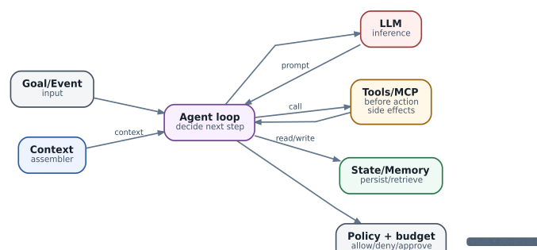

# Что такое агент: цикл, границы и критерии остановки

  
*Agent harness: минимальная операционная анатомия*

Агент полезно определять как процесс, который многократно выбирает следующий шаг на основе цели и наблюдаемого состояния среды. Минимальный цикл выглядит так: `observe → assemble context → decide → act → observe`. Если действие само создаёт новую задачу, цикл превращается в дерево или граф.

### Agent loop

1. Получить входное событие/goal.
2. Загрузить релевантное состояние и policy.
3. Сформировать context.
4. Запросить LLM или deterministic router.
5. Разобрать результат.
6. Проверить budget/policy/approval.
7. Выполнить tool/action.
8. Зафиксировать observation и side effects.
9. Проверить stop condition.
10. Повторить или завершить.

Ошибки чаще всего возникают в пунктах 6-9. Без жёстких stop conditions агент может бесконечно повторять ошибочную операцию. Без idempotency повторный tool call после network timeout способен выполнить действие дважды. Без budget controller безобидная логическая петля превращается в расход GPU/API quota.

### Паттерны

**ReAct** чередует reasoning и действия и хорош там, где следующий шаг зависит от результата предыдущего. **Planner/executor** отделяет построение плана от выполнения, что удобно для контроля и перепланирования. **Router** выбирает специализированный путь. **Supervisor/worker** позволяет одному компоненту держать общую цель, а отдельным агентам - ограниченный контекст и полномочия. **Fan-out/fan-in** эффективен для независимых параллельных проверок. **Evaluator/critic** полезен, когда результат можно формально или полуформально оценить; бесконечная «самокритика» без критерия сходимости - антипаттерн.

**State machine + LLM** обычно надёжнее «полностью автономного» агента в production: deterministic state machine определяет разрешённые переходы, а LLM помогает внутри ограниченного состояния. Это особенно подходит инфраструктурным операциям, где последовательность `collect → diagnose → propose → approve → execute → verify` важнее свободы агента.

### Делегирование не равно масштабирование

Разделять задачу на множество agents стоит только при реальной независимости контекста, tools или ответственности. Если пять агентов вынуждены постоянно обмениваться всей историей, вы получили более дорогую и менее наблюдаемую версию одного агента. AX делает Task дешёвой единицей изоляции, но не отменяет необходимость разумной декомпозиции.
