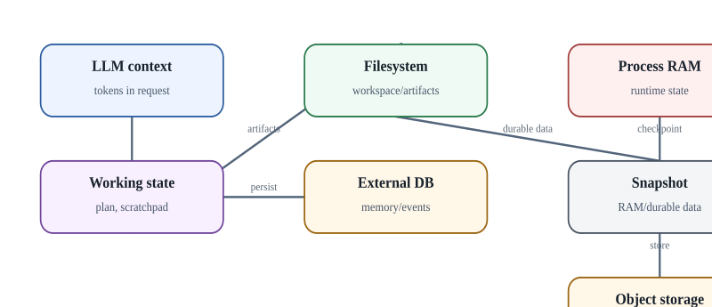

# Context, state, memory и snapshot: не смешивать

  
*Состояние агента: шесть разных сущностей, которые часто ошибочно называют «памятью»*

В agent systems слово «memory» часто скрывает несколько совершенно разных механизмов. Для правильной эксплуатации их нужно разделять.

**LLM context** существует только в рамках конкретного inference request и ограничен context window. **Working state** - текущий plan, cursor, промежуточные результаты и state machine. **Persistent memory** - записи, которые переживают перезапуск и могут быть retrieved. **Workspace** - файлы проекта, artifacts и tool configuration. **Process RAM** - heap/stack конкретного процесса. **Snapshot** - технический checkpoint части runtime state. **External system state** - Git, ticket, router config, DB - authoritative data, которые нельзя «откатить» восстановлением локального snapshot.

### Почему это важно при resume

Если runtime восстанавливает RAM image, TCP connection к внешнему API всё равно может оказаться недействительным: peer закрыл сессию, DNS/IP изменились, token протух. Если AX восстанавливает только durable `/workspace` и запускает новое process tree, агент должен самостоятельно восстановить in-memory progression из файлов/DB. Оба поведения могут называться «resume», но требования к приложению принципиально различаются.

### Рекомендуемая модель состояния

- Authoritative business state - во внешнем durable store или системе назначения.
- Agent progression - в journal/event log или компактном state object.
- Workspace/artifacts - в durable filesystem/object store.
- Prompt/context - производное представление, которое можно пересобрать.
- Snapshot - optimisation для быстрого продолжения, но не единственная копия критического state.

Для инфраструктурного агента особенно опасно считать snapshot транзакцией: после `configure terminal` на роутере и до локального checkpoint внешнее устройство уже изменено. Resume не отменит изменение. Поэтому write actions должны быть журналированы и верифицированы независимо.
