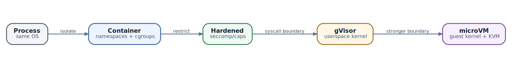

# От Linux process к gVisor и microVM

  
*Лестница изоляции: усиление boundary обычно увеличивает стоимость и сложность*

В главе 7 мы разделили работу между несколькими agents и зафиксировали ownership. Но логическая граница роли ещё не является физической границей выполнения. Два агента могут иметь разные prompts и разные Task IDs, но фактически работать под одним Linux user, видеть общий filesystem и обращаться к одному Docker socket. Тогда компрометация одного участника автоматически разрушает границы остальных.

Представим reviewer, который получает чужой pull request. Чтобы проверить изменение, он запускает package manager, compiler и test suite. Любой из этих шагов может выполнить код из repository: post-install script, build plugin, test fixture или бинарник из dependency. Если такой workload видит credential, host filesystem или управляющий socket, одной prompt-инструкции «ничего не ломай» недостаточно.

Главный принцип главы:

**Isolation tier выбирают по возможностям предполагаемого нарушителя и цене компрометации, а не по слову container в архитектурной схеме. Чем меньше доверия к коду и сильнее tenant boundary, тем меньше host interfaces должен видеть workload.**

## Изоляция начинается с threat model

Вопрос «что безопаснее: gVisor или microVM?» поставлен слишком рано. Сначала нужно определить, от кого и что именно защищается.

| Вопрос | Пример для agent workload | Почему это меняет выбор |
| --- | --- | --- |
| Какой код считается недоверенным? | Только входной текст; scripts из repository; произвольный бинарник; целый container image | Чем ближе attacker к native code, тем важнее syscall и kernel boundary |
| Какие assets находятся рядом? | Model key, Git credential, source code соседнего tenant, host filesystem, control-plane socket | Sandbox с лишним mount или credential остаётся опасным даже без escape |
| Какой outcome считается компрометацией? | Чтение чужих данных, изменение host, lateral movement, resource exhaustion, скрытая persistence | Разные outcomes требуют разных controls: isolation, egress policy, quotas, audit |
| Кто доверяет host? | Одна внутренняя команда; разные команды; внешние customers | Multi-tenant среда обычно требует более сильной и проверяемой boundary |
| Какая совместимость обязательна? | Обычный CLI; FUSE; eBPF; custom kernel module; GPU; nested container | Некоторые capabilities несовместимы с более узким System API |
| Какова цена overhead? | Один долгий job или тысячи коротких sandboxes | Startup, memory и density могут быть важнее средней CPU throughput |

Threat model полезно записать одной проверяемой фразой. Например:

```
Недоверенный build script может получить полный контроль внутри sandbox,
но не должен читать host/neighbor data, обращаться к control plane,
использовать неразрешённый egress или удерживать ресурсы после deadline.
```

Такая формулировка сразу показывает, что одного механизма недостаточно. Kernel isolation уменьшает шанс escape. Filesystem mounts определяют доступные данные. Network policy ограничивает exfiltration. IAM и short-lived credentials ограничивают полномочия. cgroups и deadlines защищают availability.

## Boundary, policy и resource control решают разные задачи

В разговорах об isolation часто смешивают четыре понятия.

- **Isolation boundary** определяет, какой код и какое состояние отделяют workload от host или соседа.
- **Authorization policy** определяет, какие действия workload имеет право выполнять.
- **Resource control** ограничивает CPU, memory, I/O, процессы и время.
- **Packaging** доставляет executable, libraries и filesystem image.

Container image в первую очередь является форматом упаковки. Namespaces и security settings добавляют изоляцию. cgroups дают учёт и limits. Ни один из этих элементов сам по себе не доказывает, что hostile workload безопасно запускать рядом с чужими данными.

Полезная проверка проста: предположите, что код внутри получил root относительно собственного окружения. Какие host interfaces остаются доступны? Видит ли он devices, privileged syscalls, host network, metadata service, Unix sockets, writable mounts или secrets? Именно этот список, а не название runtime, описывает реальную boundary.

## Linux process: дешёвая граница для доверенного кода

Обычный process получает отдельное virtual address space и собственный набор file descriptors, но разделяет host kernel, filesystem namespace, network namespace и многие системные ресурсы с другими процессами. Unix permissions, отдельный UID/GID, ограниченный working directory и service manager уже дают полезную operational boundary.

Process isolation подходит, когда:

- код собран и контролируется одной доверенной командой;
- нет выполнения произвольных repository scripts или пользовательских binaries;
- секреты и файлы разделены обычными OS permissions;
- ошибка процесса опасна для job, но не должна считаться hostile attack;
- важны минимальный startup latency и простая диагностика.

Но process не создаёт самостоятельную security boundary против кода с тем же user. Такой код может читать доступные тому же UID файлы, посылать signals, исследовать `/proc`, наследовать environment и использовать все разрешённые host syscalls. Отдельный PID не означает отдельный trust domain.

Практический пример: model adapter, написанный вашей командой и не загружающий plugins, можно запускать как service process. Test runner для внешнего pull request - уже другой класс риска.

## Container: Linux primitives, собранные в один runtime contract

Обычный OCI container запускает Linux process на host kernel, но меняет его представление системы.

| Механизм | Что ограничивает | Чего не гарантирует |
| --- | --- | --- |
| PID namespace | Видимость и нумерацию процессов | Защиту от уязвимости shared kernel |
| Mount namespace | Дерево mounts и root filesystem | Безопасность намеренно проброшенного hostPath |
| Network namespace | Interfaces, routes, ports и sockets | Запрет egress без отдельной policy |
| User namespace | Отображение UID/GID container в непривилегированные host IDs | Автоматическую совместимость со всеми volumes и devices |
| cgroups | Учёт и limits CPU, memory, I/O, PIDs | Confidentiality или syscall isolation |
| Capabilities | Дробление полномочий root | Безопасность при возврате широких capabilities |
| seccomp | Allow/deny для host syscalls | Полноценный sandbox и business authorization |
| AppArmor/SELinux | Mandatory access policy для файлов и других объектов | Корректную policy без сопровождения и тестов |

Kernel documentation прямо подчёркивает: seccomp filter уменьшает доступную syscall surface, но сам по себе не является sandbox. `no_new_privs` запрещает `execve()` выдавать новые privileges через setuid, setgid или file capabilities и позволяет непривилегированному процессу безопаснее устанавливать seccomp filters. Это два слоя defense in depth, а не замена namespaces, LSM и правильным mounts.

### Root внутри container и root на host - не одно и то же

Без user namespace UID 0 внутри container часто остаётся UID 0 с точки зрения host kernel, хотя namespaces и capability set ограничивают его действия. User namespace отображает container root в непривилегированный host UID. Rootless runtime идёт дальше: и daemon/runtime, и containers работают без host root, уменьшая последствия compromise управляющего процесса.

Rootless mode не превращает любое сочетание mounts и network в безопасное. Он также имеет ограничения совместимости и требует корректного UID/GID mapping. Но для agent execution это важный вопрос: почему runtime вообще должен иметь host root, если workload не требует devices или privileged setup?

### Опасные настройки отменяют boundary

| Настройка | Что открывает | Типичный риск |
| --- | --- | --- |
| `privileged: true` | Широкие capabilities и ослабление kernel constraints | Container становится почти host process с дополнительной упаковкой |
| `hostPID` / `hostNetwork` | Host process или network view | Разведка, interference, обход предполагаемой network boundary |
| Docker/containerd socket | Управление новыми containers и mounts | Практически эквивалент host administration |
| Writable broad `hostPath` | Host files вне workspace | Persistence, credential theft, повреждение node |
| `CAP_SYS_ADMIN` | Большой набор kernel operations | Резкое расширение attack surface |
| Unconfined seccomp/LSM | Полная host syscall surface | Больше путей к kernel vulnerabilities |
| Device passthrough | Driver и device interface | Новая attack surface вне обычного runtime |
| Long-lived broad secret | External authority | Exfiltration без необходимости sandbox escape |

Особенно опасен управляющий socket. Если agent может попросить Docker запустить новый privileged container с mount `/`, то ограничения текущего container не имеют смысла.

### Минимальный hardened Pod profile

Конкретная production policy зависит от workload, но разумная исходная точка выглядит так:

```
apiVersion: v1
kind: Pod
metadata:
  name: bounded-agent
spec:
  automountServiceAccountToken: false
  containers:
    - name: agent
      image: registry.example/agent@sha256:...
      securityContext:
        runAsNonRoot: true
        allowPrivilegeEscalation: false
        readOnlyRootFilesystem: true
        capabilities:
          drop: ["ALL"]
        seccompProfile:
          type: RuntimeDefault
      resources:
        requests:
          cpu: "250m"
          memory: "256Mi"
        limits:
          cpu: "2"
          memory: "2Gi"
```

К этому обычно добавляются отдельный writable workspace, tmpfs с limit, default-deny egress, short-lived identity и deadline. Manifest не является универсальным рецептом: test runner может потребовать write в workspace, а browser - дополнительные syscalls. Любое ослабление должно быть связано с конкретной capability и покрыто тестом.

## Почему hardened container всё ещё разделяет host kernel

У namespaces и seccomp есть принципиальная граница: разрешённый syscall всё равно обрабатывает host kernel. Container runtime может сократить доступную поверхность, но не заменяет реализацию kernel API.

Для trusted internal service этого часто достаточно. Для hostile native code риск иной: attacker целенаправленно ищет ошибку в разрешённом syscall, filesystem или device path. Чем больше kernels, drivers и privileged helpers доступны на node, тем сложнее доказать containment.

Здесь появляются два разных подхода:

- gVisor ставит перед host kernel отдельный application kernel, который реализует Linux-like System API в userspace;
- microVM помещает workload за guest kernel и virtual hardware boundary, используя hardware virtualization.

## Три пути syscall

```
container: app -> allowed syscall -> host kernel

gVisor:    app -> Sentry / application kernel
                    -> restricted host calls -> host kernel

microVM:   app -> guest kernel -> virtual device / VMM
                    -> KVM -> host kernel
```

Диаграмма упрощает детали, но показывает главное. В обычном container разрешённый syscall приходит в host kernel. В gVisor приложение видит System API, реализованный Sentry; host calls выбирает уже Sentry. В microVM приложение обращается к отдельному guest kernel, а host взаимодействует с VMM и KVM через virtual devices и VM exits.

## gVisor: application kernel между workload и host

gVisor предоставляет OCI runtime `runsc`, поэтому снаружи sandbox выглядит как container workflow. Внутри архитектура принципиально отличается от `runc`.

- **Sentry** реализует Linux-like system interface: syscalls, memory management, signals, process model, filesystems и networking.
- **Platform** перехватывает syscalls и page faults. Поддерживаемые варианты имеют разные требования к hardware и performance.
- **Gofer** посредничает при доступе к host-backed filesystem resources.
- **Netstack** реализует network stack в userspace и связывает его с virtual network devices.

Ключевое свойство: syscall sandboxed application не передаётся в host kernel с исходными аргументами. Sentry обрабатывает его по собственной модели и при необходимости делает ограниченные host calls от своего имени. Для escape attacker должен пройти дополнительную независимую реализацию System API, а затем host boundary.

Это не означает абсолютную безопасность. gVisor сам является сложным software и опирается на host kernel. Он не устраняет hardware side channels, ошибки configuration, unsafe mounts, egress и credential leakage. Его security model прямо говорит: sandbox не заменяет secure architecture.

### Systrap и KVM platform внутри gVisor

Термин KVM здесь легко спутать с microVM. gVisor KVM platform использует hardware virtualization для address-space switching и interception, но сохраняет gVisor process model: отдельного conventional guest kernel и virtual machine device model не появляется.

Systrap использует seccomp trap mechanism для перехвата syscalls и не требует hardware virtualization. Официальная документация рекомендует выбирать platform по среде: на bare metal KVM может давать лучший профиль, а внутри VM или без virtualization support практичнее Systrap. Nested virtualization способна сделать KVM platform медленнее.

Не фиксируйте историческое знание вроде «gVisor всегда использует ptrace». Текущая default platform - Systrap, а ptrace больше не является рекомендуемым вариантом. Runtime choice нужно проверять по pinned release и реальной конфигурации node.

### Совместимость - часть security decision

gVisor стремится запускать обычные Linux binaries без модификаций, но не реализует каждый syscall, файл в `/proc`/`/sys` и каждый device path. Иногда несовместимость полезна: workload не получает kernel feature, которую platform не собиралась предоставлять. Иногда она блокирует легитимный tool.

Проверять нужно не абстрактный language runtime, а полный execution path:

- package manager и post-install scripts;
- compiler, linker и test runner;
- filesystem watchers, FUSE и special files;
- browser sandbox nesting;
- debugger, profiler и tracing tools;
- network behavior под высокой concurrency;
- GPU или другой device interface;
- checkpoint/restore именно вашего runtime.

Performance тоже зависит от профиля. Syscall-heavy filesystem или network workload может платить больше, чем compute-heavy process, который долго работает в userspace. Поэтому «gVisor медленнее на N процентов» без benchmark shape почти бессмысленно.

### Когда gVisor является разумным tier

gVisor часто подходит для:

- выполнения test suites и build scripts из недоверенного repository;
- sandboxed code interpreter и browser automation;
- multi-tenant agents, где важна высокая density;
- коротких или suspendable workloads, для которых full VM management слишком тяжёл;
- сред, где OCI integration важнее полной Linux kernel compatibility.

Он менее удобен, когда workload требует custom kernel behavior, broad device access или features, которых нет в реализованном System API. Тогда нужно либо сузить workload, либо выбрать другую boundary, а не отключать protections случайными flags.

## microVM: отдельный guest kernel и минимальный virtual hardware

MicroVM использует hardware virtualization и запускает отдельный guest kernel. VMM предоставляет ограниченный набор virtual devices и связывает их с host resources. В сравнении с general-purpose VM уменьшаются device model, boot path и management surface, но фундаментальная VM boundary сохраняется.

Firecracker - пример специализированного VMM для microVM. Он не является Kubernetes runtime сам по себе. Firecracker предоставляет machine model и API для lifecycle, а integration layer должен решить image preparation, network, storage, logging, credentials, snapshot lifecycle и scheduling.

Kata Containers решает другую задачу: даёт OCI/CRI-compatible runtime, который запускает container workload внутри lightweight VM. Kata может использовать разные hypervisors, включая QEMU, Cloud Hypervisor и Firecracker. Поэтому корректное сравнение выглядит так:

| Компонент | Главная роль | Что видит platform engineer |
| --- | --- | --- |
| gVisor / `runsc` | Application kernel и OCI runtime | Sandboxed container без отдельного guest Linux |
| Firecracker | Minimal VMM | API и machine lifecycle, вокруг которых строится runtime |
| Kata Containers | Container runtime поверх lightweight VMs | OCI/CRI integration и Pod-like UX с VM boundary |
| KVM | Host kernel virtualization interface | Низкоуровневый механизм, которым пользуются VMM |

### Что приходится эксплуатировать дополнительно

Отдельный guest kernel приносит более сильную boundary, но добавляет систему:

- guest kernel и root filesystem нужно собирать, обновлять и сканировать;
- virtual network и block devices требуют provisioning;
- memory reserve и Pod overhead должны учитываться scheduler;
- логи и metrics проходят через guest/host boundary;
- debugging требует понимания guest и VMM;
- hardware virtualization должна быть доступна на node;
- nested virtualization в cloud VM или lab может отсутствовать либо иметь высокий overhead.

На Proxmox/KVM lab это означает отдельную проверку: видит ли Kubernetes node virtualization extensions, разрешён ли `/dev/kvm`, совместимы ли CPU flags и не запрещает ли provider nested virtualization. Успешный запуск обычного container ничего об этом не говорит.

### Snapshot microVM не равен backup всей задачи

Firecracker snapshot разделяет VM state и guest memory; attached block devices и внешние resources управляются отдельно. Restore также зависит от совместимости CPU features, host kernel, VMM/device model и доступности прежних tap, block и vsock endpoints.

Следовательно, snapshot contract должен включать:

- VMM и snapshot format version;
- CPU architecture и допустимый feature baseline;
- guest kernel/image digest;
- block device identities;
- network reattachment и connection semantics;
- encryption, integrity и access policy для memory image;
- reconciliation внешних side effects после resume.

Memory snapshot может содержать tokens, private keys и пользовательские данные. Его следует считать secret-bearing artifact. CRC защищает от случайной порчи, но не является authenticity или confidentiality control.

И ещё одна граница из главы 5: snapshot возвращает вычислительное состояние, но не откатывает Git remote, ticket, payment или DNS. После restore agent обязан сверить внешнюю реальность.

## Kubernetes RuntimeClass: выбор runtime как platform policy

Kubernetes `RuntimeClass` связывает имя в Pod spec с runtime handler, настроенным в CRI implementation. Это позволяет одному cluster запускать разные workload tiers.

```
apiVersion: node.k8s.io/v1
kind: RuntimeClass
metadata:
  name: gvisor
handler: runsc
---
apiVersion: v1
kind: Pod
metadata:
  name: untrusted-build
spec:
  runtimeClassName: gvisor
  containers:
    - name: runner
      image: registry.example/build-runner@sha256:...
```

Конкретные handler names зависят от containerd/CRI-O configuration. RuntimeClass также может нести scheduling constraints и Pod overhead. Если runtime доступен только на части nodes, class должна направлять Pods на эти nodes и учитывать taints/tolerations.

Создание и изменение RuntimeClass должно оставаться полномочием cluster administrator. Agent не должен выбирать себе менее строгую boundary через tool call. Application передаёт workload classification, а admission/platform policy отображает её на разрешённый runtime.

Полезный contract выглядит так:

```
workload.trust = external-code
workload.devices = none
workload.network = allowlisted-egress
workload.persistence = workspace-only
isolation.required = sandboxed-system-api

platform decision -> RuntimeClass gvisor + policy profile v3
```

Здесь application описывает требования, а не знает имя runtime binary. Это позволяет platform team заменить implementation без изменения agent logic.

## Как выбирать isolation tier

| Tier | Подходящий workload | Основное преимущество | Главное ограничение |
| --- | --- | --- | --- |
| Отдельный process | Доверенный platform code без plugins | Минимальные startup и operational cost | Слабая boundary против hostile code |
| Hardened container | Доверенный image, внутренние tools, ограниченный blast radius | Зрелая OCI/Kubernetes integration и высокая density | Shared host kernel |
| gVisor | Недоверенные scripts/repositories, multi-tenant execution, обычные Linux apps | Дополнительный System API boundary при container UX | Compatibility и workload-dependent overhead |
| microVM/Kata | Hostile tenant code, более строгая kernel boundary, нужен guest Linux | Отдельный guest kernel и hardware isolation | Memory, boot, image, device и operations overhead |
| Отдельный node/cluster | Особо чувствительные assets, privileged devices, сильные regulatory требования | Уменьшение shared failure domain | Стоимость, capacity fragmentation и более сложная operations model |

Выбор не обязан быть глобальным. Одна agentic application может использовать несколько tiers:

- coordinator как trusted process;
- read-only repository analysis в hardened container;
- test execution внешнего code в gVisor;
- редкий kernel-level experiment в microVM на специальном node pool.

Это дешевле и яснее, чем помещать каждый model call в microVM или, наоборот, запускать всё на одном privileged runner.

### Не выбирайте только по слову stronger

Более сильная boundary может ухудшить итоговую безопасность, если ради совместимости команда начинает выдавать broad mounts, devices и permanent credentials. Неработающий debugger иногда приводит к включению privileged mode, а медленный cold start - к бесконечно живущим sandboxes без cleanup.

Сравнивайте end-to-end profile:

- startup и resume latency;
- idle и peak memory;
- CPU для model-adjacent tools, build и tests;
- filesystem metadata и small-file I/O;
- network throughput и connection churn;
- sandbox density на node;
- compatibility failure rate;
- операционное время на обновления и incident recovery.

Benchmark должен использовать тот же repository size, dependency cache, language toolchain, network policy и concurrency, что production. Microbenchmark одного syscall помогает объяснить механизм, но не выбирает platform за вас.

## Isolation не заменяет capability security

Sandbox может идеально удержать process и всё равно позволить ему легально украсть данные через разрешённые interfaces. Если agent видит production database password и arbitrary Internet egress, escape не нужен.

Для каждого sandbox отдельно проектируются:

- **Filesystem:** какие paths read-only, какие writable, что является disposable, что сохраняется.
- **Network:** default deny, allowlisted destinations, DNS behavior, proxy и metadata endpoint.
- **Identity:** short-lived token, audience, scope, rotation и revocation.
- **Tools:** read/write capabilities, approval и idempotency.
- **Data:** какие artifacts можно вернуть из sandbox и кто их проверяет.
- **Time:** deadline, idle timeout, cancellation и гарантированный cleanup.

Prompt injection действует на уровне решений агента. Sandbox containment действует на уровне исполнения. Они дополняют друг друга: policy должна предполагать, что model уже убеждена выполнить худшее разрешённое действие.

## Lifecycle: stop, pause, suspend и destroy

Isolation tier влияет не только на security, но и на lifecycle semantics.

- **Stop** прекращает выполнение, но может оставить filesystem и metadata.
- **Pause** временно не планирует CPU, сохраняя resources занятыми.
- **Suspend** сериализует достаточное состояние и освобождает часть capacity.
- **Destroy** удаляет execution boundary, но не обязательно external artifacts.

Для process/container checkpoint обычно тесно связан с host kernel state. Для gVisor и microVM runtime может контролировать больше state, но portability всё равно зависит от version, architecture, filesystem и network. Любой suspend/resume contract должен явно отвечать:

1. Какие bytes сохраняются?
2. Кто шифрует и авторизует snapshot?
3. На каких hosts его можно восстановить?
4. Что происходит с TCP connections и open files?
5. Как обнаруживается partial restore?
6. Как сверяется внешний мир после resume?

## Observability через границу

Сильная isolation усложняет диагностику. Host видит VMM или Sentry, а не всегда каждый guest process привычным способом. Debug interface, который обходит boundary, легко становится новым escape path.

Production design должен заранее определить:

- correlation IDs от Task до sandbox, process и tool call;
- structured stdout/stderr без доверия к содержимому;
- CPU, memory, I/O, process count и network metrics;
- runtime events: create, start, OOM, policy deny, checkpoint, restore, destroy;
- audit mounts, RuntimeClass, image digest и security profile version;
- способ получить crash artifact без broad shell access;
- redaction до вывода logs за tenant boundary.

Фраза «sandbox упал» так же бесполезна, как «агент завис». Нужно знать, завершился ли guest process, сработал ли seccomp/LSM deny, случился ли OOM, потерялся ли VMM, не восстановился ли snapshot или platform отменила Task по deadline.

## Как тестировать isolation layer

### Compatibility suite

Соберите representative corpus: языковые runtimes, package managers, browsers, compilers, filesystem patterns и network clients. Тестируйте pinned images на каждом runtime tier. Ошибка compatibility должна быть видима до production routing.

### Negative security tests

Проверяйте не только успешный job, но и запрещённые действия:

- чтение host paths и соседнего workspace;
- доступ к container runtime socket и Kubernetes API;
- обращение к cloud metadata;
- egress к неразрешённому endpoint;
- создание слишком большого числа процессов;
- mount, namespace escape primitives и forbidden syscalls;
- сохранение процесса после cancellation;
- чтение snapshot другим tenant.

Тест считается успешным, когда действие отклонено ожидаемым control, а событие видно в audit. Просто получить non-zero exit code недостаточно: отказ мог произойти случайно.

### Resource abuse

Запускайте fork bomb, memory pressure, disk fill, file descriptor exhaustion и network flood в controlled lab. Проверяйте, что страдает sandbox, а не node control plane или соседние workloads. Отдельно тестируйте cleanup после OOM и hard kill.

### Upgrade и restore matrix

Для stateful sandbox нужны тесты N-1/N/N+1: runtime version, host kernel, CPU pool, guest image и snapshot format. Если поддерживается только same-version restore, это допустимый contract, но он должен влиять на rollout strategy.

## AX и Agent Substrate

В AX `Task` является минимальной единицей isolated execution. Task описывает image, command, resources и Workspace bindings, но application не должна считать любой Task автоматически достаточной boundary для любого threat model.

Agent Substrate предоставляет runtime layer и в текущей архитектуре поддерживает несколько sandbox backends, включая gVisor и microVM path. Его Actor/Worker model позволяет отделить logical actor от физической capacity, а suspend/resume - освобождать Worker, когда agent простаивает.

Граница ответственности выглядит так:

- application классифицирует workload, данные и требуемые capabilities;
- AX создаёт декларативную Task и управляет её lifecycle;
- platform policy выбирает допустимый sandbox profile;
- Agent Substrate размещает Actor на совместимом Worker и выполняет runtime operations;
- Kubernetes управляет nodes, worker Pods, scheduling prerequisites и cluster-level isolation.

Не следует превращать current implementation в вечную спецификацию. AX и Agent Substrate остаются pre-1.0; Sandbox/SandboxConfig и policy surfaces развиваются. Для production design нужно фиксировать commit/release и проверять реальный backend, а не только design goal.

Особенно важно не путать runtime snapshot с application recovery. Substrate может вернуть process memory и filesystem, но harness всё равно отвечает за state schema, leases, idempotency и reconciliation внешних операций.

## Практикум: безопасная проверка недоверенного pull request

Задача: agent получает pull request из внешнего fork, исследует diff, запускает tests и возвращает report. Merge и публикация запрещены.

### Шаг 1. Зафиксировать trust и assets

```
trust:
  repository_code: hostile
  base_image: platform-signed
assets:
  readable:
    - source snapshot at exact commit
    - public dependency mirror
  forbidden:
    - host filesystem
    - Kubernetes API
    - production credentials
    - other tenant workspaces
side_effects:
  allowed:
    - write ephemeral workspace
    - upload test report artifact
```

### Шаг 2. Разделить setup и execution

Trusted setup component получает repository через platform-controlled fetch и создаёт immutable input artifact. Недоверенный build не получает Git credential. Dependency access идёт через allowlisted mirror. Это уменьшает authority ещё до выбора runtime.

### Шаг 3. Выбрать tier

Hardened container может быть baseline для внутреннего trusted repository. Для внешнего fork выбран gVisor: обычный toolchain совместим, нужен container UX и высокая parallel density. MicroVM остаётся отдельным profile для workloads, которым требуется guest kernel или более строгая tenant boundary.

### Шаг 4. Ограничить окружение

- read-only source input и отдельный ephemeral writable workspace;
- нет service account token и runtime socket;
- all capabilities dropped, no privilege escalation;
- default-deny egress с dependency mirror и artifact endpoint;
- CPU, memory, PID, disk и wall-clock budgets;
- output size limit и content scanning;
- destroy после report независимо от результата tests.

### Шаг 5. Проверить boundary отрицательными тестами

В repository добавляется test fixture, который пытается прочитать host path, metadata endpoint и соседний artifact, затем создаёт process storm. Ожидаемый результат - каждый путь блокируется конкретным control, node остаётся healthy, audit связывает deny с Task ID.

### Шаг 6. Измерить цену

Сравните hardened container, gVisor и microVM на одном corpus:

- p50/p95 start-to-first-command;
- полное время install/build/test;
- peak и idle memory;
- node density при целевой concurrency;
- доля несовместимых repositories;
- время cleanup и recovery после kill.

Решение документируется не как «gVisor безопаснее container», а как verified contract: какие attacks проверены, какие interfaces доступны, какой overhead измерен и когда routing повышает tier до microVM.

## Типичные антипаттерны

**Container means safe.** Название packaging format принимается за доказательство containment.

**Privileged for compatibility.** Любую несовместимость лечат отключением security controls.

**Docker socket as a tool.** Agent получает host-level authority, чтобы запускать вложенные workloads.

**One tier for everything.** Model call, trusted controller и hostile build запускаются с одинаковой дорогой boundary.

**Sandbox with production secrets.** Escape закрыт, но легальный egress позволяет украсть credentials.

**Snapshot equals rollback.** Restore process state считают откатом внешних side effects.

**Benchmark without workload shape.** Решение принимают по чужому syscall microbenchmark.

**Debug by bypass.** Для диагностики навсегда добавляют broad shell, host mount или privileged sidecar.

**Runtime selected by agent.** Недоверенный workload может сам выбрать менее строгий RuntimeClass.

**Node is infinite.** Security обсуждают без PID, memory, disk и time limits.

## Checklist выбора и эксплуатации

1. Какой exact code считается hostile?
2. Какие host и tenant assets находятся рядом?
3. Можно ли убрать capability вместо усиления sandbox?
4. Какие mounts, devices, sockets и credentials видит workload?
5. Есть ли user namespace/rootless path?
6. Какие syscalls и LSM rules реально применены?
7. Нужен ли отдельный System API boundary или guest kernel?
8. Какие features toolchain несовместимы с выбранным runtime?
9. Кто выбирает RuntimeClass и можно ли обойти policy?
10. Как ограничены egress, metadata и control-plane access?
11. Как измеряются CPU, memory, PIDs, disk и deadline?
12. Что сохраняет snapshot и какие secrets в нём остаются?
13. На каких CPU/kernel/runtime versions разрешён restore?
14. Как sandbox уничтожается после success, failure и cancellation?
15. Какие negative tests доказывают containment?
16. Какой end-to-end overhead измерен на production-like workload?

## Итоги главы

- Isolation tier выбирается по threat model, а не по названию runtime.
- Process подходит для доверенного кода, но не является tenant boundary против hostile code.
- Container объединяет namespaces, cgroups и security controls, сохраняя shared host kernel.
- cgroups управляют resources; seccomp уменьшает syscall surface; ни один из них отдельно не является полным sandbox.
- Privileged mode, broad host mounts, devices и runtime sockets способны отменить container boundary.
- gVisor реализует Linux-like System API в Sentry и даёт дополнительную boundary при OCI workflow.
- gVisor Systrap и KVM platform - способы interception, а не две разновидности microVM.
- MicroVM добавляет guest kernel и hardware virtualization, но требует VMM, images, devices и более сложной operations model.
- Firecracker является VMM building block; Kata Containers предоставляет container runtime integration поверх lightweight VMs.
- RuntimeClass позволяет platform policy выбирать runtime и учитывать scheduling/overhead.
- Sandbox не заменяет egress policy, IAM, filesystem scoping, short-lived credentials и tool authorization.
- Snapshot содержит чувствительное runtime state и не откатывает внешний мир.
- Проверять нужно compatibility, containment, resource abuse, restore и end-to-end cost.
- В AX и Agent Substrate application классифицирует workload, а platform обеспечивает выбранную physical boundary и lifecycle.

**Дальше.** Мы выбрали границу выполнения, но ещё не разобрали substrate, который размещает такие workloads на nodes, связывает их сетью и постоянно приводит actual state к desired. Следующая глава даст необходимый минимум Kubernetes для понимания AX и Agent Substrate.

### Источники и дальнейшее чтение

- [Linux kernel: Seccomp BPF](https://docs.kernel.org/userspace-api/seccomp_filter.html) - назначение syscall filtering и прямое предупреждение, что seccomp сам по себе не является sandbox.
- [Linux kernel: No New Privileges Flag](https://docs.kernel.org/userspace-api/no_new_privs.html) - semantics `no_new_privs` и связь с `execve`.
- [Linux kernel: Control Group v2](https://docs.kernel.org/admin-guide/cgroup-v2.html) - resource hierarchy и cgroup namespace.
- [Docker Engine security](https://docs.docker.com/engine/security/) - namespaces, capabilities, daemon surface и container configuration.
- [Docker Rootless mode](https://docs.docker.com/engine/security/rootless/) - user namespaces и runtime без host root.
- [gVisor: Introduction to security](https://gvisor.dev/docs/architecture_guide/intro/) - Sentry, Gofer и dual-kernel security model.
- [gVisor: Platform Guide](https://gvisor.dev/docs/architecture_guide/platforms/) - Systrap, KVM platform и требования среды.
- [gVisor: Security Model](https://gvisor.dev/docs/architecture_guide/security/) - boundaries, assumptions и ограничения sandbox.
- [gVisor: Performance Guide](https://gvisor.dev/docs/architecture_guide/performance/) - structural и implementation costs.
- [Firecracker Design](https://github.com/firecracker-microvm/firecracker/blob/main/docs/design.md) - VMM architecture, device model и threat containment.
- [Firecracker Snapshotting](https://github.com/firecracker-microvm/firecracker/blob/main/docs/snapshotting/snapshot-support.md) - memory/state files, external resources и security responsibilities.
- [Firecracker Snapshot Versioning](https://github.com/firecracker-microvm/firecracker/blob/main/docs/snapshotting/versioning.md) - CPU, host kernel и device compatibility.
- [Kata Containers Architecture](https://katacontainers.io/software/) - OCI/CRI runtime поверх lightweight VMs.
- [Kubernetes RuntimeClass](https://kubernetes.io/docs/concepts/containers/runtime-class/) - runtime handlers, scheduling и Pod overhead.
- [Kubernetes: Linux kernel security constraints](https://kubernetes.io/docs/concepts/security/linux-kernel-security-constraints/) - seccomp, AppArmor, SELinux и privileged containers.
- [AX Core concepts](https://github.com/google/ax/blob/main/docs/concepts.md) - Task как smallest unit of isolated execution.
- [Agent Substrate](https://github.com/agent-substrate/substrate) - gVisor/microVM backends, Actor/Worker и suspend/resume.
