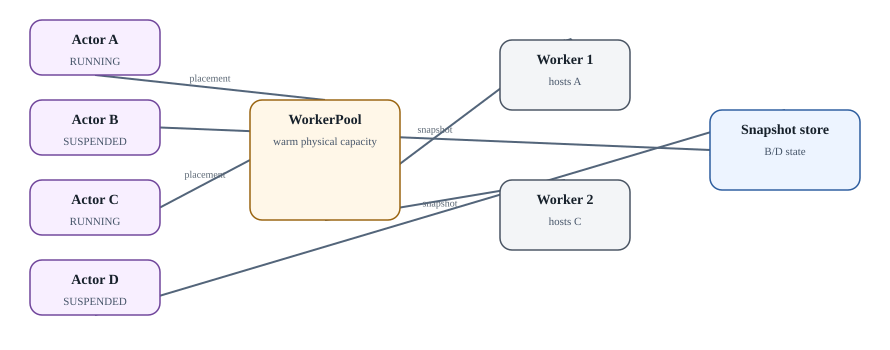

# Actor model применительно к агентным workload

  
*Actor ≠ Worker: logical population can be larger than active capacity*

Actor в Substrate полезно понимать как **логически долгоживущую identity + state**, которая не обязана постоянно занимать физический process/Pod. Worker - физическая capacity, готовая выполнить Actor. Это главное отличие от интуитивной модели «один agent = один Pod навсегда».

### Почему это подходит agents

Типичный агент много времени ждёт: человека, external tool, webhook, следующую задачу. Если каждый idle agent удерживает 1-4 GiB RAM, плотность системы быстро упирается в hardware. Если runtime умеет checkpoint state, освободить Worker и позже восстановить Actor, logical population может быть существенно больше active capacity.

### ActorTemplate

`ActorTemplate` - immutable blueprint: image, sandbox class/config, resources, volumes, snapshot policy и другие runtime параметры. Из него создаётся golden snapshot. Изменение workload должно приводить к новой версии template, а не к мутации state root под существующими actors.

### WorkerPool

WorkerPool описывает физическую warm capacity и в Substrate связан с Kubernetes objects. Matching sandbox class и selectors определяют, на какие workers может попасть Actor. Именно здесь появляются capacity planning, oversubscription и queueing.

### Dormant Actor

Suspended Actor продолжает существовать в control plane и object storage, но не занимает active Worker. Его можно разбудить explicit API call или сетевым запросом через routing layer. Это не serverless function в классическом смысле: Actor имеет durable identity и state lineage.
