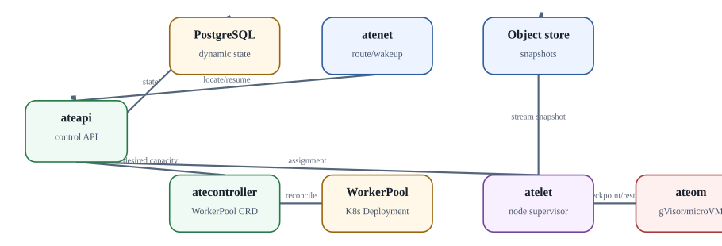

# Agent Substrate: назначение и operational architecture

**Статус:** `IMPLEMENTED / VERIFIED` · `MAIN DELTA where noted` · `ROADMAP kept separate`

  
*Agent Substrate: operational data path*

Agent Substrate позиционируется как runtime для большого количества sandboxed stateful actors поверх Kubernetes. Он намеренно не является agent SDK: внутренняя reasoning logic остаётся приложению. Его задача - lifecycle, placement, isolation, snapshot/restore и routing.

### Основные компоненты current architecture

- `ateapi` - control API.
- `atecontroller` - reconciliation Kubernetes-side WorkerPool resources.
- `atelet` - supervisor на node/worker side, координирующий lifecycle и snapshot transfer.
- `ateom` - runtime management внутри worker path; варианты gVisor и microVM.
- `atenet` - networking/routing, включая wake-on-request path.
- PostgreSQL - dynamic Actor/Worker state в текущей архитектуре.
- Object storage - snapshot blobs. В local Kind quickstart проект разворачивает RustFS; cloud deployments могут использовать GCS/S3-compatible path.

### Важная оговорка о документации

Architecture document Substrate прямо предупреждает, что значительная часть описания aspirational и может ещё не быть реализована. Поэтому книгу нельзя использовать как «contract по каждой стрелке». Для production baseline проверяются release notes, API guide и реальное поведение на pinned версии.

### Project claims и sizing

README заявляет очень высокую density, sub-500ms resume и высокую suspend/resume throughput. Эти цифры полезны как направление design goals, но не как sizing input. Реальная latency зависит от snapshot size, object-store bandwidth, sandbox backend, node locality, CPU pressure и workload readiness. Мы будем benchmark'ить собственный path.

### Источники и дальнейшее чтение

- [Substrate README](https://github.com/agent-substrate/substrate/blob/main/README.md)
- [Substrate architecture](https://github.com/agent-substrate/substrate/blob/main/docs/architecture.md)
- [Substrate API guide](https://github.com/agent-substrate/substrate/blob/main/docs/api-guide.md)
