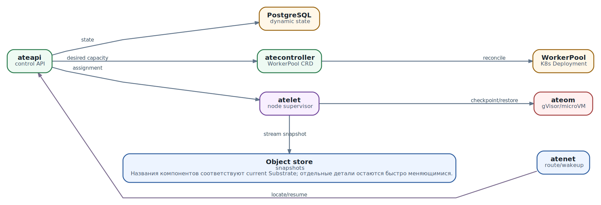

# Agent Substrate: как устроен runtime для stateful Actors

**Статус:** `CURRENT ARCHITECTURE` · `OPERATIONS FIRST` · `LIMITS MADE EXPLICIT`

В предыдущей главе мы отделили классическую Actor model от конкретной реализации Agent Substrate. Теперь можно пройти по системе изнутри. Представим, что HTTP-запрос адресован Actor, который сейчас не занимает CPU, не привязан к Worker и существует только как запись в control plane плюс snapshot в object storage. Что должно произойти, чтобы запрос получил ответ? Какие компоненты участвуют в этом пути? Где находится истина о состоянии? Что случится, если свободного Worker нет, PostgreSQL недоступен или snapshot повреждён?

Именно на эти вопросы отвечает operational architecture. Названия процессов сами по себе мало полезны. Инженеру важнее понимать ответственность каждого компонента, границы согласованности и цену каждого перехода. Тогда можно решить, подходит ли Substrate workload, выбрать sandbox class, оценить capacity, сформулировать SLO и диагностировать сбой без хаотичных перезапусков.

## Что читатель должен унести из главы

После этой главы вы сможете:

- объяснить, зачем Substrate добавляет специализированный control plane поверх Kubernetes;
- разделить infrastructure plane, Actor control plane и request data path;
- проследить холодный и тёплый путь запроса от `atenet-router` до процесса Actor;
- различать `pause`, `suspend`, `resume`, `revert` и `delete` по их эксплуатационным последствиям;
- понимать, какую часть состояния держат PostgreSQL, object storage, Kubernetes и само приложение;
- проектировать capacity, telemetry и runbook вокруг реальных failure modes;
- не принимать показатели из README или architecture roadmap за гарантию для своего кластера.

## Какую проблему решает Substrate

Обычный Kubernetes хорошо управляет сравнительно небольшим числом Pod, которые живут минуты, часы или дни. Для agent-like workload профиль часто другой: логических исполнителей много, большинство долго ждёт пользователя, модели или события, а активные периоды короткие и всплесковые. Если каждому логическому исполнителю постоянно держать отдельный Pod, оплачиваются idle memory, Pod IP, записи control plane и лимиты node даже тогда, когда полезной работы нет.

Substrate вводит два разных объекта. **Actor** - долговечная логическая единица с identity и состоянием. **Worker** - заранее поднятая физическая ёмкость, способная временно исполнять Actor. Большое множество Actors отображается на меньшее множество Workers. Когда Actor не нужен, его execution state можно вынести в snapshot и освободить Worker. Когда приходит запрос, Actor восстанавливается на свободном Worker.

Это не бесплатная оптимизация. Мы экономим постоянно зарезервированный compute, но получаем новые задачи: атомарное назначение Worker, перемещение snapshot, маршрутизацию к меняющемуся location, защиту от смешивания состояний разных Actors, наблюдаемость через несколько activation и управление очередью при дефиците capacity. Substrate полезен только там, где эта цена оправдывается плотностью и характером idle/active workload.

> **Не перепутайте слой.** Substrate не строит agent loop, не выбирает модель, не управляет prompt и не вводит классический mailbox. Это execution runtime для sandboxed, stateful workload. Harness и приложение по-прежнему отвечают за reasoning, tool protocol, идемпотентность бизнес-операций и семантику сообщений.

### Когда специализированный control plane оправдан

Специализированный Actor control plane нужен не потому, что Kubernetes плох. У него другой рабочий диапазон. Создание Pod включает scheduler, admission, image pull, CNI, kubelet и readiness. Это разумный путь для долгоживущей нагрузки, но слишком тяжёлый для activation, которую хотят укладывать в сотни миллисекунд. Кроме того, миллионы часто обновляемых Actor records и snapshot references не следует превращать в миллионы Kubernetes objects.

Поэтому Substrate оставляет Kubernetes то, что тот делает хорошо: nodes, Deployments, DaemonSets, Worker Pods, инфраструктурную изоляцию и low-frequency reconciliation. Частые операции Actor lifecycle идут через отдельный API и state store. Это фундаментальное архитектурное решение, а не деталь реализации.

## Три плоскости системы

Удобно читать архитектуру не как один граф, а как три связанные плоскости.

| Плоскость | Что управляет | Основные компоненты | Характер изменений |
| --- | --- | --- | --- |
| Infrastructure plane | Nodes, Worker Pods, controller deployments, sandbox capacity | Kubernetes, `atecontroller`, WorkerPool CRD, atelet DaemonSet | Секунды и минуты; declarative reconciliation |
| Actor control plane | Actor records, Worker assignments, lifecycle workflows, template metadata | `ateapi`, PostgreSQL | Высокая частота; транзакции и state transitions |
| Request data path | Wake-on-request, выбор текущего Worker, туннель до Actor | `atenet-router`, Envoy `ext_proc`, `atunnel`, Actor | На каждый запрос; latency-sensitive |

Object storage пересекает плоскости: оно не принимает решение о placement, но хранит durable snapshot, без которого suspended Actor не восстановится. `atelet` и `ateom` тоже стоят на границе: control plane инициирует операцию, а фактический checkpoint или restore происходит на node и внутри Worker Pod.

  
*Agent Substrate: operational data path*

## Карта компонентов и ответственности

| Компонент | За что отвечает | Чего от него не ждать |
| --- | --- | --- |
| `ateapi` | gRPC API, lifecycle state machine, выбор и атомарное назначение Worker, orchestration resume/suspend, Actor identity issuance | Не исполняет Actor и не хранит blob snapshot внутри себя |
| PostgreSQL | Динамические Actor и Worker records, state, assignment, version guards, ссылки на snapshot | Не является хранилищем process memory или файловой системы Actor |
| `atecontroller` | Reconcile WorkerPool CRD в Kubernetes resources и warm Worker capacity | Не планирует каждую Actor activation через Kubernetes scheduler |
| `atelet` | Node supervisor, связь control plane с runtime, перенос snapshot, координация checkpoint/restore | Не является глобальной базой placement и не должен самостоятельно назначать чужой Actor |
| `ateom` | Управление sandbox внутри Worker: запуск, checkpoint, restore; варианты для gVisor и microVM | Не решает, какой Actor и на каком Worker должен работать |
| `atenet-router` | Определяет целевой Actor по `ate-target-actor`, вызывает resume/lookup, выбирает backend, паркует retryable requests | Не хранит authoritative Actor state и не заменяет application gateway с пользовательской authz |
| `atunnel` | Принимает аутентифицированный TLS tunnel на Worker и пересылает HTTP к активному Actor через private network | Worker port 80 не становится публичным Actor ingress |
| Object storage | Durable external snapshots: memory, writable rootfs и durable data в зависимости от scope/backend | Snapshot не равен backup всей системы и не откатывает внешние side effects |
| Kubernetes | Жизненный цикл control-plane и Worker Pods, node placement, devices, NetworkPolicy, ресурсы | Не является high-frequency Actor registry |

### Почему Worker уже должен быть тёплым

Главная latency-оптимизация - не создавать Pod при каждом wake-up. Worker Pods заранее запущены и зарегистрированы как свободные. Control plane выбирает подходящий Worker, после чего node-local компоненты восстанавливают sandbox. Kubernetes scheduler находится вне критического пути обычного resume. Он возвращается в путь, когда надо увеличить или восстановить сам пул Workers.

Это означает, что autoscaling WorkerPool не спасает запрос мгновенно. Даже если HPA или cluster autoscaler увидит нагрузку, новые Pod и node появятся позже. Короткий burst должен быть покрыт warm headroom, request parking или admission control верхнего уровня.

## Путь одного запроса: Actor уже работает

Начнём с fast path. Клиент или верхнеуровневый gateway отправляет HTTP-запрос в `atenet-router` и указывает адрес `<atespace>/<actor>` в заголовке `ate-target-actor`. Значение `Host` остаётся authority приложения и не выбирает Actor.

1. Envoy передаёт request headers внешнему процессору router.
2. Router обращается к `ateapi` через `ResumeActor`. Операция также играет роль locate: если Actor уже `RUNNING`, ответ содержит его актуальное Worker assignment.
3. Router открывает mTLS tunnel к `atunnel` на порту 443 выбранного Worker.
4. `atunnel` проверяет router identity и соответствие заголовка Actor, реально назначенному этому Worker.
5. Запрос передаётся по private veth к приложению Actor; ответ идёт обратно тем же путём.

Даже fast path не должен полагаться на кэшированный Pod IP без проверки assignment. Actor может suspend/resume на другом Worker. Location transparency удобна приложению, но инфраструктура обязана разрешать identity в актуальное placement.

## Путь wake-up: Actor suspended

Для suspended Actor request data path превращается в distributed workflow:

```
Client
  -> atenet-router: HTTP + ate-target-actor
  -> ateapi: ResumeActor
  -> PostgreSQL: проверить state и атомарно claim свободного Worker
  -> atelet на выбранной node: Restore
  -> object storage: скачать manifest и snapshot objects
  -> ateom: восстановить sandbox и network
  -> application readiness: Actor способен принять request
  -> ateapi: commit RUNNING + worker assignment
  -> router: открыть mTLS tunnel к atunnel
  -> Actor: исходный HTTP request
```

У этой цепочки есть важное свойство: исходный request удерживается, пока Actor ещё не готов. Нельзя сначала отправить трафик, а затем надеяться, что restore закончится. Граница readiness должна означать готовность приложения обработать запрос, а не только наличие процесса или network namespace.

### Golden snapshot и первый запуск

При создании `ActorTemplate` Substrate может поднять временный golden Actor, дождаться readiness или warm-up interval, suspend его и сохранить опубликованный tag. Новый Actor начинает с ссылки на этот golden snapshot. Первый resume тогда восстанавливает уже прогретое состояние, а не повторяет дорогую инициализацию.

Golden snapshot особенно полезен для загрузки больших зависимостей, инициализации runtime и подготовки read-only caches. Но нельзя бездумно запекать в него краткоживущие credentials, соединения и данные конкретного пользователя. Всё, что попало в memory image или writable layer, размножается вместе с шаблоном. Template следует считать immutable state root; обновление кода обычно означает новый ActorTemplate и новый golden snapshot.

### Cold boot и restore - разные режимы

Если snapshot недоступен, несовместим или Actor создан до готовности golden tag, система может идти через cold boot, если это допускает конкретная конфигурация и lifecycle. Cold boot заново запускает OCI workload. Restore возвращает process memory и filesystem state из checkpoint. Эти пути имеют разную latency, разные failure modes и должны различаться в telemetry. Метрика "Actor started" без признака `cold`/`restore` скрывает самое важное.

## Что происходит при дефиците Worker

Oversubscription означает, что свободный Worker иногда отсутствует. Это не обязательно авария: другой Actor может освободить capacity через несколько сотен миллисекунд. Текущий router поддерживает **request parking**. При `ResourceExhausted`, некоторых transient `FailedPrecondition`, `Aborted` и `Unavailable` он может удержать request и повторять resume с backoff.

Parking имеет ограниченный budget и ограниченный parking lot. По умолчанию документация описывает budget 5 секунд и максимум 1024 parked requests, но production должен явно закрепить эти параметры и проверить их для выбранной версии. Запросы к одному Actor дедуплицируются на один in-flight resume call, хотя каждый клиентский request занимает отдельный parking slot.

| Ситуация | Поведение | Что увидит оператор |
| --- | --- | --- |
| Actor уже RUNNING | Fast path, parking slot не нужен | Низкая router latency |
| Нет свободного Worker, но скоро появился | Request ждёт и обслуживается | `parking.wait.duration{outcome="served"}` |
| Capacity не появилась до budget | HTTP 503 после bounded wait | `budget_exhausted`, pool saturation |
| Parking lot заполнен | Новый ожидающий request сбрасывается | `parking.rejected`, HTTP 503 |
| Actor не существует | Fail fast | HTTP 404, ждать бессмысленно |
| Authentication/permission error | Fail fast | HTTP 401/403 |

Parking сглаживает короткий burst, но не создаёт capacity. Если p95 parking wait растёт, а `budget_exhausted` становится нормой, увеличивать budget бесконечно нельзя: вы только превратите отказ в длинный отказ и займёте больше streams. Нужны warm Workers, admission control, приоритизация или другой коэффициент oversubscription.

## Lifecycle: не все виды остановки одинаковы

Состояния Actor - это не декоративные labels. Они задают допустимые операции и объясняют, какие данные уже durable, а какие ещё живут только на node.

| Операция | Результат | Worker | Snapshot | Типичный смысл |
| --- | --- | --- | --- | --- |
| `CreateActor` | `SUSPENDED` | Не назначен | Golden или указанный source tag, если доступен | Создать identity без постоянного compute |
| `ResumeActor` | `RESUMING -> RUNNING` | Занят Actor | External snapshot читается или выполняется cold boot | Начать обработку запросов |
| `PauseActor` | `PAUSING -> PAUSED` | Освобождается, но local checkpoint привязан к node | Node-local | Быстрый краткий stop без полной durable выгрузки |
| `SuspendActor` | `SUSPENDING -> SUSPENDED` | Возвращается в pool | Новый external snapshot записан durable | Освободить capacity с переносимым состоянием |
| `RevertActor` | `... -> SUSPENDED` | Активный sandbox прекращается | Возврат к последнему завершённому external snapshot | Восстановиться после crash или отбросить неудачный run |
| `DeleteActor` | Record удалён | Assignment освобождён | Actor-owned snapshot собирается | Окончательно убрать logical Actor |

### Pause не равен suspend

`PAUSED` экономит execution resources, но local snapshot остаётся привязанным к node. Такой Actor нельзя считать полностью переносимым или защищённым от потери node. Resume должен вернуться туда, где находится local checkpoint. `SUSPENDED` означает, что завершённый external snapshot сохранён в object storage и Actor может быть восстановлен на другом подходящем Worker.

Из этого следует простое эксплуатационное правило: pause полезен как latency-оптимизация внутри контролируемого окна, suspend - как граница durable hibernation. Перед node maintenance или rolling upgrade paused Actors надо обнаружить и перевести в suspended state, иначе локальное состояние станет препятствием или будет потеряно.

### Revert не отменяет внешний мир

`RevertActor` завершает текущий execution и возвращает Actor к последнему успешно завершённому external snapshot. Это откатывает memory и captured filesystem state, но не отменяет отправленное письмо, списание денег, запись в стороннюю базу или содержимое external volume. Поэтому side effects должны иметь idempotency keys, operation records или compensation. Snapshot rollback - локальный механизм восстановления, а не распределённая транзакция.

### Crash и окно потери данных

Если Worker Pod вытесняется, приложению передаётся `SIGTERM`, а control plane даёт ограниченное окно на suspend. Текущая API guide описывает 30 минут. Если suspend не завершён, Actor переходит в `CRASHED`, и изменения после последнего external snapshot могут быть потеряны. Долгоживущий Actor, который часами не делает durable checkpoint, имеет большой recovery point objective, даже если процесс кажется здоровым.

Частоту suspend нельзя выбирать только по стоимости snapshot. Это решение между overhead и потенциальным объёмом потерянной работы. Для задач с дорогими side effects приложение должно дополнительно фиксировать logical progress вне memory snapshot.

## Где на самом деле живёт состояние

| Слой | Примеры | Свойство | Что резервировать |
| --- | --- | --- | --- |
| PostgreSQL control-plane state | Actor state, Worker assignment, versions, snapshot URI | Authoritative metadata для lifecycle | Database backup, HA, point-in-time recovery, schema compatibility |
| Object storage | Memory image, writable rootfs, durable-data objects, manifests | Большие durable blobs, привязанные к owner и template version | Bucket durability, retention, integrity, access policy, inventory |
| Kubernetes | WorkerPool, Deployments, DaemonSets, node labels, NetworkPolicy | Desired infrastructure state | Git/manifests, CRDs, cluster configuration |
| Node-local state | Pause checkpoint, caches, runtime assets | Быстро, но связано с node и может исчезнуть | Не считать единственной durable копией |
| Application/external state | Бизнес-БД, object store приложения, очереди, SaaS side effects | Не входит автоматически в Actor snapshot | Собственный backup, idempotency и consistency protocol |

PostgreSQL и object storage образуют связанную пару. База говорит, какой snapshot является последним завершённым и кому он принадлежит; bucket содержит bytes. Восстановить только базу без соответствующих объектов - получить Actors со сломанными ссылками. Восстановить только bucket - получить orphaned blobs, о которых control plane не знает. Disaster recovery должен определять согласованную точку, порядок восстановления и проверку ссылочной целостности.

### Snapshot ownership и commit boundary

External snapshot имеет одного owner: Actor или Tag. Новый snapshot не должен становиться текущим, пока все обязательные объекты не записаны и не проверены. Практически это означает: сначала создать данные под уникальным именем, затем атомарно обновить authoritative reference. Если процесс упал между шагами, останется garbage для сборщика, но не ссылка на незавершённый snapshot.

Actor хранит один текущий external snapshot. Успешный следующий suspend заменяет старый. Если checkpoint нужно сохранить дольше, его фиксируют Tag. Actor, созданный из Tag, может сначала заимствовать tag-owned snapshot. Удаление такого Tag до первого собственного suspend клона оставит его без источника resume; текущая документация прямо предупреждает, что эта опасная операция пока не всегда предотвращается автоматически.

### Version compatibility

Memory image тесно связан с runtime, image и ActorTemplate. При смене template нельзя считать старую память переносимой. Текущий API допускает ограниченное обновление suspended Actor при совместимых sandbox, volumes и storage location; если UID template snapshot не совпадает с новым template, система может восстановить durable data и загрузить guest заново вместо memory resume. Production rollout должен тестировать именно такую границу, а не только успешный cold start новой версии.

## WorkerPool и capacity engineering

WorkerPool задаёт физическую тёплую ёмкость. ActorTemplate выбирает подходящие pool по labels и sandbox class. Один Worker одновременно обслуживает один активный Actor. Поэтому грубая нижняя граница capacity проста:

```
required_warm_workers
  >= concurrent_running_actors_at_target_percentile
   + restore_in_progress
   + maintenance_headroom
   + failure_headroom
```

Но количество Actors в registry в формулу почти не входит. Важны concurrency, средняя длительность active period, burst shape, suspend rate и restore latency. Миллион mostly-idle Actors может требовать меньше Workers, чем несколько тысяч Actors с длинными tool calls.

### Что измерять до выбора oversubscription

- распределение active и idle intervals, а не только среднее;
- p50/p95/p99 одновременных running Actors по pool и template;
- скорость wake-up events и длительность всплеска;
- размер full/data snapshot и фактическую пропускную способность object storage;
- CPU, memory и I/O contention во время параллельных restore;
- время освобождения Worker при suspend;
- долю parked, rejected и budget-exhausted requests;
- capacity, которую можно потерять при отказе одной node или zone.

Если pool обслуживает workloads с разными resource profiles, маленький Actor может конкурировать с большим за одинаковый Worker. На практике полезны отдельные pools или классы capacity, чтобы тяжёлые Actors не создавали fragmentation и noisy-neighbor effects.

### Версионирование dataplane

Worker capacity привязана к версии Substrate. Nodes несут label `ate.dev/substrate-version`, а atelet и Workers должны быть совместимы. Новая node, появившаяся после установки без нужного label, не даст ожидаемой capacity. Upgrade нельзя выполнять массовой заменой serving WorkerPool: сначала создаётся новый pool и dataplane, затем Actors последовательно suspend, nodes переводятся на новую версию и только после soak удаляется старый pool. Глава об operations вернётся к полному runbook; здесь важен принцип: Actor portability не отменяет управление version skew.

## Sandbox class: gVisor или microVM

Оба backend дают единый lifecycle API, но не одинаковую реализацию и стоимость.

| Критерий | gVisor | microVM |
| --- | --- | --- |
| Изоляция | Отдельное user-space kernel boundary, меньше overhead | Guest kernel и VMM, более тяжёлая граница |
| Checkpoint/restore | `runsc` process tree и filesystem state | VM memory snapshot плюс host-backed writable data |
| Требования к node | Runtime assets, совместимый kernel | `/dev/kvm`, nested virtualization, Kata/Cloud Hypervisor assets |
| Latency и density | Обычно выгоднее, но проверяется workload benchmark | Больше overhead, возможна более сильная isolation boundary |
| Выбор | Подходит большинству sandboxed Linux workload, если syscall compatibility достаточна | Подходит, когда threat model или workload требует VM boundary |

Выбор нельзя делать по маркетинговому ярлыку. Сначала определяют threat model, необходимые syscalls, devices, network behavior и предел latency. Затем запускают одинаковый benchmark для cold start, resume, steady-state и suspend. Sandbox, который быстро восстанавливается на игрушечном counter, может вести себя иначе с сотнями мегабайт dirty memory и большим writable layer.

## Networking и identity-aware routing

Router знает не только IP, но и логический Actor target. Это позволяет разбудить Actor и выбрать его новое placement. Но такой заголовок становится частью security boundary: пользователь не должен иметь возможность просто подставить имя чужого Actor.

Текущая схема разделяет routing и transport. Router получает `ate-target-actor`, control plane возвращает assignment, затем router подключается к `atunnel` по mTLS. `atunnel` проверяет, что target соответствует Actor, назначенному Worker. Это защищает от устаревшего или подменённого маршрута внутри dataplane, но не заменяет пользовательскую authorization policy на входе.

### Arbitrary ports и ограничения протокола

Для порта, отличного от стандартного HTTP, текущая архитектура использует HTTP `CONNECT`. Каждый request внутри долгоживущего tunnel снова проходит actor-aware routing, поэтому может пережить перемещение Actor. Это не означает произвольный raw TCP ingress: документация ограничивает путь HTTP(S)-трафиком. Если agent tool требует SSH, custom binary protocol или inbound UDP, совместимость надо проверять отдельно.

### Timeout должен покрывать весь wake-up path

Client timeout, gateway timeout, Envoy `ext_proc` timeout, parking budget и server-side resume deadline образуют цепочку. Если внешний gateway ждёт 2 секунды, а допустимый restore занимает 3 секунды, увеличение Substrate budget не поможет: клиент уже ушёл, хотя control plane может закончить resume. Таймауты проектируют от end-to-end SLO и делают так, чтобы внутренние операции имели осмысленное завершение даже после client disconnect.

## Security boundaries без самообмана

Substrate pre-1.0, а его threat model прямо говорит о ранней стадии и недостаточной hardening. Поэтому безопасная эксплуатация начинается не со слова secure-by-default в README, а с проверки конкретных invariant.

- **Control-plane access.** `ateapi`, PostgreSQL и node-local APIs не выставляются во внешнюю сеть; доступ ограничен NetworkPolicy и infrastructure firewall.
- **Authentication не равна authorization.** Текущий `ateapi` принимает mTLS и JWT, но документация указывает, что пользовательские RBAC/authorization ещё не реализованы. Подключённый identity provider фактически даёт широкие права control plane.
- **Worker reuse.** После Actor должны быть удалены process state, filesystem delta, environment, credentials, routes и policy. Остаток от предыдущего tenant - критическая уязвимость.
- **Snapshot integrity и confidentiality.** Actor не должен иметь прямые широкие credentials к bucket. Manifest и blobs нужно проверять до restore; доступ node ограничивают ровно нужными prefixes, насколько позволяет backend.
- **Routing authorization.** Знание имени Actor не должно давать право вызвать его. User-facing gateway обязан сопоставить principal, atespace и разрешённое действие.
- **Actor identity.** Выдача credentials проверяет, что Actor сейчас running и назначен Worker на той же node, откуда обращается atelet. Короткий срок и отзыв при reschedule уменьшают окно злоупотребления.
- **Egress.** Untrusted agent не получает cluster DNS, metadata service, Kubernetes API и произвольные secrets по умолчанию. Нужны default deny и явные policy.

> **Практический вывод.** До появления полноценной authorization в control plane его сеть и набор доверенных клиентов являются основной границей доступа. Не подключайте к `ateapi` identity provider, пользователи которого не должны управлять всеми atespaces и Actors.

## Failure matrix: что ломается и как выглядит

| Отказ | Симптом | Что остаётся доступным | Первое действие |
| --- | --- | --- | --- |
| `ateapi` недоступен | Новые resume/lookup не проходят; requests могут парковаться и завершаться 503 | Уже running Actor физически может быть жив, но router control path затронут | Проверить API replicas, TLS, PostgreSQL и rollout, а не перезапускать Workers |
| PostgreSQL недоступен | Lifecycle RPC failing, assignment не подтверждается | Running processes могут продолжить работу до следующей операции | Восстановить DB connectivity/HA и проверить consistency до новых writes |
| Object storage медленное | Рост restore/suspend latency, timeouts | Fast path к already-running Actors | Разложить timing на download/upload, проверить bandwidth, throttling и snapshot size |
| Snapshot отсутствует или повреждён | Один Actor не resume, integrity/NotFound error | Другие Actors и pools | Не затирать evidence; проверить owner URI, manifest, retention и последний хороший tag |
| Нет свободного Worker | Parking, затем 503 budget exhausted | Already-running Actors | Проверить pool utilization, stuck RUNNING/PAUSED, suspend throughput и warm headroom |
| Worker/Node умер | Actor CRASHED или завис в переходном state; assignment устарел | Actors на других nodes | Определить последний external snapshot; затем controlled revert, а не слепой delete |
| Router недоступен | Ingress падает, хотя Actors и control plane здоровы | Прямые administrative RPC | Проверить Envoy/ext\_proc, certificates, service endpoints и parking saturation |
| Устаревший route/assignment | Tunnel отвергнут, 5xx после перемещения | Control plane state | Проверить assignment version и что router заново разрешает target |

## Наблюдаемость: Actor живёт дольше Pod

Pod name не является identity Actor. Один Actor за жизнь появится на разных Workers, а один Worker последовательно примет разных Actors. Логи и traces нужно связывать по стабильным полям: `ate.atespace`, `ate.actor.name`, `ate.actor.uid`, template identity, operation и activation epoch.

Текущая observability guide описывает structured container logs и lifecycle records. Для расследования особенно полезны:

- `Actor state changed` - committed transition, а не намерение до транзакции;
- `Actor crashed` - событие с operation и actor identity;
- `Restore timing breakdown` - download, OCI unpack, ateom restore и total;
- `Checkpoint timing breakdown` - где тратится suspend time;
- router access и parking metrics - сколько запросов реально ждало capacity;
- pool utilization, free/busy Workers и assignment churn;
- object-store bytes, errors и throttling;
- PostgreSQL transaction latency, lock conflicts и connection saturation.

### SLO нужно разложить на бюджет

```
wake_up_latency =
    router_processing
  + control_plane_lookup_and_claim
  + queue_or_parking_wait
  + snapshot_fetch
  + sandbox_restore
  + application_readiness
  + tunnel_setup
```

Одна итоговая p95 не говорит, что оптимизировать. Если dominant phase - download, добавление CPU в `ateapi` бессмысленно. Если dominant phase - parking, сжатие snapshot не решит shortage capacity. Записывайте phase timing для успеха и ошибки, а также признак snapshot scope, sandbox class и template. Actor UID нельзя бездумно помещать в metric labels с высокой cardinality; для per-Actor расследований подходят logs и traces.

## Runbook: Actor не отвечает

1. **Зафиксируйте точный target.** Atespace, Actor name, UID, template, время и request/trace ID. Одинаковое имя после delete/create может означать другую lifetime.
2. **Проверьте HTTP outcome.** 404 указывает на identity/resource, 401/403 - на доступ, 503 - на capacity или unavailable control plane, 504 - на deadline.
3. **Прочитайте Actor state.** `SUSPENDED`, `RESUMING`, `RUNNING`, `PAUSED`, `SUSPENDING` и `CRASHED` требуют разных действий.
4. **Если RESUMING завис.** Найдите operation trace, Worker assignment и restore timing. Проверьте свободные Workers, object storage и atelet на выбранной node.
5. **Если RUNNING, но request не проходит.** Сверьте assignment с tunnel destination, atunnel TLS, private network и readiness приложения. Не делайте вывод по одному Pod Ready.
6. **Если PAUSED.** Проверьте node-local snapshot и доступность исходной node. Для maintenance переведите Actor в durable suspend.
7. **Если CRASHED.** Определите последний завершённый external snapshot и цену потери данных. После этого используйте revert осознанно.
8. **Проверьте scope проблемы.** Один Actor, один template, один pool, одна node, object-storage region или весь control plane. Это быстрее всего сужает слой.
9. **Сохраните evidence.** State versions, operation logs, manifest URI и timings до restart. Массовый restart может освободить симптомы и уничтожить причинную цепочку.

## Project claims, targets и ваш benchmark

README проекта сообщает sub-500ms resume и более 500 activations/sec, architecture document формулирует north-star target 100ms p95 и 1000 wakeups/sec, а также очень большой scale target. Это полезные направления развития, но не взаимозаменяемые гарантии. Документ архитектуры прямо предупреждает, что многое aspirational, а проект остаётся pre-1.0.

Минимальный benchmark должен включать не один counter, а матрицу:

- cold boot, golden restore и последующий Actor-owned restore;
- snapshot sizes: малый, типичный, p95 и предельный;
- gVisor и microVM, если рассматриваются оба;
- одиночный wake-up и burst при 50/80/95/100% pool utilization;
- object storage в той же region и с искусственным throttling;
- node failure, router rollout и временную недоступность `ateapi`;
- parking enabled/disabled и реальные client timeouts;
- correctness после restore: память, writable data, external side effects и credentials.

Результат benchmark - не одно красивое число. Нужны latency distributions по phase, throughput до насыщения, error taxonomy, recovery time и стоимость единицы active Actor-hour при выбранном oversubscription.

## Граница между AX и Substrate

В стеке этой книги AX управляет задачей и agent execution на уровне продукта: Task, Workspace, runner, desired state и reconciliation. Substrate предоставляет sandboxed Actor runtime, placement, suspend/resume и actor-aware ingress. Один слой не должен притворяться другим.

| Вопрос | AX | Substrate |
| --- | --- | --- |
| Какую пользовательскую задачу выполнить? | Да | Нет |
| Какой harness/process запустить? | Да, через runner/workspace contract | Исполняет заданный OCI workload |
| Где взять sandbox capacity? | Запрашивает runtime | Выбирает WorkerPool/Worker |
| Как сохранить RAM и writable filesystem? | Не обязан реализовывать | Checkpoint/snapshot lifecycle |
| Как возобновить Task после side effect? | Task state и application idempotency | Только возвращает execution environment |

Для end-to-end диагностики идентификаторы должны проходить через оба слоя: AX Task ID, Actor UID, Actor operation/activation, request/trace ID и tool operation ID. Иначе успешный `ResumeActor` нельзя связать с зависшей пользовательской задачей.

## Production readiness checklist

- Версия Substrate закреплена; release notes, API guide и manifests соответствуют бинарям.
- Проверено, какие фрагменты architecture являются implemented, а какие roadmap.
- Control plane изолирован от Worker burst; PostgreSQL имеет проверенный backup/restore.
- Object storage policy, lifecycle и snapshot integrity протестированы.
- У `ateapi` есть authentication, а отсутствие полноценной user authorization компенсировано network boundary и доверенным набором клиентов.
- WorkerPools разделены по sandbox class и resource profile; есть failure и maintenance headroom.
- Node labels `ate.dev/substrate-version` автоматически применяются к новым nodes.
- Client/gateway/router/resume timeouts согласованы.
- Parking lot имеет bounded size; alerts различают served wait, budget exhaustion и rejection.
- Restore и checkpoint timings видны по phase; Actor lifecycle связывается по UID.
- Приложение корректно переживает потерю sockets, повтор request и откат к предыдущему snapshot.
- Side effects имеют idempotency keys или compensation; snapshot не считается транзакцией.
- Проверены node loss, partial suspend, corrupt/missing snapshot и rolling upgrade.
- Runbook учит сначала локализовать слой и сохранить evidence, а не restart всего кластера.

## Итог

Agent Substrate превращает Actor в логическую сущность, которая живёт дольше конкретного Pod и получает compute по требованию. Для этого система разделяет медленное инфраструктурное reconciliation Kubernetes, быстрый Actor control plane и latency-sensitive request path. Warm Workers убирают Kubernetes scheduler из обычного resume, PostgreSQL фиксирует lifecycle и assignment, object storage хранит durable snapshots, atelet/ateom восстанавливают sandbox, а atenet-router направляет request к текущему location.

Главный инженерный вывод не в том, чтобы запомнить восемь названий. Нужно видеть границы: metadata отдельно от blob state, pause отдельно от suspend, routing отдельно от authorization, snapshot отдельно от business transaction, request parking отдельно от capacity. Если эти различия отражены в SLO, telemetry и runbook, multiplexing становится управляемой оптимизацией. Если нет, экономия на idle Pods превращается в систему со скрытой очередью, непонятной потерей состояния и трудно воспроизводимыми отказами.

Следующая глава приблизит камеру к ресурсной модели: Atespace, WorkerPool, SandboxConfig, ActorTemplate, Actor и Tag. Мы разберём, какие поля задаёт platform team, какие - разработчик workload, какие значения изменяет только server и как эти объекты связываются без смешивания Kubernetes API с Actor API.

### Источники и дальнейшее чтение

- [Agent Substrate README](https://github.com/agent-substrate/substrate/blob/main/README.md)
- [Agent Substrate architecture](https://github.com/agent-substrate/substrate/blob/main/docs/architecture.md)
- [Substrate API guide](https://github.com/agent-substrate/substrate/blob/main/docs/api-guide.md)
- [ate-api authentication](https://github.com/agent-substrate/substrate/blob/main/docs/authentication.md)
- [Request parking](https://github.com/agent-substrate/substrate/blob/main/docs/request-parking.md)
- [Actor observability](https://github.com/agent-substrate/substrate/blob/main/docs/observability.md)
- [Substrate threat model](https://github.com/agent-substrate/substrate/blob/main/docs/threat-model.md)
- [Rolling upgrade runbook](https://github.com/agent-substrate/substrate/blob/main/docs/upgrade.md)
