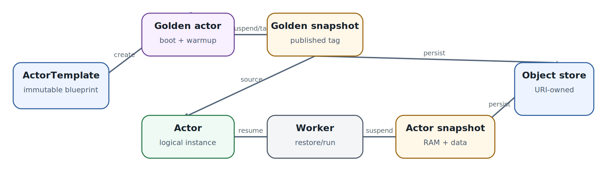

# Substrate resources: Atespace, WorkerPool, ActorTemplate, Actor, Tag

  
*Golden snapshot и жизненный цикл stateful Actor*

### Atespace

Atespace задаёт logical tenancy/scope для Substrate resources. Имена и права удобно рассматривать вместе с tenant boundary, а не просто как «namespace под другим названием».

### WorkerPool

WorkerPool - физическая capacity. Он определяет replicas, worker image, sandbox class и pod template properties. Labels WorkerPool могут участвовать в выборе через `workerSelector`; не следует считать namespace или RBAC автоматическим scheduler selector'ом.

### ActorTemplate

ActorTemplate immutable. Он содержит контейнеры, required `sandboxConfig`, ресурсы, snapshot config, volumes и selectors. При создании Substrate подготавливает golden actor, ждёт readiness/warmup, suspend'ит его и публикует golden snapshot через Tag. Так дорогая initialization может быть оплачена один раз.

### Actor

Actor - конкретный instance template. В status хранится lifecycle state, assignment и snapshot metadata. Один Actor в каждый момент привязан максимум к одному Worker, но между resume может оказаться на другом Worker.

### Tag

Tag даёт отдельное ownership snapshot'а и позволяет клонировать состояние. Snapshot lifetime важен: actor snapshot заменяется следующим successful suspend, тогда как Tag живёт до удаления. Actor, созданный из Tag, может некоторое время **заимствовать** tag-owned snapshot; преждевременное удаление Tag способно сломать последующий resume.

### SandboxConfig

SandboxConfig определяет runtime assets/configuration и связывается с `sandboxClass` (`gVisor` или `microVM`). Для воспроизводимости runtime binaries и guest assets должны быть pinned так же жёстко, как container image.
