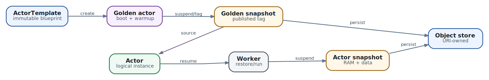

# Ресурсная модель Substrate: от capacity до долговечного Actor

**Статус:** `TWO API DOMAINS` · `VERSIONED RESOURCES` · `OWNERSHIP MATTERS`

В предыдущей главе мы прошли по operational path: запрос приходит в router, control plane находит или возобновляет Actor, а Worker предоставляет sandbox capacity. Теперь нужно понять, какими объектами инженер описывает эту систему. Без этого архитектура остаётся набором процессов, а любое изменение превращается в угадывание: куда положить label, что можно обновить, кто владеет snapshot и почему объект с тем же именем после пересоздания уже не тот же объект.

Ресурсная модель Substrate специально разделена между Kubernetes API и собственным ate API. Это не косметика. Инфраструктурные объекты меняются редко и хорошо согласуются с Kubernetes reconciliation. Actor records и assignments меняются часто, поэтому живут в отдельном control-plane store. Инженеру нужно видеть обе стороны и не переносить правила одной на другую автоматически.

## Что читатель должен унести из главы

- какие ресурсы принадлежат Kubernetes, а какие ate API;
- чем Atespace отличается от Kubernetes namespace и почему это ещё не полноценная authorization boundary;
- как WorkerPool, SandboxConfig и ActorTemplate вместе определяют допустимый placement;
- почему ActorTemplate следует версионировать созданием нового объекта, а не редактировать на месте;
- как `uid` и `version` защищают update/delete от гонок и повторного использования имени;
- что именно принадлежит Actor, Tag и template golden snapshot;
- как собрать минимальный набор ресурсов без скрытой зависимости от namespace, mutable tags или непроверенного snapshot URI.

## Два API-домена и три типа состояния

| Домен | Ресурсы | Где хранятся | Кто обычно управляет |
| --- | --- | --- | --- |
| Kubernetes API | `WorkerPool`, `SandboxConfig`, Deployments, Pods | etcd/Kubernetes control plane | Platform team, GitOps, cluster controllers |
| ate API: declarative definitions | `Atespace`, `ActorTemplate`, `Tag` | Substrate control-plane store | Platform или application team через `kubectl ate`/gRPC |
| ate API: dynamic records | `Actor`, `Worker`, assignments и status | Substrate control-plane store | Clients создают intent; server ведёт lifecycle/status |

`WorkerPool` является Kubernetes CRD в конкретном namespace. `SandboxConfig` тоже Kubernetes resource, но cluster-scoped. Напротив, `ActorTemplate`, `Actor`, `Tag` и `Atespace` не являются Kubernetes objects. Их нельзя корректно описывать как обычные namespaced CRD и ожидать, что Kubernetes RBAC автоматически ограничит доступ.

Это разделение определяет диагностику. Если не создаются Worker Pods, смотрят controller, CRD и Kubernetes events. Если Actor застрял в `RESUMING` или update получил `ABORTED`, смотрят ate API, resource version и lifecycle workflow. Один `kubectl get all` не показывает всю систему.

## Общая грамматика ate API: metadata и references

Atespaced resources имеют общий `ResourceMetadata`:

| Поле | Кто задаёт | Смысл |
| --- | --- | --- |
| `atespace` | Клиент при create | Логическая область ресурса; immutable |
| `name` | Клиент при create | DNS-compatible имя, уникальное внутри Atespace; immutable |
| `uid` | Server | Глобально уникальная identity конкретной lifetime |
| `version` | Server увеличивает при mutation | Optimistic concurrency guard |
| `createTime`, `updateTime` | Server | Аудит и диагностика возраста состояния |

Имя удобно человеку, но не доказывает identity. Если Actor `team-a/assistant` удалили и создали заново, новый объект может иметь то же имя, но другой `uid`. Логи, snapshot prefixes, idempotency records и долгоживущие ссылки должны учитывать UID, когда важно отличить lifetimes.

### ObjectRef не является строкой

Ссылка на ate resource содержит отдельные поля `atespace` и `name`. Даже ссылка на объект в том же Atespace должна явно указывать Atespace. Строка `team-a/assistant` удобна в CLI и routing header, но внутри API её не следует парсить вручную или хранить вместо typed reference.

### Почему update начинается с read

Для mutable resource клиент сначала читает объект, меняет разрешённые поля и отправляет полный replacement с теми же `uid` и `version`. Если другой процесс уже обновил объект, server возвращает `ABORTED`. Это лучше last-write-wins: оператор видит конфликт и решает, как объединить intent.

```
read object (uid=u1, version=17)
  -> modify allowed field
  -> update with uid=u1, version=17
      success: stored version becomes 18
      conflict: ABORTED, re-read before retry
```

Создавать update message с нуля опасно: можно неявно очистить поля, которых клиент не знал. `status` и server-managed metadata игнорируются на input, но immutable/mutable spec fields всё равно требуют точной модели.

## Atespace: logical scope, но не Kubernetes namespace

`Atespace` - глобально-scoped запись ate API. Его собственное `metadata.atespace` пусто, а identity задаётся `metadata.name`. Actor, ActorTemplate и Tag адресуются парой `(atespace, name)`. Одинаковое имя Actor может существовать в разных Atespaces.

Atespace нужен до создания Actor и удаляется только после очистки зависимых ресурсов. Он помогает организовать tenancy, snapshot prefixes и references. Но Atespace не равен Kubernetes namespace:

- WorkerPool живёт в Kubernetes namespace и может обслуживать Actors из разных Atespaces, если selectors это позволяют;
- ActorTemplate живёт в Atespace, но выбирает WorkerPool по labels, а не по совпадению namespace;
- Substrate API authentication не превращает Atespace автоматически в RBAC boundary;
- published Tag может быть использован Actor из другого Atespace и потребовать cross-prefix доступа к object storage.

> **Проектное правило.** Используйте Atespace как logical ownership и адресное пространство, но security boundary подтверждайте отдельной authorization и storage/network policy. Совпадение названий Atespace и Kubernetes namespace может быть полезной convention, но не системной гарантией.

  
*Golden snapshot и жизненный цикл stateful Actor*

## WorkerPool: тёплая физическая ёмкость

`WorkerPool` описывает fleet заранее запущенных Worker Pods. Это Kubernetes CRD, который `atecontroller` преобразует в Deployment. Ключевые поля:

| Поле | Роль | Инженерный риск |
| --- | --- | --- |
| `spec.replicas` | Число Worker Pods | Реплики не равны числу Actors: один Worker может держать несколько Actors |
| `spec.workerImage` | Образ `ateom` для sandbox class | Непроверенный tag создаёт version drift; pin digest |
| `spec.sandboxClass` | `gvisor` или `microvm` | Должен совпадать с template и SandboxConfig |
| `spec.template.resources.limits` | Общий CPU/RAM envelope Worker | Нулевое/отсутствующее измерение может трактоваться как unconstrained placement data |
| `spec.template.nodeSelector` | Node placement, включая Substrate version | Непривязанный pool ломает безопасный rolling upgrade |
| `metadata.labels` | Их сопоставляют Actor selectors | Не путать с `spec.template.labels` |

### Labels пула и labels Pod - разные поверхности

`WorkerPool.metadata.labels` участвуют в Actor placement. `WorkerPool.spec.template.labels` копируются на Deployment/Pods и нужны Kubernetes tooling, policy или observability. Selector ActorTemplate не смотрит на Pod labels. Это типичная ошибка: инженер добавляет `workload=secure` в pod template, а Actor продолжает попадать во все eligible pools.

### Capacity теперь многомерная

Текущий Worker может одновременно держать несколько Actors. Каждый assignment вычитает declared Actor limits из remaining Worker capacity. Дополнительно действует actor-count limit, по умолчанию связанный с `ateom --max-actors`. Placement прекращается по первому исчерпанному ограничению: CPU, RAM или числу Actors.

```
eligible(worker, actor) =
    sandbox_class_matches
  AND template_selector_matches
  AND actor_selector_matches
  AND remaining_cpu >= actor_cpu_limit
  AND remaining_memory >= actor_memory_limit
  AND assigned_actors < max_actors
```

Поэтому capacity planning нельзя сводить к `replicas == concurrent Actors`. Нужны bin-packing, resource fragmentation и headroom на failure. Два Worker по 8 GiB не гарантируют placement Actor на 12 GiB, хотя суммарно RAM достаточно.

### Минимальный WorkerPool

```
apiVersion: ate.dev/v1alpha1
kind: WorkerPool
metadata:
  name: general-gvisor
  namespace: ate-workers
  labels:
    tier: general
    sandbox: gvisor
spec:
  replicas: 6
  workerImage: registry.example/ateom-gvisor@sha256:...
  sandboxClass: gvisor
  template:
    nodeSelector:
      ate.dev/substrate-version: "<installed-version>"
    resources:
      limits:
        cpu: "8"
        memory: 16Gi
```

Pool labels задают eligibility, а nodeSelector фиксирует совместимую версию dataplane. При upgrade создают новый pool и поэтапно переводят nodes/Actors, а не редактируют serving pool с массовым restart.

## SandboxConfig: воспроизводимый runtime, а не workload

`SandboxConfig` - cluster-scoped Kubernetes resource. Он отделяет sandbox binaries от ActorTemplate. Для gVisor это `runsc` asset и digest-pinned pause image; для microVM - Cloud Hypervisor, `virtiofsd`, kernel и guest image по архитектурам.

ActorTemplate хранит только runtime family и имя config. При cold boot atelet разрешает assets через этот объект, а snapshot manifest фиксирует версии, необходимые для restore. Такой слой позволяет платформе централизованно поддерживать runtime, не переписывая каждый workload template.

| Поле | gVisor | microVM |
| --- | --- | --- |
| `sandboxClass` | `gvisor` | `microvm` |
| `pauseImage` | Обязателен, pinned digest | Не допускается |
| `assets` | gVisor archive per architecture | VMM, virtiofsd, kernel, image |
| Node requirements | Совместимый Linux runtime | `/dev/kvm`, nested virtualization |

SandboxConfig нельзя обновлять как обычный mutable config без плана совместимости. Новый runtime может не восстановить старую memory image. Безопасная стратегия - новый config/version, новый WorkerPool и новый ActorTemplate с controlled migration.

## ActorTemplate: immutable blueprint версии workload

`ActorTemplate` - ate API resource в конкретном Atespace. Он описывает не отдельный процесс, а версию исполняемой среды: containers, limits, volumes, sandbox, snapshot policy и pool constraints. После создания Substrate строит golden snapshot. Поэтому изменение template задним числом сделало бы непонятным, с каким кодом и runtime связан уже существующий snapshot.

Практический вывод: имя template должно отражать release или configuration version, например `coding-agent-v3`. Новая image, иной sandbox, другие volume mounts или limits - новый ActorTemplate. Rollout then becomes an explicit migration, а не скрытая мутация основания состояния.

| Поле | Что задаёт | На что влияет |
| --- | --- | --- |
| `metadata` | Atespace, name; server добавляет UID/version | Identity template и snapshot provenance |
| `containers` | Digest-pinned OCI images, command, args, env, mounts, wakeup probe | Код и готовность workload |
| `resources.limits` | Actor CPU и RAM | Sandbox sizing и placement capacity |
| `workerSelector` | Equality match по WorkerPool labels | Допустимые pools |
| `sandboxConfig` | Runtime family и имя cluster config | Hard gate по sandbox class и restore compatibility |
| `snapshotConfig` | Storage prefix, pause/commit scopes | Что сохраняется и сколько стоит lifecycle |
| `volumes` | DurableDir, external volume template или systemInfo | State, credentials/trust data и persistence surface |
| `status.goldenSnapshotStatus` | Server | Готовность golden tag или причина ошибки |

### Images, command и environment

Container image должен быть pinned digest. Mutable tag вроде `:latest` разрушает воспроизводимость: две node могут cold-boot одинаковый template с разными bytes. Команда и args не полностью повторяют Kubernetes semantics: если явно задан `command`, image ENTRYPOINT и CMD отбрасываются; ссылки `$(VAR)` в command/env не разворачиваются. `envFrom` и `valueFrom` также не являются автоматической частью этого API.

Не копируйте PodSpec механически. ActorTemplate похож на Pod template концептуально, но его schema меньше и ориентирована на checkpointable sandbox. Каждое используемое поле нужно проверять по API выбранной версии.

### Wakeup probe - контракт готовности resume

Без `wakeupProbe` `ResumeActor` может завершиться, когда container process уже запущен, но HTTP server ещё не слушает. Probe заставляет lifecycle ждать HTTP 200. Это особенно важно для router wake-on-request: успешный resume должен означать, что исходный request можно передавать приложению.

Probe не должен проверять медленную внешнюю dependency без необходимости. Иначе краткий сбой database превратит каждый Actor resume в timeout и займёт Worker. Разделяйте готовность локального process и полноценную business health.

### Actor resources и bin packing

Actor-level limits - часть immutable template и snapshot compatibility. Для gVisor они задают cgroup quota и видимую memory; для microVM - vCPU и guest RAM с runtime reserve. Scheduler использует эти limits при выборе Worker. Отсутствующий limit зависит от runtime defaults и затрудняет capacity planning, поэтому production template лучше задавать CPU/RAM явно.

Заявлять завышенный limit тоже дорого: scheduler резервирует declared envelope, даже если процесс обычно использует меньше. Сначала измерьте p95/p99 steady-state и restore peaks, затем добавьте понятный safety margin.

### SnapshotConfig: policy, а не URI одного файла

`snapshotConfig.storageLocation` - базовый object-storage prefix. Конкретные snapshot objects получают owner path автоматически. Policy также задаёт:

- `onPause` - scope node-local checkpoint;
- `onCommit` - scope durable snapshot при suspend;
- `Full` - process memory, writable rootfs delta и поддерживаемые durable volumes;
- `Data` - durable data без memory/rootfs, после resume containers стартуют заново.

`onCommit` должен быть subset `onPause`. Если pause захватил только Data, поздний suspend не может волшебно получить уже отброшенную process memory. Подробнее стоимость и failure semantics этих scopes разобраны в следующей главе.

### Volumes: не всё является snapshot state

`DurableDir` входит в Data/Full snapshot. External volumes имеют отдельный lifecycle и могут не откатываться вместе с Actor. `systemInfo` передаёт platform metadata или trust bundle. Из названия volume нельзя выводить transactional semantics. Для каждого mount зафиксируйте owner, backup, deletion policy и поведение при revert.

### Пример ActorTemplate

```
metadata:
  atespace: team-a
  name: coding-agent-v3
containers:
- name: agent
  image: registry.example/coding-agent@sha256:...
  wakeupProbe:
    httpGet:
      path: /readyz
      port: 80
  volumeMounts:
  - name: workspace
    mountPath: /workspace
resources:
  limits:
  - name: cpu
    quantity: "2"
  - name: memory
    quantity: 4Gi
workerSelector:
  matchLabels:
    tier: general
sandboxConfig:
  sandboxClass: SANDBOX_CLASS_GVISOR
  configName: gvisor-2026-10
snapshotConfig:
  onPause: SNAPSHOT_CONTENT_SCOPE_FULL
  onCommit: SNAPSHOT_CONTENT_SCOPE_FULL
  storageLocation: gs://substrate-state/coding-agent
volumes:
- name: workspace
  durableDir: {}
```

Это protojson-shaped ate API document, а не Kubernetes manifest: здесь нет `apiVersion` и `kind`. Его создают через `kubectl ate create actor-template` или gRPC client.

## Golden snapshot: status становится частью deployment gate

Create ActorTemplate запускает workflow:

1. создать временный golden Actor в reserved Atespace `ate-golden`;
2. cold-boot workload с выбранным SandboxConfig;
3. дождаться wakeup/readiness или warmup interval;
4. сделать Full suspend;
5. скопировать snapshot в immutable published Tag, имя которого связано с template UID;
6. удалить временный Actor и записать ссылку в `status.goldenSnapshotStatus.goldenTag`.

Успешный create RPC не всегда означает, что golden snapshot уже готов. Deployment automation должна ждать template readiness и проверять error status. Если Actor создать раньше, чем golden tag готов, он может остаться без snapshot и пойти через cold boot даже после того, как template позже станет Ready.

## Worker: observed capacity и runtime epoch

`Worker` - глобально-scoped dynamic record, представляющий конкретный Worker Pod. Его создаёт dataplane, а не application developer. Record связывает Kubernetes coordinates, pool labels, sandbox class, IP addresses и server-managed status.

Worker status показывает:

- `state` - можно ли принимать новые assignments;
- `capacity` - CPU/RAM и actor slots, которые runtime реально сообщает;
- `allocated` - сумма limits назначенных Actors;
- `observedEpoch` - обработана ли смена runtime epoch.

`epoch` увеличивается при restart процесса `ateom` внутри того же Pod. Такой restart означает, что sandbox state прежних Actors потерян, даже если Pod UID не изменился. Control plane должен пометить Actors старой epoch как crashed и освободить assignments. Проверка только Pod Ready пропустит этот класс отказа.

## Actor: identity, intent и server-managed status

`Actor` - конкретная логическая instance template. Клиент задаёт минимум:

- `metadata.atespace` и `metadata.name`;
- `actorTemplate` как ObjectRef;
- опциональный per-Actor `workerSelector`;
- опциональный immutable `sourceTag`.

```
metadata:
  atespace: team-a
  name: alice-coding-session
actorTemplate:
  atespace: team-a
  name: coding-agent-v3
workerSelector:
  matchLabels:
    zone-class: standard
sourceTag:
  atespace: team-a
  name: baseline-workspace
```

### Placement - пересечение, а не приоритет

Template selector и Actor selector объединяются логическим AND. Actor не может расширить pools, разрешённые template; он только сужает выбор. Затем применяются hard sandbox-class match и remaining capacity. Если labels не пересекаются, результатом будет отсутствие eligible Worker, а не fallback в более широкий pool.

| Ограничение | Источник | Можно ли Actor расширить выбор |
| --- | --- | --- |
| Sandbox class | ActorTemplate/SandboxConfig | Нет |
| Template pool labels | ActorTemplate.workerSelector | Нет |
| Instance labels | Actor.workerSelector | Только добавить ограничения |
| CPU/RAM/actor slots | Worker observed capacity | Нет |
| Drain/state/version | Worker/control plane | Нет |

### Status читают, но не задают

`Actor.status` server-managed и игнорируется на create/update input. Он включает lifecycle state, current Worker assignment, external/local snapshot, in-progress snapshot URI, external volume records и crash details. Клиент не переводит Actor в `RUNNING` записью поля; он вызывает lifecycle RPC, а server выполняет workflow и фиксирует status после реального действия.

### Что можно обновить

ActorTemplate reference может измениться только в `SUSPENDED` и при строгой совместимости: тот же SandboxConfig, совместимые volumes/mounts, а после собственного external snapshot - тот же storage location. `sourceTag` immutable. Update требует актуальных UID/version preconditions. Это защищает snapshot от попытки восстановить memory в несовместимом runtime.

## Tag: долговечное имя и отдельный owner snapshot

`Tag` создаётся из suspended Actor. Control plane копирует его external snapshot в новый tag-owned prefix. После завершения Tag неизменно указывает на одну snapshot copy. Это не mutable branch pointer вроде Git tag, который можно передвинуть, а immutable retention pin и источник для клонирования.

| Scope | Кто может создать Actor из Tag | Адрес Tag |
| --- | --- | --- |
| `TAG_SCOPE_ATESPACE` | Только Actor в owning Atespace | Всегда `owner-atespace/tag-name` |
| `TAG_SCOPE_PUBLISHED` | Actor в любом Atespace | Не перемещается; остаётся в source Atespace |

Published не означает, что snapshot bytes копируются в target Atespace. Restore читает source prefix, поэтому node/storage identity должна иметь доступ к source Atespace. Это важная часть multi-tenant design: публикация control-plane reference и выдача object-storage permissions должны быть согласованы.

### Clone сначала заимствует snapshot

Когда Actor создаётся с `sourceTag`, bytes сразу не копируются. `status.externalSnapshot` указывает на tag-owned snapshot. После первого успешного suspend Actor пишет собственную copy под actor prefix и становится её owner.

> **Опасное окно.** Не удаляйте Tag, пока есть Actors, которые ещё заимствуют его snapshot. Сегодня control plane не всегда предотвращает это автоматически. Проверяйте, что clone сделал собственный suspend или что его `snapshotUri` больше не указывает на `/tags/<tag-uid>`.

## Snapshot paths и ownership

```
<storageLocation>/atespaces/<atespace>/actors/<actor-uid>/snapshots/<snapshot-id>
<storageLocation>/atespaces/<atespace>/tags/<tag-uid>
```

UID в path не даёт новому объекту с повторно использованным name унаследовать старые bytes. Server-generated snapshot ID не позволяет двум suspend перезаписать друг друга. Snapshot URI из status следует трактовать как opaque server output; код не должен конструировать его по имени Actor.

| Owner | Когда создаётся | Когда удаляется | Кто может ссылаться |
| --- | --- | --- | --- |
| Actor | Первый и последующие successful suspend | Следующий suspend заменяет или Actor удалён | Сам Actor |
| Tag | CreateTag копирует snapshot suspended Actor | При DeleteTag | Actors в пределах scope |
| Golden Tag | Template preparation workflow | При удалении template | Новые Actors этого template |

Database row и object bytes должны удаляться в правильном порядке. Сначала control plane удаляет owned objects, затем ссылку. Retry использует deterministic destination и должен продолжать частично выполненную операцию. Если process упал между шагами, возможен orphaned object, но не ссылка на уже удалённые bytes.

## Практический порядок развёртывания

1. **Platform:** установить Substrate и узнать version label dataplane.
2. **Platform:** создать/проверить SandboxConfig с pinned assets.
3. **Platform:** создать WorkerPool с labels, capacity и node version pin.
4. **Owner:** создать Atespace и определить storage prefix/policy.
5. **Developer:** создать immutable ActorTemplate с digest-pinned images и явными limits.
6. **Automation:** дождаться golden snapshot Ready, не только успешного create RPC.
7. **Application:** создать Actor, при необходимости из sourceTag.
8. **Operations:** проверить eligible Workers, resume и wakeup probe.
9. **Protection:** сделать Tag только для snapshot, который действительно нужно удерживать.
10. **Cleanup:** удалять в обратном порядке с проверкой borrowers и external volumes.

## Сквозной пример: general и isolated pools

Представим платформу для coding agents. Большинство sessions можно запускать в gVisor на общем node pool. Отдельные customers требуют microVM. Platform team создаёт два SandboxConfig и два WorkerPool с labels `isolation=standard` и `isolation=strong`. Application team публикует два ActorTemplate, потому что sandbox class и snapshot compatibility являются частью версии workload.

Для обычного Actor template selector требует `isolation=standard`. Для regulated Actor - `isolation=strong` и microVM config. Per-Actor selector может дополнительно потребовать `region=eu`, но не может отправить microVM Actor в gVisor pool. Если eu microVM capacity закончилась, правильный результат - bounded waiting или capacity error, а не тихий fallback на более слабую изоляцию.

Когда support engineer готовит воспроизводимый workspace, он suspend'ит Actor и создаёт Atespace-scoped Tag. Для передачи baseline другой команде создаётся отдельный PUBLISHED Tag после проверки, что snapshot не содержит customer secrets. Storage policy выдаёт runtime второй команды read access к source prefix. После того как clone сделал собственный suspend, borrowed dependency можно удалить по retention policy.

Этот пример показывает, что выбор инструмента выражается несколькими ресурсами: Atespace отвечает за logical ownership, WorkerPool - за capacity, SandboxConfig - за runtime bytes, ActorTemplate - за immutable workload contract, Actor - за lifetime, а Tag - за retention и cloning. Попытка поместить всё в один объект сделала бы границы доступа и обновления неявными.

### GPU reservation пока не означает GPU внутри Actor

Текущая API guide отдельно предупреждает: device pass-through для Actors временно не поддержан. Extended resource `nvidia.com/gpu` в WorkerPool может поставить Worker Pod на GPU node и зарезервировать устройство, но Substrate не передаст его Actor sandbox. Для GPU workload нужен отдельный подтверждённый integration path; одного pool limit недостаточно.

## Кто за что отвечает

| Решение | Platform team | Application team | Control plane |
| --- | --- | --- | --- |
| Sandbox runtime/assets | SandboxConfig, node capabilities | Выбирает разрешённый class | Проверяет match |
| Warm capacity | WorkerPool replicas/resources/labels | Объявляет Actor limits | Bin-packing и assignment |
| Workload version | Registry policy | ActorTemplate, image digest, probes | Golden workflow/status |
| Tenant scope | Authorization/storage policy | Atespace references | Validation и lifecycle |
| Snapshot retention | Bucket lifecycle/backup | Tag semantics | Owner references и garbage collection |
| Instance lifecycle | Capacity/SLO | Create/update/resume/suspend intent | State machine и status |

## Антипаттерны

- **Считать Atespace Kubernetes namespace.** Это ломает ожидания RBAC и placement.
- **Матчить Pod labels вместо WorkerPool labels.** Actor selector не увидит `spec.template.labels`.
- **Использовать mutable image tag.** Golden/cold boot становятся невоспроизводимыми.
- **Редактировать template как Deployment.** Snapshot остаётся связан со старым code/runtime.
- **Не задавать Actor limits.** Runtime defaults и unconstrained dimensions скрывают capacity risk.
- **Писать status вручную.** Lifecycle изменяется RPC, а не patch поля.
- **Retriable update без re-read.** Повтор с устаревшей version снова конфликтует или стирает intent.
- **Удалять Tag сразу после clone.** Clone может всё ещё заимствовать snapshot.
- **Строить snapshot URI по имени.** Ownership основан на UID и server-generated IDs.
- **Публиковать Tag без storage policy.** Reference доступна, bytes нет.

## Production checklist ресурсной модели

- Документировано, какие объекты идут через Kubernetes API, а какие через ate API.
- Atespace naming не выдаётся за authorization без реальной policy.
- WorkerPool labels отделены от Pod template labels.
- Pool pinned к `ate.dev/substrate-version` и sandbox class.
- Worker capacity учитывает CPU, RAM, actor slots, fragmentation и failure headroom.
- SandboxConfig assets и pause image content-addressed.
- ActorTemplate images pinned digest; limits и wakeup probes протестированы.
- Snapshot scopes выбраны осознанно, а storage prefix имеет per-Atespace policy.
- Automation ждёт golden snapshot Ready.
- Actor updates выполняются read-modify-write с UID/version.
- Tag borrowers обнаруживаются до deletion.
- Logs и audit сохраняют UID, version и ссылки на operation, а не только human name.

## Итог

Ресурсная модель Substrate связывает два мира. Kubernetes описывает физическую ёмкость и runtime assets через WorkerPool и SandboxConfig. Ate API описывает logical scope, workload version, Actor lifetimes и snapshot retention через Atespace, ActorTemplate, Actor и Tag. Worker records соединяют declarative capacity с фактическим состоянием dataplane.

Главная мысль - ownership и version важнее красивого имени. Template UID определяет происхождение snapshot, Actor UID отделяет одну lifetime от другой, resource version защищает от гонок, Tag владеет отдельной immutable copy, а pool labels задают eligibility независимо от Kubernetes namespace. Если эти связи явны, rollout и cleanup можно автоматизировать. Если скрыты, ошибки проявятся только во время restore или удаления.

Следующая глава разбирает самую дорогую часть этой модели: что именно происходит при pause, suspend и resume, как отличаются Full и Data snapshots, где проходит durable commit boundary и какое состояние невозможно восстановить из process checkpoint.

### Источники и дальнейшее чтение

- [Substrate API guide](https://github.com/agent-substrate/substrate/blob/main/docs/api-guide.md)
- [Agent Substrate glossary](https://github.com/agent-substrate/substrate/blob/main/docs/glossary.md)
- [Agent Substrate architecture](https://github.com/agent-substrate/substrate/blob/main/docs/architecture.md)
- [ate API resource definitions](https://github.com/agent-substrate/substrate/blob/main/pkg/proto/ateapipb/ateapi.proto)
- [Substrate API style guide](https://github.com/agent-substrate/substrate/blob/main/docs/api-style-guide.md)
- [Rolling upgrade runbook](https://github.com/agent-substrate/substrate/blob/main/docs/upgrade.md)
