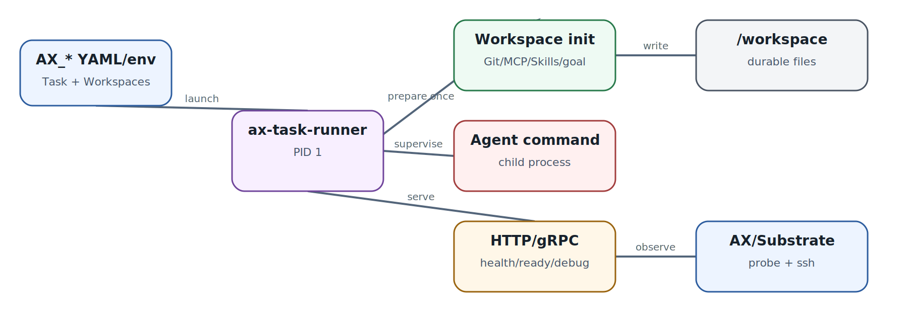

# Runner: PID 1 как платформенный контракт

  
*Runner contract: почему PID 1 здесь является частью платформенного API*

Runner - одна из самых важных и при этом недооценённых частей AX. Control plane не запускает `spec.command` напрямую. Он запускает `/usr/local/bin/ax-task-runner` как PID 1; уже runner читает `AX_TASK_YAML`, `AX_WORKSPACES_YAML`, env, подготавливает workspace, запускает child command и обслуживает control endpoints.

### Минимальный contract

Runner должен слушать port 80 и предоставлять `/healthz` и `/readyz`. Readiness остаётся 503, пока workspace не готов. Metadata endpoints могут отдавать Task/Workspaces. При `debug: true` runner включает guest services, через которые работает `ax ssh`; это фактически arbitrary process execution/file access внутри sandbox, поэтому debug нельзя оставлять включённым без причины.

### Workspace initialization once

На первом boot runner клонирует Git, записывает files, подготавливает skill path/MCP config и выполняет goal-based bootstrap. Он должен сохранить marker, чтобы после resume не переклонировать repository поверх изменённого workspace. Current default runner использует служебный marker под `/ax`.

### Child process semantics

Runner запускает agent command отдельной process group, но **остаётся жить после завершения child**. Это позволяет сохранить metadata/debug surface, однако создаёт monitoring nuance: container alive != agent alive. Current control plane не получает exit code child command как authoritative Task status. Значит, ваш custom runner или harness должен экспортировать application state отдельно.

### SIGTERM и suspend

Stop/suspend доставляют SIGTERM PID 1. Runner обязан forward signal process group, дать bounded grace period, затем завершить остаток. Всё, что должно пережить resume, нужно flush в durable state до выхода. Это нормальная Unix discipline, а не специфический «LLM механизм».

### Custom runner

Есть три уровня customization: расширить default image; embedded Go runner package; полностью свой implementation на любом языке. Для большинства платформенных команд оптимален первый вариант - сохранить contract и изменить только toolchain image. Полный custom runner оправдан, когда agent framework уже имеет собственный supervisor или нужен иной workspace layout.

### Источники и дальнейшее чтение

- [AX runner contract](https://github.com/google/ax/blob/main/docs/runner.md)
- [AX sandbox](https://github.com/google/ax/blob/main/docs/sandbox.md)
