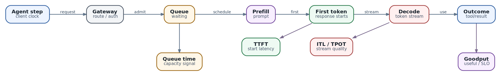

# Производительность inference: как измерять latency, throughput и capacity для 10-15+ агентов

  
*Путь inference-запроса: где возникают queue time, TTFT, ITL и полезный результат*

В главе 20 мы выбрали границу model service: AX Task знает стабильный endpoint, а runtime, model revision и hardware скрыты за ним. Теперь возникает практический вопрос: выдержит ли этот endpoint реальную работу десяти, пятнадцати или большего числа агентов?

Ответ нельзя получить одним числом `tokens/s`. Пользователь ощущает не среднюю скорость GPU, а задержку конкретного шага: сколько запрос стоял в очереди, когда появился первый полезный token, не начал ли stream заикаться, успел ли агент сформировать корректный tool call и закончилась ли задача до deadline. Сервер тем временем видит другую картину: batch, prompt tokens, KV cache, preemptions и суммарный throughput.

Цель этой главы - связать эти две картины. Мы разберём timeline запроса, метрики, модель нагрузки, программу benchmark и диагностические признаки bottleneck. Точный расчёт VRAM и выбор parallelism останутся в главе 41; здесь важнее научиться доказывать, что система выполняет свой SLO.

## Сначала определите, что значит «быстро»

Фраза «модель отвечает медленно» неоднозначна. Для интерактивного пользователя критично быстро увидеть начало ответа. Для coding agent важнее завершить tool call до timeout. Для фонового researcher допустима большая задержка одного шага, но неприемлемы часовая очередь и массовые retries. Один endpoint может быть хорош для одного класса работы и плох для другого.

До benchmark нужно назвать:

- кто ждёт результат: человек, coordinator или background worker;
- когда ожидание становится заметным или нарушает deadline;
- нужен ли streaming или важен только полный structured result;
- сколько model calls требуется для одной полезной задачи;
- что считается успехом: текст, валидный tool call, завершённый agent step или решённая задача;
- что система делает при перегрузке: ждёт, отклоняет, упрощает модель или уходит на fallback.

Без этого команда легко «улучшает» aggregate throughput, одновременно ухудшая время до первого token и полезную производительность агента.

## Timeline одного запроса

Разложим путь запроса на наблюдаемые участки.

1. **Client preparation.** Harness собирает messages, tool schemas и sampling parameters, иногда выполняет retrieval и сокращает context.
2. **Network и gateway.** Запрос проходит TLS, authentication, routing, rate limits и serialization.
3. **Admission и queue.** Server принимает запрос, но sequence ещё не получила compute/cache capacity.
4. **Tokenization и rendering.** Chat template превращает messages в model input; multimodal preprocessing может добавить заметную CPU-нагрузку.
5. **Prefill.** Модель обрабатывает prompt и создаёт KV state. Чем длиннее input, тем больше работы до первого output token.
6. **First token.** Клиент получает первый непустой chunk. На этом заканчивается TTFT.
7. **Decode.** Модель генерирует последующие tokens. Здесь важны ITL, jitter и fairness между sequences.
8. **Completion и postprocessing.** Server завершает stream, client собирает JSON/tool call, валидирует schema и передаёт результат agent loop.
9. **Useful outcome.** Агент использует ответ: вызывает tool, принимает решение или завершает step.

Границы измерения должны быть явными. Server-side TTFT обычно не включает часть client/network времени, а client-side TTFT включает. Метрика gateway может начинаться раньше, чем engine metric. Если сравнивать их без определения точки старта, цифры будут выглядеть противоречивыми, хотя обе корректны.

Для production полезны оба взгляда:

- **client observed** показывает опыт harness и пользователя;
- **server internal** объясняет, где именно потрачено время.

## Метрики, которые нельзя смешивать

| Метрика | Что измеряет | На какой вопрос отвечает | Чего не доказывает |
| --- | --- | --- | --- |
| **TTFT** - time to first token | От отправки/приёма запроса до первого output token | Насколько быстро система начинает отвечать | Скорость и плавность оставшегося stream |
| **ITL** - inter-token latency | Интервал между соседними output tokens | Есть ли паузы и jitter во время decode | Полную длительность запроса |
| **TPOT** - time per output token | Средний интервал генерации после первого token | Среднюю decode latency для request | Редкие длинные паузы, которые видны в ITL distribution |
| **E2E latency** | Время до последнего token/полного ответа | Когда model call полностью закончится | Где возникла задержка |
| **Prompt throughput** | Обработанные input tokens/s | Производительность prefill path | Interactive latency конкретного запроса |
| **Output throughput** | Сгенерированные output tokens/s | Производительность decode path | Полезность или корректность output |
| **Aggregate throughput** | Tokens/s или requests/s всего deployment | Общую пропускную способность | Fairness и SLO отдельных requests |
| **Queue time** | Время ожидания scheduler/admission | Есть ли дефицит capacity | Причину дефицита без остальных метрик |
| **KV occupancy и preemptions** | Давление активного context на cache | Хватает ли cache для workload | Качество модели и client latency вне engine |
| **Goodput** | Успешные requests/tasks, уложившиеся в SLO, за единицу времени | Сколько полезной работы реально выполнено | Почему отдельные requests не прошли SLO |

TTFT удобно мысленно раскладывать так:

`TTFT = network/gateway + queue + tokenize/render + prefill + delivery первого chunk`

А полную model latency - так:

`E2E = TTFT + decode оставшихся tokens + завершение stream`

Это не универсальные формулы telemetry: runtime может считать границы иначе. Их задача - не дать свести все задержки к слову «GPU».

## Почему среднее почти всегда врёт

Средняя TTFT 800 ms может скрывать ситуацию, в которой большинство запросов начинает отвечать за 300 ms, а каждый двадцатый ждёт 12 секунд. Для agent coordinator именно этот хвост задержки часто определяет время всей задачи: он ждёт самый медленный child.

Минимально нужны p50, p95 и p99:

- **p50** описывает обычный опыт;
- **p95** показывает частые хвостовые задержки и удобен для рабочего SLO;
- **p99** обнаруживает редкие stalls, queue bursts, cold paths и interference.

Но percentile без sample count и временного окна тоже опасен. P99 по 40 запросам почти ничего не говорит; суточный p95 склеивает утро без нагрузки и вечерний overload. Храните count, rate и histogram по классу запроса, model revision и deployment, а не только одну линию «average latency».

Нельзя бездумно добавлять labels с Task ID или request ID в Prometheus metrics: cardinality взорвётся. Такие идентификаторы принадлежат traces/logs; metrics агрегируются по ограниченному набору измерений вроде model, pool, route и result class.

## Количество агентов не равно inference concurrency

Агент не генерирует tokens непрерывно. Он читает tool result, ждёт filesystem/network, выполняет код, запрашивает approval и обновляет state. Поэтому пятнадцать активных агентов не означают пятнадцать постоянных decode sequences.

Для первой оценки можно использовать inference duty cycle:

`средняя concurrency ≈ число активных агентов × доля времени в model call`

Если 15 агентов проводят в inference около 35% wall time, средняя concurrency будет примерно `15 × 0.35 = 5.25`. Это не capacity guarantee. После общего события - запуска batch, resume Tasks или fan-out coordinator - все 15 могут отправить запрос почти одновременно.

Вторая полезная оценка строится через arrival rate:

`LLM requests/s = agent tasks/s × среднее число model calls на task`

Если приходит 0.4 задачи в секунду, а агент делает в среднем 6 model calls, endpoint получает около 2.4 requests/s. При средней model latency 2 секунды закон Little даёт примерно `L = λW = 4.8` одновременно находящихся в системе requests. Если latency под нагрузкой вырастет до 6 секунд, среднее число уже станет 14.4: очередь увеличивает concurrency, а concurrency ещё сильнее увеличивает очередь.

Обе оценки требуют реальных traces. Duty cycle не видит burst, а среднее calls/task не показывает длинный хвост сложных задач. Их используют для начальной гипотезы, затем проверяют replay или synthetic workload.

## Что записать из реальной нагрузки

Сервер следует тестировать не «prompts по 1k tokens», а распределением, похожим на production. Для каждого класса model call собирайте:

- input tokens p50/p95/p99;
- output tokens и finish reason;
- tool schema size и число tools;
- долю prefix reuse и повторяющихся system prompts;
- arrival rate, burst size и интервал между requests;
- число параллельных active sequences;
- streaming/cancellation/retry rate;
- model route и sampling parameters;
- долю structured output, vision и embeddings;
- итог agent step: success, validation error, retry или fallback.

Особенно важно не путать объявленный `max_model_len` с фактическим context. Если 99% requests укладываются в 8k, а один диагностический transcript занимает 64k, benchmark из одних 64k prompts покажет стресс-предел, но не ежедневную capacity. Нужны оба режима: representative и worst credible case.

Длины измеряются tokenizer'ом той же model revision и того же chat template. Подсчёт «слов» или characters не воспроизводит реальные input tokens, особенно при JSON, исходном коде и многоязычном тексте.

## SLO по классам, а не одно число на весь endpoint

Ниже не готовые нормативы, а пример структуры решения.

| Класс запроса | Что важно | Пример измеряемой цели |
| --- | --- | --- |
| Interactive chat | Быстрое начало и плавный stream | TTFT p95, ITL p95/p99, error rate |
| Tool selection / JSON | Полный короткий ответ и schema validity | E2E p95, valid-output rate, retry rate |
| Long planning | Deadline всего шага | E2E p95, output cap, cancellation rate |
| Background research | Goodput и стоимость | tasks/hour, tokens/task, success before deadline |
| Coordinator fan-out | Хвост самого медленного child | group completion p95/p99, rejected children, queue depth |

SLO должен включать качество. Например, «95% tool-selection calls заканчиваются за 3 секунды и 99.5% ответов проходят schema validation». Если после quantization latency улучшилась, но valid-output rate упал и появились retries, goodput мог стать хуже.

Полезная capacity-метрика формулируется так:

**максимальная нагрузка, при которой одновременно выполняются TTFT, ITL/E2E и error-rate SLO.**

Это честнее, чем «сервер выдаёт 900 tok/s», потому что лишние tokens, просроченные requests и повторные попытки не являются полезной работой.

## Closed-loop и open-loop benchmark

Два генератора нагрузки отвечают на разные вопросы.

**Closed-loop** держит фиксированное число clients. Каждый отправляет следующий request только после завершения предыдущего. Такой тест удобен для concurrency sweep и поиска saturation point, но имеет coordinated omission: когда server замедляется, clients тоже реже отправляют requests. Реальный входящий поток мог бы продолжить расти, а benchmark сам себя притормаживает.

**Open-loop** отправляет requests по заданному arrival schedule независимо от времени ответа. Он лучше показывает queueing и overload. Для agent systems полезны как минимум три arrival profile:

- ровный поток для baseline;
- Poisson-like поток для независимых событий;
- burst/fan-out, где группа requests приходит почти одновременно.

`vllm bench serve` поддерживает request rate, распределение arrivals и burstiness; llama.cpp содержит server benchmark сценарии на k6. Но инструмент не заменяет workload design: default `request-rate=inf`, при котором все prompts отправляются сразу, измеряет burst stress, а не обычный production traffic.

## Практический benchmark protocol

### 1. Зафиксируйте deployment

Запишите model revision, quantization, tokenizer/template, runtime version, container digest, hardware, driver, accelerator runtime, parallelism, cache/context settings и gateway configuration. Иначе разницу между двумя запусками невозможно объяснить.

### 2. Подготовьте dataset

Используйте обезличенный trace replay или синтетический набор, повторяющий распределения input/output. Сохраните отдельные группы short/median/p95/worst-case context и tool schemas. Не отправляйте production secrets в benchmark artifacts.

### 3. Отделите cold и warm path

Cold start, первая компиляция kernels, graph capture, model load и заполнение prefix cache измеряются отдельно. Для steady-state теста выполните warm-up и убедитесь, что его requests не попали в итоговые percentiles.

### 4. Найдите single-request baseline

Concurrency 1 показывает нижнюю границу latency и выявляет очевидные ошибки configuration. Это не production capacity, а контрольная точка.

### 5. Выполните concurrency sweep

Например: `1, 2, 4, 6, 8, 12, 15, 20`. На каждом уровне сохраняйте TTFT, ITL/TPOT, E2E, prompt/output throughput, queue, KV occupancy, preemptions, errors и cancellations. Диапазон должен пересечь saturation, а не закончиться на последней зелёной точке.

### 6. Выполните arrival-rate sweep

Повторите тест open-loop для нескольких requests/s и добавьте burst, похожий на coordinator fan-out. Наблюдайте не только completed requests, но и рост queue, rejected requests и recovery после burst.

### 7. Дайте системе выйти в steady state

Короткий прогон часто заканчивается раньше, чем заполняется KV cache или проявляется thermal/power throttling. Продолжительность выбирают по workload, но фиксируют warm-up, measurement window и cooldown. Каждый сценарий повторяют, чтобы отличить стабильный эффект от шума.

### 8. Проверяйте результат

Benchmark не считается успешным только потому, что HTTP status равен 200. Проверяйте truncated completions, пустые streams, invalid JSON/tool calls, wrong finish reasons и несоответствие ожидаемой длине output. Часть нагрузочных генераторов умеет считать только transport success, поэтому semantic validation добавляется отдельно.

## Матрица минимального эксперимента

Чтобы тест не превратился в бесконечный перебор, начните с небольшой матрицы.

| Ось | Минимальные значения |
| --- | --- |
| Context | p50, p95, worst credible |
| Output | short tool call, median answer, long planning |
| Load | concurrency 1, expected, burst peak, beyond saturation |
| Arrival | steady, Poisson-like, coordinator burst |
| Cache | cold prefix, warm prefix |
| Result | plain text, structured/tool output |

Меняйте одну группу факторов за раз. Сравнивать другой runtime, другую quantization, другой context и новое batching setting в одном прогоне бессмысленно: даже если результат лучше, причина неизвестна.

## Как читать симптомы

| Наблюдение | Наиболее вероятное направление проверки |
| --- | --- |
| TTFT растёт, ITL после старта остаётся нормальной | Queue, длинный prefill, tokenization/gateway, конкуренция prompt-heavy requests |
| TTFT нормальная, ITL и jitter растут | Decode contention, memory bandwidth, слишком много active sequences, prefill interruptions |
| Queue растёт вместе с высокой accelerator utilization | Deployment достиг compute/memory capacity; нужен admission, routing или scale-out |
| Queue растёт, accelerator utilisation низкая | CPU preprocessing, gateway, scheduler stalls, network, locks или неравномерный routing |
| KV occupancy близка к пределу, растут preemptions | Context/concurrency не помещаются в cache; проверяйте length policy и cache budget |
| Aggregate tok/s растёт, p95 TTFT нарушен | Throughput получен ценой interactivity; batching/concurrency слишком агрессивны для SLO |
| Server metrics хорошие, client E2E плохая | Gateway/network, client backpressure, медленное чтение stream или postprocessing |
| Latency хорошая, tasks/hour падает | Output стал длиннее, tool accuracy ухудшилась, выросли retries или агент делает больше steps |
| После burst система долго не восстанавливается | Очередь не ограничена, requests слишком длинные или retry storm поддерживает перегрузку |

Это направления расследования, не автоматические диагнозы. Подтверждайте гипотезу trace'ом и контролируемым экспериментом.

## Свяжите server telemetry с AX

Без correlation «агент завис» и «request 8 секунд стоял в model queue» выглядят одинаково. На границе harness/gateway передавайте и записывайте:

- AX Task ID и Actor ID;
- agent/coordinator ID;
- step и attempt ID;
- inference request ID;
- model route и resolved revision;
- input/output tokens;
- client timestamps: send, first chunk, last chunk;
- outcome: text, tool call, validation failure, cancellation, retry;
- trace ID, связывающий gateway и server span.

Не помещайте уникальные IDs в metric labels. Metrics отвечают «насколько часто и насколько плохо», traces - «что случилось с этим request», logs - «какие события и ошибки зафиксированы».

Для streaming client также измеряйте время между chunks. Server может генерировать tokens равномерно, а proxy или client buffer отдавать их пачками. Пользователь увидит рывки, хотя engine ITL останется хорошей.

## Admission control лучше бесконечной очереди

Когда arrival rate выше service rate, очередь растёт до тех пор, пока requests не начнут нарушать deadline или не закончится память. Бесконечная очередь не сохраняет availability - она превращает явный отказ в скрытую многоминутную задержку.

Нужны:

- bounded in-flight requests и prompt-token backlog;
- per-tenant или per-priority quotas;
- deadline/cancellation propagation;
- load shedding с понятными `429/503`;
- retry budget и jitter, чтобы не создать retry storm;
- fallback только на совместимый и заранее проверенный endpoint.

Актуальный vLLM предоставляет queue и prefill-backlog limits, но названия и semantics flags зависят от версии. В архитектуре важно не конкретное значение CLI, а правило: admission должен отклонить работу раньше, чем гарантированно нарушится SLO.

## Оптимизируйте в порядке доказанного bottleneck

Разумная последовательность:

1. **Уберите лишнюю работу.** Сократите повторяющийся context, tool schemas и слишком большие output limits; проверьте prefix reuse.
2. **Ограничьте перегрузку.** Настройте admission, priority и cancellation, чтобы просроченные requests не отнимали capacity.
3. **Настройте scheduler под SLO.** Continuous batching, chunked prefill и concurrency меняют баланс TTFT, ITL и throughput.
4. **Разделите классы traffic.** Interactive и background workload могут требовать разных pools/queues.
5. **Проверьте routing.** Маленькая модель полезна только если с учётом ошибок и retries снижает cost/latency полезной задачи.
6. **Добавьте replicas**, когда модель помещается на одном device и workload состоит из независимых requests.
7. **Меняйте model format, quantization или hardware**, только повторяя quality и capability evaluation.
8. **Переходите к tensor/pipeline/disaggregated serving**, когда измерения показывают, что более простая topology не выполняет SLO.

Флаг, который улучшил чужой benchmark, может ухудшить ваш workload. Например, более крупный batch повышает aggregate tokens/s, но увеличивает latency одной sequence; агрессивный prefill повышает prompt throughput, но создаёт ITL spikes у уже идущих streams.

## Agent-aware routing и цена полезного результата

Agent platform часто имеет несколько классов model work: classification, retrieval filtering, tool selection, planning, synthesis и review. Отправлять всё на самую большую модель дорого, но routing на меньшую модель тоже не бесплатен.

Считайте не цену одного token, а:

`стоимость успешной задачи = стоимость всех calls + retries + fallback + wasted work`

То же относится ко времени:

`task latency = сумма последовательных model/tool этапов + критический путь параллельных ветвей`

Модель, которая отвечает вдвое быстрее, но увеличивает число agent steps с 4 до 9, может ухудшить и latency, и cost. Поэтому server benchmark дополняют end-to-end evaluation на настоящих задачах.

## Когда capacity достаточно

Цель тестирования - не найти абсолютный максимум GPU, а построить **capacity envelope**. Например:

> При representative mix endpoint выдерживает 8 concurrent active generations и burst до 15 requests, сохраняя TTFT p95 и valid-tool-call rate в пределах SLO; после этого admission начинает отклонять background traffic.

Такое утверждение проверяемо. В нём есть workload, load, quality и overload behavior. Его можно привязать к alert и повторять после обновления model/runtime.

Для запаса учитывайте отказ replica, rollout и неожиданный burst. Система, которая выполняет SLO только при 100% доступных devices и пустой очереди, не имеет эксплуатационного headroom.

## Что сохранять после benchmark

Результат должен быть воспроизводимым artifact, а не скриншотом dashboard. Сохраняйте:

- цель и SLO;
- deployment manifest и версии;
- dataset/profile без секретов;
- команды и configuration генератора;
- raw per-request results;
- server metrics и traces за то же окно;
- summary с percentiles, counts, failures и confidence/variance;
- вывод: capacity envelope, bottleneck и следующее изменение;
- ссылку на предыдущий comparable run.

Так benchmark превращается в regression test. После обновления runtime, driver, quantization или model revision команда сравнивает одинаковый workload, а не полагается на субъективное «кажется быстрее».

## Антипаттерны

- **Сравнивать только tokens/s.** Throughput без latency и quality SLO не показывает полезную capacity.
- **Тестировать concurrency 1 и экстраполировать линейно.** Queue, batching и KV pressure нелинейны.
- **Отправлять все prompts в момент zero и называть это production load.** Это один burst-сценарий, не распределение arrivals.
- **Использовать один prompt length.** Agent workload имеет широкий context/output distribution.
- **Смешивать cold start и steady state.** Получается число, которое невозможно интерпретировать.
- **Показывать только average.** Tail latency определяет coordinator и user experience.
- **Не валидировать outputs.** Быстрый invalid tool call не является успешным request.
- **Игнорировать cancellations и retries.** Они потребляют capacity и могут поддерживать overload.
- **Сравнивать разные models/configurations одновременно.** Причина изменения теряется.
- **Оптимизировать GPU, не измеряя gateway и client.** Bottleneck может находиться вне engine.
- **Оставлять очередь без границы.** Просроченная работа мешает requests, которые ещё могли выполнить SLO.
- **Объявлять capacity числом агентов.** Нужны arrival rate, context mix, active generations и duty cycle.

## Итог

Производительность inference для multi-agent системы измеряется на трёх уровнях. Engine показывает prefill, decode, KV cache и throughput. Endpoint показывает queue, TTFT, ITL, errors и admission. Agent application показывает число steps, tool-call correctness, retries, task latency и goodput. Ни один уровень сам по себе не объясняет систему.

Для 10-15+ агентов начинайте не с покупки второй GPU, а с traces и workload profile. Переведите activity агентов в arrival rate и active sequences, задайте SLO по классам запросов, проведите closed-loop и open-loop tests, найдите saturation и проверьте recovery после burst. После этого bottleneck становится инженерным фактом, а не предположением.

Следующая глава применит этот подход к multi-agent architecture на AX. Теперь мы знаем цену fan-out: каждый child создаёт не только Task и security scope, но и burst model requests, tail latency и общий budget. Это позволит делегировать работу без task explosion и без перегрузки inference endpoint.

### Источники и дальнейшее чтение

- [vLLM: production metrics и определения request phases](https://docs.vllm.ai/en/latest/usage/metrics/)
- [vLLM benchmark CLI](https://docs.vllm.ai/en/latest/cli/)
- [vLLM serving benchmark API](https://docs.vllm.ai/en/stable/api/vllm/benchmarks/serve/)
- [vLLM serve: queue limits и performance modes](https://docs.vllm.ai/en/latest/cli/serve/)
- [vLLM performance dashboard: TTFT/TPOT SLO и throughput](https://docs.vllm.ai/en/latest/benchmarking/dashboard/)
- [llama-server: Prometheus metrics](https://github.com/ggml-org/llama.cpp/blob/master/tools/server/README.md)
- [llama.cpp server benchmark](https://github.com/ggml-org/llama.cpp/blob/master/tools/server/bench/README.md)
