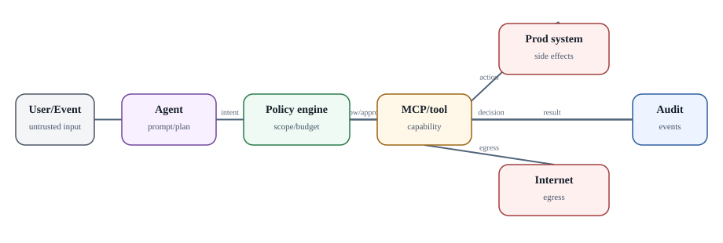

# Security architecture: threat model agent platform

**Статус:** `IMPLEMENTED / VERIFIED` · `MAIN DELTA where noted` · `ROADMAP kept separate`

  
*Security: безопасный агент - это цепочка ограничений, а не один sandbox*

Agent platform объединяет несколько высокорисковых свойств: untrusted natural-language input, executable tools, downloaded code, credentials и network access. Sandbox нужен, но он закрывает только часть угроз.

### Основные классы угроз

**Prompt injection** заставляет модель изменить решение. **Tool injection** подсовывает вредоносные descriptions/results. **Malicious repository/Skill/MCP server** атакует supply chain. **Credential exfiltration** использует shell/network/tool. **Sandbox escape** атакует kernel/runtime boundary. **Lateral movement** использует cluster/service credentials. **Runaway execution** расходует tokens/CPU/API quota. **Confused deputy** заставляет привилегированный tool выполнить действие от имени менее привилегированного task.

### Defense in depth

1. Минимальный system/container image.
2. gVisor или microVM в зависимости от threat model.
3. Без privileged/root capabilities без нужды.
4. Read-only base FS там, где возможно; durable mount только в нужное место.
5. Default-deny egress.
6. Short-lived scoped credentials.
7. Tool-level authorization по operation и arguments.
8. Approval для destructive/write actions.
9. Resource/token/time budgets.
10. Audit trail и immutable action journal.
11. Central secret manager/Kubernetes secret integration с минимальным exposure.
12. Continuous vulnerability/supply-chain scanning.

### Debug как capability

`ax ssh` требует `spec.debug: true`, а runner guest services позволяют arbitrary process/file operations внутри sandbox. Следовательно, debug - привилегия, не cosmetic flag. В production его лучше делать временным break-glass mechanism с audit и отдельной identity, а не включать у всех Tasks.

### Current maturity

Substrate threat-model document в июне 2026 прямо описывал раннюю стадию hardening; последующие релизы добавили identity/egress/authorization работу, но pre-1.0 status остаётся. AX current issues также поднимают auth/authz control plane. Поэтому production internet/multi-tenant deployment без собственного perimeter и review следует считать высоким риском.

### Источники и дальнейшее чтение

- [Substrate threat model](https://github.com/agent-substrate/substrate/blob/main/docs/threat-model.md)
- [Substrate releases](https://github.com/agent-substrate/substrate/releases)
- [AX issues](https://github.com/google/ax/issues)
