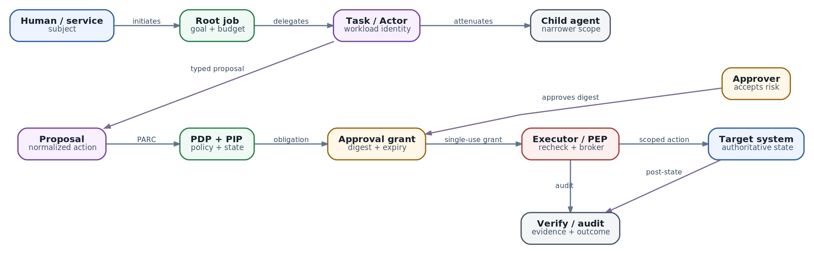

# Identity, authorization и human-in-the-loop: как безопасно делегировать authority агенту

**Статус:** `AX MAIN ac233282` · `SUBSTRATE MAIN 36d6d22` · `VERIFIED 2026-10-08` · `EXPERIMENTAL AUTHZ marked explicitly`

  
*Authority path: identity, policy и approval превращают proposal в ограниченный execution grant*

Представим сетевого агента, который расследует потерю связности. Он прочитал telemetry, нашёл неверный BGP prefix-list и предлагает исправить одну строку. На экране это выглядит как простой вопрос: «Применить изменение?» Но за кнопкой скрывается несколько разных вопросов.

- Кто инициировал расследование?
- Какой Task сформировал proposal?
- Имеет ли этот Task право менять именно этот router и именно этот object?
- Кто вправе принять риск?
- Не изменились ли конфигурация и topology после approval?
- Каким credential executor обратится к network controller?
- Как доказать, что выполнено ровно одобренное действие?

Если все ответы представлены одним admin token, human-in-the-loop становится декорацией. Модель может повлиять на текст approval, Task может подменить target между approve и execute, а компрометация одного child agent получит authority всей платформы.

Эта глава строит связку из identity, authorization, delegation и approval. Глава 23 объяснила threat model и defense in depth. Здесь мы опускаемся на уровень конкретного запроса: **какой principal, действуя от чьего имени, может выполнить какое action над каким resource при каких условиях**. Глава 25 продолжит путь в audit и observability.

## Четыре механизма, которые нельзя смешивать

### Authentication: кто предъявил запрос

Authentication проверяет credential и связывает соединение или request с principal. Примеры: human вошёл через OIDC, workload предъявил SPIFFE certificate, CLI отправил JWT с проверенными issuer и audience.

Authentication не отвечает, можно ли удалить Actor или изменить firewall. Валидный token доказывает identity, а не право на любое действие.

### Authorization: разрешён ли конкретный request

Authorization принимает решение над структурированным запросом:

`principal + action + resource + context -> allow / deny`

Например: может ли `task:incident-742/child-3` выполнить `network.prefix-list.update` над `router:edge-17/prefix-list:customers` в production, если change window открыт, proposal имеет approved digest, а текущая revision равна `481`?

Проверка «пользователь состоит в группе netops» недостаточна, если она не связывает роль с target, environment, operation и текущими условиями.

### Approval: кто принимает остаточный риск

Approval - не замена authorization. Он фиксирует решение ответственного человека или отдельного control process о конкретном high-impact transition. Даже одобренное действие должно пройти обычную policy check. И наоборот, policy может разрешать bounded write без ручного approval.

### Credential: как разрешение предъявляется исполнителю

После allow или approval executor всё равно должен обратиться к target system. Credential является техническим носителем authority: short-lived token, mTLS identity, signed capability или brokered request. Если агенту выдать исходный долгоживущий admin secret, вся предыдущая логика теряет смысл.

Короткая формула:

> Identity называет действующее лицо. Policy ограничивает допустимое. Approval принимает конкретный риск. Credential переносит минимальную authority к месту исполнения.

## Карта identities агентной системы

У одного действия редко бывает только одна identity.

| Identity | Что она обозначает | Жизненный цикл | Что нельзя с ней делать |
| --- | --- | --- | --- |
| Human / service initiator | кто поставил цель | user session или service request | превращать в общий runtime token |
| Root job / session | один запуск бизнес-задачи | от enqueue до финального outcome | переиспользовать между независимыми jobs |
| Task / Actor workload | конкретный изолированный runtime | create/resume/suspend/delete | считать равным инициатору |
| Child agent | делегированную подзадачу и scope | короче parent task | автоматически наследовать все права parent |
| Harness / coordinator | компонент, который строит plan и вызывает tools | deployment/runtime instance | принимать собственный model output за grant |
| Tool executor / gateway | trusted component, делающий side effect | service identity + operation | выполнять unvalidated free-form arguments |
| Approver | кто имеет право принять риск | отдельная authenticated session | подтверждать действие без target и diff |
| Resource owner | кто отвечает за target и policy | организационный lifecycle | подменять identity фактического исполнителя |

Audit event должен связывать эти identities, а не схлопывать их в поле `user`. Для запроса полезны как минимум:

- `subject` - от чьего имени выполняется работа;
- `actor` - кто сейчас действует;
- `root_job_id`, `task_id`, `parent_task_id`;
- `tool_executor` и его workload identity;
- `approver` и assurance level его сессии;
- `resource_owner` и policy domain.

Это различие особенно важно для multi-agent. Root coordinator может иметь право создать child, но child не должен получать токен coordinator. Он получает новую identity и более узкий grant.

## Authorization request как контракт

Практичная модель запроса близка к PARC: principal, action, resource, context.

| Часть | Пример | Источник истины |
| --- | --- | --- |
| Principal | `task:incident-742/child-3` | workload identity / broker |
| Subject | `user:alice@example.com` | IdP session или trusted job envelope |
| Action | `network.prefix-list.update` | server-side tool catalog |
| Resource | `router:edge-17/prefix-list:customers` | resolved object ID, не свободный текст модели |
| Context | prod, ticket, revision, risk, time, device posture | authoritative systems и policy inputs |

Модель может предложить action и human-readable reason. Она не должна самостоятельно определять principal, нормализованный resource ID или policy context. Эти поля собирает trusted harness или gateway.

Пример внутреннего запроса:

```
{
  "subject": "user:alice@example.com",
  "actor": "task:incident-742/child-3",
  "action": "network.prefix-list.update",
  "resource": "router:edge-17/prefix-list:customers",
  "context": {
    "environment": "production",
    "ticket": "INC-742",
    "current_revision": 481,
    "proposal_digest": "sha256:...",
    "risk": "high"
  }
}
```

Не передавайте в policy engine весь prompt и не заставляйте его интерпретировать natural language. Authorization должна работать над типизированными полями с однозначной семантикой.

## Делегирование: child получает меньше, а не копию parent

Agent delegation означает передачу части authority другому actor. Без явной модели делегирования команда часто делает самое опасное: копирует parent environment вместе с tokens.

Безопасное делегирование обладает свойством attenuation - каждый следующий grant не шире предыдущего:

- меньше actions;
- меньше resources;
- более узкий audience;
- короче TTL;
- меньший budget;
- меньшая допустимая глубина spawn;
- запрет дальнейшей delegation, если она не нужна;
- обязательные conditions, например ticket, revision или approval ID.

Для child, который проверяет BGP diff, достаточно `read route`, `read candidate` и `run validation`. Ему не нужен `apply`, credential от production controller или право создавать ещё десять children.

OAuth 2.0 Token Exchange описывает различие subject и actor и позволяет представить delegation chain через `act` claim. Это полезная модель, даже если конкретная платформа использует SPIFFE или собственные signed capabilities. Важно не название protocol, а свойства выдачи:

1. Broker проверяет parent identity и право делегировать.
2. Запрошенный scope пересекается с parent scope, а не заменяет его.
3. Новый token привязан к downstream audience.
4. Token короткоживущий и, по возможности, proof-of-possession.
5. Audit сохраняет subject, current actor и root chain.
6. Revocation root job прекращает выдачу новых grants descendants.

### Delegation и impersonation - не одно и то же

При delegation downstream видит subject и actor: сервис действует от имени Alice, но фактический actor - Task 742. При impersonation сервис выглядит как Alice. Для agent platform delegation предпочтительнее: она сохраняет accountability и позволяет policy ограничить machine actor сильнее человека.

## Как выбрать policy model

Одного универсального механизма нет. Обычно production-система комбинирует несколько моделей.

| Модель | Когда подходит | Сильная сторона | Где ломается |
| --- | --- | --- | --- |
| RBAC | немного стабильных ролей: platform-admin, operator, viewer | проста для human governance | role explosion, слабая привязка к object/context |
| ABAC / policy-as-code | решение зависит от environment, risk, time, labels, revision | выражает request context и conditions | сложнее объяснять и тестировать, нужен надёжный PIP |
| ReBAC | права следуют отношениям owner/editor/viewer, tenant, parent-child | object-level access и наследование | не заменяет runtime conditions и approval semantics |
| Capability / scoped grant | конкретному executor нужен узкий временный доступ | минимальная authority рядом с side effect | требует broker, lifecycle и защиты от replay |

Практический выбор:

- Kubernetes RBAC оставьте для platform operators и service accounts, которые управляют Kubernetes resources. Не используйте ClusterRole как authorization model бизнес-действий агента.
- OpenFGA или SpiceDB удобны, когда вопрос звучит как «имеет ли этот principal отношение owner/editor/viewer к этому tenant/object через граф родителей?»
- Cedar или OPA удобны, когда решение зависит от типизированного request context, risk tier, environment, maintenance window и approval obligations.
- Credential broker или tool gateway нужен у точки side effect, чтобы превратить решение policy в короткоживущую capability и не раскрывать upstream secret Task.

Эти инструменты дополняют друг друга. ReBAC может установить, что Alice - editor atespace. Context policy проверит, что действие production и требует approval. Broker выдаст executor одноразовый grant только на нужный target.

## PDP, PEP, PIP и broker

Zero Trust Architecture разделяет принятие решения и его исполнение.

- **Policy Decision Point (PDP)** вычисляет allow/deny и obligations.
- **Policy Enforcement Point (PEP)** блокирует operation, если действительного решения нет.
- **Policy Information Point (PIP)** поставляет authoritative attributes: ownership, environment, current revision, incident state.
- **Credential broker** выдаёт или добавляет downstream credential после успешной проверки.

Для agent system PEP должен находиться в tool gateway или непосредственно перед target API. Проверка только внутри prompt, harness или UI слишком далеко от side effect: скомпрометированный Task может обойти её прямым network call.

Хороший policy decision содержит не только `allow=true`, но и:

- principal и normalized resource;
- разрешённую operation и argument constraints;
- policy version и decision ID;
- expiry;
- obligations: approval, logging, rate limit, post-verification;
- reason codes, пригодные для audit и UX.

PDP не должен выполнять action. Executor не должен самовольно расширять policy. PIP не должен доверять caller-supplied labels, если может получить их из authoritative store.

## Что реально есть в AX и Substrate сейчас

### AX: atespace пока не является security boundary

В проверенном AX snapshot `ac233282` gRPC server создаётся без transport credentials и authn/authz interceptors. Caller-supplied atespace участвует в адресации resources, но сам по себе не доказывает tenant identity. Issue #376 отдельно фиксирует отсутствие control-plane authentication и authorization.

Следствие: перед production или multi-tenant использованием AX нужен внешний authenticated perimeter, object-level authorization и network isolation control plane. Нельзя строить approval service поверх AX API и считать, что прямой доступ к AX уже закрыт.

### Substrate: authentication реализована, authorization экспериментальна

В snapshot `36d6d22` `ate-api` требует authentication и принимает:

- mTLS client certificate, используя первый URI SAN как principal;
- bearer JWT от настроенного OIDC issuer с проверяемой audience.

В source также есть OpenFGA authorization stack, роли `owner`, `editor`, `viewer`, global и atespace relationships, per-RPC registry и флаг `--experimental-enable-authz`. AccessPolicy governance checks выполняются даже при выключенном общем enforcement, чтобы caller не подготовил себе grant до включения режима.

Но `docs/authentication.md` на том же snapshot всё ещё говорит, что authorization/RBAC не реализованы и authenticated providers следует считать полноправными операторами control plane. Это не повод игнорировать код и не повод объявлять RBAC production-ready. Это признак переходного состояния.

Перед security claim проверьте конкретный image digest и deployment:

1. Собран ли binary из ожидаемого commit.
2. Включён ли `--experimental-enable-authz`.
3. Заданы ли bootstrap owners и кто способен изменить эту конфигурацию.
4. Есть ли rule для каждого используемого RPC.
5. Соответствуют ли stored AccessPolicy и OpenFGA tuples ожидаемому graph.
6. Проходят ли negative tests между atespaces.
7. Что происходит при недоступности policy store.

Substrate также строит actor identity для data plane: использует SPIFFE identities, умеет выпускать actor JWT/certificate и поддерживает egress credential injection, где secret добавляет gateway, а Actor видит только placeholder. Эти механизмы полезны для downstream access, но не являются человеческим approval workflow.

## Human-in-the-loop: человек нужен не на каждом шаге

Если просить approve каждый tool call, оператор быстро начнёт подтверждать не читая. Approval fatigue превращает человека в медленный автомат и ухудшает безопасность.

Approval ставят на переход authority, а не на количество шагов. Полезные сигналы:

| Фактор | Низкий риск | Высокий риск |
| --- | --- | --- |
| Impact | локальный artifact | production availability, money, identity |
| Reversibility | простой rollback | потеря данных или внешний irreversible effect |
| Scope | один test object | fleet, tenant, shared control plane |
| Uncertainty | typed operation и проверенный diff | ambiguous target или слабая диагностика |
| Sensitivity | public/read-only data | secrets, PII, signing material |
| Novelty | известный playbook | новый tool, policy или target class |
| Delegation | direct operator request | длинная chain или autonomous child |

Рабочая taxonomy:

| Класс | Пример | Default |
| --- | --- | --- |
| Read-only | logs, metrics, route lookup | auto при scoped identity |
| Bounded reversible write | создать branch, обновить test object | policy allow + automatic verification |
| High-impact write | production firewall, BGP policy, deploy | explicit approval + separation of duties |
| Destructive / irreversible | wipe data, root PKI revoke | отдельная процедура или запрет agent execution |

Human-on-the-loop подходит там, где действие автоматизировано, но человек наблюдает SLO и способен быстро остановить систему. Human-in-the-loop нужен, когда каждое конкретное действие должно дождаться решения. Human-out-of-the-loop допустим для низкого риска с сильными limits и recovery. Выбор определяется impact и time-to-intervene, а не маркетинговым уровнем автономности.

## Approval должен подтверждать immutable action

Approval «продолжить» ничего не связывает. Между экраном и executor должны совпасть normalized action, target, arguments и preconditions.

Минимальный approval object:

```
approvalId: apr-0194
subject: user:alice@example.com
actor: task:incident-742/child-3
action: network.prefix-list.update
resource: router:edge-17/prefix-list:customers
argumentsDigest: sha256:...
expectedDiffDigest: sha256:...
preconditions:
  currentRevision: 481
  incident: INC-742
risk: high
requiredApproverRole: network-prod-approver
policyVersion: net-policy-87
expiresAt: 2026-10-08T09:15:00Z
singleUse: true
idempotencyKey: op-7f81
```

Human-readable plan хранится рядом, но security binding строится по canonical representation. Canonicalization должна определять сортировку, регистр, default values, units и encoding. Иначе UI и executor могут вычислить разные digest для логически похожих payloads.

### Защита от TOCTOU

Time-of-check to time-of-use возникает, когда approval выдан для revision 481, а к моменту execute target уже имеет revision 483. Executor обязан:

1. Заново authenticated caller и approval claimant.
2. Проверить expiry, single-use и status.
3. Пересчитать digest из фактических normalized arguments.
4. Повторить authorization с текущим policy context.
5. Проверить resource UID/version или другой compare-and-swap precondition.
6. Получить scoped credential только после этих проверок.
7. Выполнить operation с idempotency key.
8. Пометить approval consumed атомарно с claim или operation ledger.

Если target, diff, risk, approver requirement или policy revision изменились существенно, создаётся новый proposal. Старое approval не «переносится» на похожее действие.

## Lifecycle approval object

Полезная state machine:

`proposed -> pending -> approved | rejected | expired | superseded -> claimed -> executed -> verified | failed | uncertain`

Состояние `uncertain` обязательно. Timeout после write не доказывает, что action не произошёл. В этом состоянии система запрещает слепой retry и сначала читает authoritative post-state или operation ledger.

Approval service должен атомарно предотвращать:

- double execution;
- одновременный claim двумя executors;
- approve после expiry;
- изменение payload после approve;
- reuse approval другим Task;
- исполнение после revoke или supersede.

## Separation of duties и break-glass

Для high-impact действий инициатор, approver и executor выполняют разные роли:

- Agent предлагает, но не approves.
- Approver принимает риск, но не меняет payload незаметно.
- Executor применяет только signed/hashed grant.
- Verifier независимо читает post-state.

Для самых критичных операций полезны quorum или два разных policy domains: service owner подтверждает intent, security/network owner подтверждает blast radius.

Break-glass не означает «выключить policy». Это отдельный короткоживущий путь с сильной authentication, узким scope, обязательной причиной, повышенным audit, alert и последующим review. Emergency access не должен становиться удобным обходом approval latency.

## Каким должен быть approval UX

Человек способен принять решение только если видит релевантный context. Экран approval должен показывать:

- точный environment и target с устойчивым ID;
- before/after diff или normalized arguments;
- источник proposal и evidence;
- blast radius и затрагиваемые dependencies;
- policy reason: почему нужен человек;
- preconditions и freshness;
- план verification и rollback;
- expiry и признак single-use;
- identity инициатора, Task и фактического executor.

Не прячьте critical fields в раскрывающийся JSON и не показывайте только natural-language summary модели. Summary помогает понять intent, но не является authoritative payload.

Evidence тоже недоверенно. Ticket, repository text или tool result может содержать prompt injection, misleading links и Unicode spoofing. Approval UI должна явно отделять generated explanation от verified facts, нормализовать identifiers и не превращать текст модели в активные команды.

## End-to-end pattern: observe -> propose -> authorize -> approve -> execute -> verify

Разберём BGP incident полностью.

### 1. Observe

Read-only Task получает scoped доступ к telemetry. Он не имеет production write credential. Все reads связаны с incident и target domain.

### 2. Diagnose

Harness собирает evidence: expected route, current config revision, recent changes. Model формирует гипотезу, но authoritative facts поступают из controller и source-of-truth.

### 3. Propose

Trusted tool adapter преобразует предложение в typed operation. Target разрешается по inventory ID, diff нормализуется, вычисляется digest, оценивается blast radius.

### 4. Authorize

PDP проверяет subject, Task identity, action, resource, environment, delegation chain и policy. Решение требует `network-prod-approver`, потому что write влияет на production edge.

### 5. Approve

Approver видит точный diff, revision 481, validation result и rollback. Approval получает TTL и single-use binding к digest.

### 6. Execute

PEP повторяет policy check, сравнивает revision, claims approval и просит broker выдать credential только для `edge-17` и одной operation. Task этого credential не видит.

### 7. Verify

Отдельный read path проверяет config revision, route propagation и invariants. Успешный HTTP/gRPC response executor не считается outcome. Если verification не проходит, запускается controlled rollback или incident escalation.

## Что и как тестировать

Authorization test suite должна включать отрицательные и race-сценарии.

| Проверка | Ожидаемый результат |
| --- | --- |
| JWT валиден, audience чужая | unauthenticated |
| Actor authenticated, но чужой atespace | permission denied без утечки object details |
| Child запросил scope шире parent | broker deny |
| Proposal изменён после approval | digest mismatch, execute deny |
| Resource revision изменилась | precondition failed, требуется новый proposal |
| Approval expired или revoked | execute deny |
| Два executors claim один approval | ровно один получает grant |
| Timeout после write | state `uncertain`, blind retry запрещён |
| Policy store недоступен | high-impact action fail closed |
| Task обходит gateway прямым network call | network deny |
| Approver пытается подтвердить собственный high-risk request | separation-of-duties deny |
| Break-glass использован | alert, короткий TTL, обязательный review evidence |
| Verifier читает summary executor вместо target | тест считается некорректным |

Дополнительно тестируйте policy coverage: каждый production RPC/tool method должен иметь зарегистрированное правило. Новый endpoint без policy обязан падать закрыто, а не становиться неявно разрешённым.

## Метрики, которые покажут деградацию контроля

Глава 25 подробно разберёт observability, но approval и authorization должны сразу проектироваться с измерениями:

- allow/deny по policy, action и resource class;
- доля actions, потребовавших approval;
- approve/reject/expire/supersede;
- approval latency и time-to-execute;
- stale proposal и revision mismatch;
- double-claim attempts;
- break-glass frequency;
- uncertain outcomes после timeout;
- post-verification failures и rollbacks;
- child delegation depth и denied scope amplification.

Высокий approve rate не доказывает безопасность. Он может означать rubber stamping. Полезнее смотреть на rejected proposals, изменённые планы, просроченные approvals, расхождения verification и качество policy automation.

## Антипаттерны

- **Один service account на всех агентов.** Нельзя установить actor и ограничить blast radius.
- **Parent token копируется child.** Делегирование превращается в privilege cloning.
- **Валидный JWT означает полный доступ.** Authentication подменяет authorization.
- **Atespace или namespace считается tenant boundary.** Имя resource не доказывает caller relationship.
- **Approval подтверждает prompt.** Исполняется typed action, поэтому именно он должен быть связан digest.
- **Каждый tool call требует человека.** Approval fatigue делает контроль формальным.
- **Approval проверяется только в UI.** Прямой API path обходит решение.
- **Policy выполняется только перед ожиданием человека.** После ожидания context и target могли измениться.
- **Executor использует admin secret.** Scoped policy не ограничивает реальную downstream authority.
- **Успешный response равен outcome.** Side effect проверяется по authoritative state.
- **Break-glass отключает audit.** Emergency path требует больше evidence, а не меньше.
- **Экспериментальный authz объявлен готовым по наличию кода.** Нужны flag, coverage, negative tests и failure-mode validation.

## Итог

Безопасный agent не получает «права пользователя». Он получает короткую цепочку доказуемого делегирования. Human или service формулирует цель, Task действует под собственной workload identity, child получает attenuated scope, PDP проверяет principal-action-resource-context, approval связывается с immutable action, а PEP рядом с side effect выдаёт executor минимальную capability.

Human-in-the-loop полезен только там, где человек видит конкретный риск и способен принять осмысленное решение. Он не исправляет широкие credentials, слабую isolation или неструктурированный tool call. Правильная архитектура делает низкорисковые действия автоматическими, high-impact действия проверяемыми, а запрещённые действия технически недоступными.

Для current AX нужно внешнее control-plane authn/authz. В current Substrate authentication уже реальна, а OpenFGA authorization находится в экспериментальном переходе и требует проверки конкретного deployment. Ни продукт, ни роль, ни approval сами по себе не создают гарантию. Гарантия появляется только тогда, когда identity, policy, grant, execution и verification образуют непрерывный проверяемый путь.

Следующая глава покажет, как сделать этот путь наблюдаемым: связать user goal, Task/Actor, policy decision, approval, tool call, model request и внешний side effect общей correlation identity без утечки secrets и скрытого reasoning.

### Источники и дальнейшее чтение

- [Substrate authentication на снимке 36d6d22](https://github.com/agent-substrate/substrate/blob/36d6d222a04051cbe05e6877e67bf13498cc558d/docs/authentication.md)
- [Substrate experimental OpenFGA authorization model](https://github.com/agent-substrate/substrate/blob/36d6d222a04051cbe05e6877e67bf13498cc558d/cmd/ateapi/internal/authz/model.fga)
- [Substrate ate-api wiring: authentication и experimental authz flag](https://github.com/agent-substrate/substrate/blob/36d6d222a04051cbe05e6877e67bf13498cc558d/cmd/ateapi/main.go)
- [Substrate egress credential injection](https://github.com/agent-substrate/substrate/blob/36d6d222a04051cbe05e6877e67bf13498cc558d/docs/egress-credential-injection.md)
- [AX server на снимке ac233282](https://github.com/google/ax/blob/ac2332829f22360ff97b0ba34d94dd0dd782f17e/internal/server/server.go)
- [AX issue #376: control-plane authentication и authorization](https://github.com/google/ax/issues/376)
- [NIST SP 800-207A: identity-based access control для cloud-native systems](https://csrc.nist.gov/pubs/sp/800/207/a/final)
- [RFC 8693: OAuth 2.0 Token Exchange и delegation chain](https://www.rfc-editor.org/rfc/rfc8693.html)
- [OpenFGA: relationship-based fine-grained authorization](https://openfga.dev/)
- [Cedar authorization request: principal, action, resource, context](https://docs.cedarpolicy.com/auth/authorization.html)
- [OWASP LLM06:2025 Excessive Agency](https://genai.owasp.org/llmrisk/llm062025-excessive-agency/)
- [NIST AI RMF Core: роли и процессы human oversight](https://airc.nist.gov/airmf-resources/airmf/5-sec-core/)
