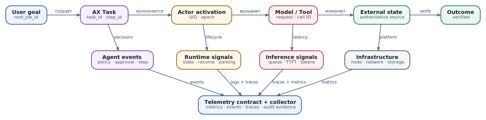

# Observability: от user goal до подтверждённого результата

> Снимок главы: **AX main `ac233282` · Substrate main `df78882` · проверено 2026-10-08**. Реализованные возможности и целевая архитектура ниже разделены явно.

Пользователь пишет: «агент завис». На одном dashboard CPU свободен. В логах модели последний запрос завершился успешно. Actor числится `RUNNING`. Инструмент вернул HTTP 200. Каждая подсистема по отдельности выглядит здоровой, но результата нет.

Причина может находиться где угодно в причинной цепочке. Task ждёт approval, запрос припаркован из-за заполненного WorkerPool, model gateway держит очередь, tool ответил до фактического применения изменения, verification читает устаревшую replica, а дочерний Task завершился без передачи результата родителю. Набор разрозненных графиков не отвечает, какой из этих сценариев произошёл.

**Observability — способность восстановить внутреннее состояние и причинный путь системы по её внешним сигналам.** Monitoring проверяет заранее известные условия: «очередь выше порога», «p95 превысил цель». Observability нужна для вопроса, который заранее не был записан в alert rule: «почему именно этот user goal не дошёл до подтверждённого outcome?»

  
*Observability graph: один user goal связывает outcome, agent, runtime и infrastructure signals*

Главная идея главы проста: метрики, логи и traces становятся полезными только после того, как система договорилась об identity, событиях и критерии результата. Сначала проектируют **telemetry contract**, затем выбирают backend.

## Что именно требуется наблюдать

У agent system есть четыре технических слоя и одна сквозная плоскость результата.

| Слой | Что происходит | Главный вопрос | Примеры сигналов |
| --- | --- | --- | --- |
| Infrastructure | Nodes, Pods, сеть, storage, GPU, Redis/PostgreSQL/object store | Есть ли физический или платформенный bottleneck? | CPU throttling, memory pressure, disk latency, packet drops, GPU memory, workqueue depth |
| Runtime / Substrate | Actor назначается Worker, запускается, suspend/resume, checkpoint/restore, request parking | Где находится логический Actor и почему он не исполняется? | actor state, WorkerPool saturation, resume phases, snapshot size, parked requests |
| Agent / harness | Goal превращается в план, шаги, delegation, approvals, tools и verification | Какое решение принял orchestrator и на каком переходе остановился workflow? | step events, policy decision, approval state, retry, child Task, tool outcome |
| LLM / inference | Request попадает в gateway, очередь и model server | Сколько времени и ресурсов ушло на inference и чем закончился вызов? | queue time, TTFT, inter-token latency, tokens, cache hit, error class, cost estimate |
| Outcome | Внешнее состояние изменилось или проверяемый ответ доставлен пользователю | Получил ли пользователь требуемый результат, а не просто успешный RPC? | verified outcome, end-to-end latency, manual recovery, unsafe side effects |

Outcome — не «пятый dashboard». Это верхняя плоскость, которая связывает остальные. Если tool process завершился с `exit_code=0`, но требуемый route не появился в authoritative control plane, tool execution успешен технически, а outcome не достигнут.

## Три сигнала и два вида доказательств

Разные сигналы отвечают на разные вопросы. Попытка складывать всё в один «лог агента» быстро создаёт дорогой архив, в котором трудно расследовать инцидент.

| Сигнал | Для чего он нужен | Что в нём хранить | Чего в нём не должно быть |
| --- | --- | --- | --- |
| Metrics | агрегаты, тенденции, SLI и alerts | bounded labels, counts, histograms, gauges | Task ID, Actor UID, prompt, URL с параметрами, user ID |
| Logs / events | точные факты с высокой cardinality | event name, identity, state transition, reason, error, sanitized details | secrets, raw credentials, скрытый chain-of-thought |
| Traces | причинный путь и разложение latency | spans, parent/child relations, links, status, bounded attributes | один span длиной в дни, полный prompt по умолчанию |

Profiles полезны для CPU и memory hotspots, но не заменяют эти три сигнала. Они объяснят, где process тратит время, но не покажут, почему policy отправила действие на approval.

Нужно также разделить **diagnostic telemetry** и **audit evidence**. Диагностические логи могут сэмплироваться, теряться при backpressure и удаляться по короткому retention. Audit trail должен доказывать, кто инициировал действие, какая policy сработала, что именно было разрешено, какой executor применил side effect и чем закончилась verification. Он требует другой целостности, доступа и срока хранения. Копия обычных application logs не становится аудитом только из-за долгого retention.

## Correlation identity: карта, а не один ID

Фраза «добавим `trace_id`» недостаточна. В agent workflow несколько временных масштабов: пользовательская цель живёт часы, Task — дни, Actor переживает много activations, RPC — миллисекунды, а external operation может продолжаться после timeout клиента. Один identifier не выражает все эти отношения.

Практический correlation contract разделяет четыре класса identity.

| Класс | Примеры | Жизненный цикл |
| --- | --- | --- |
| Логическая цель | `root_job_id`, `session_id_hash`, `task_id`, `parent_task_id` | от постановки цели до terminal outcome |
| Исполняемая сущность | `ate.atespace`, `ate.actor.uid`, `ate.actor.name`, template | Actor UID стабилен в течение жизни Actor |
| Попытка | `activation_id`/epoch, `step_id`, `attempt`, `tool_call_id`, `approval_id`, `model_request_id` | один resume, шаг или внешний вызов |
| Физическое размещение | `service.instance.id`, cluster, Pod, Worker, node, sandbox class | меняется при relocation и restart |

У каждого класса своя роль. `task_id` отвечает «какая работа?», `actor.uid` — «какой логический runtime?», activation/epoch — «какая попытка исполнения?», Pod и Worker — «где она выполнялась в этот момент?». Pod name нельзя использовать как основную identity: после suspend/resume история распадётся на несколько машин. Actor name тоже недостаточен без atespace, а повторно созданный объект нельзя смешивать с прежним — для этого нужен server-assigned UID.

`trace_id` связывает операции внутри конкретного причинного графа, но не должен подменять resource ID или idempotency key. Повтор команды может получить новый trace и сохранить тот же idempotency key. Новый Actor может получить прежнее имя, но обязан иметь другой UID.

### Минимальный propagation contract

На каждой границе — gRPC/HTTP, queue, child Task, model gateway, MCP/tool executor — передаются:

- W3C `traceparent` и при необходимости `tracestate`;
- `root_job_id`, `task_id`, `parent_task_id` как явно определённые application attributes;
- Actor identity, которую authoritative runtime добавляет сам;
- operation-specific ID: `tool_call_id`, `model_request_id`, `approval_id` или external request ID.

Не доверяйте workload самостоятельно присвоить себе platform identity. Substrate резервирует namespace `ate.*` и отбрасывает такие ключи из actor output: иначе workload мог бы выдать себя за другой Actor. Тот же принцип нужен AX и tool gateway — authoritative identity добавляется на доверенной границе.

## Trace не должен жить столько же, сколько Task

Долгий agent workflow не следует представлять одним незавершённым span. Span, открытый на часы или дни, плохо экспортируется, неудобен для sampling и может исчезнуть при crash. Parent span также не всегда охватывает асинхронного потомка по времени.

Лучше использовать короткие traces по активным участкам и связывать их:

1. Входной request создаёт trace для принятия goal и создания Task.
2. Resume или новая activation создаёт новый trace, связанный с root job и предыдущей attempt.
3. Producer span заканчивается после постановки работы в queue; consumer span описывает фактическое выполнение.
4. Child Task получает собственный trace и `parent_task_id`; scatter/gather связывает результаты через span links.
5. Tool и model requests создают отдельные client spans, а gateway/server — соответствующие server spans.

OpenTelemetry links предназначены именно для причинных отношений, которые не укладываются в одного parent. Они особенно полезны после suspend/resume, retries, fan-out и при пересечении trust boundary, где входной trace сознательно заменяется новым. Для расследования сохраняется link, но входной `traceparent` не принимается как доверенная identity пользователя.

## События агента: фиксируйте переходы, а не внутренний монолог

Agent observability не требует сохранять chain-of-thought. Скрытое reasoning нестабильно как interface, может содержать чувствительные данные и не является надёжным доказательством принятого решения. Нужен структурированный журнал **наблюдаемых решений и действий**.

Полезный минимальный словарь событий:

- `agent.task.created`, `agent.task.completed`, `agent.task.failed`;
- `agent.step.started`, `agent.step.completed`;
- `agent.route.selected`, `agent.child.created`, `agent.child.result_received`;
- `agent.tool.proposed`, `agent.tool.authorized`, `agent.tool.executed`, `agent.tool.verified`;
- `agent.approval.requested`, `agent.approval.granted`, `agent.approval.expired`;
- `agent.model.requested`, `agent.model.completed`;
- `agent.outcome.verified`.

Событие должно быть машинно разбираемым и версионированным. Свободный текст остаётся для человека, но не несёт единственную копию semantics.

```
{
  "event.name": "agent.tool.verified",
  "event.schema.version": "1.0",
  "timestamp": "2026-10-08T10:41:12.381Z",
  "trace_id": "4bf92f3577b34da6a3ce929d0e0e4736",
  "root_job_id": "job-8041",
  "task_id": "task-net-17",
  "step_id": "step-06",
  "tool_call_id": "tool-923",
  "tool.name": "network.apply_prefix_list",
  "action.class": "write",
  "policy.decision_id": "dec-118",
  "approval.id": "apr-551",
  "outcome": "verified",
  "verification.source": "network-controller",
  "duration_ms": 842
}
```

Этот record не содержит raw token, prompt или полный tool payload. Если для forensic analysis нужен payload, храните его в отдельном зашифрованном evidence store, а в событии — digest, classification и access-controlled reference.

### Tool call — не одно событие

Для write operation различайте минимум четыре момента:

1. **Proposed** — модель или rule предложили typed action.
2. **Authorized** — PDP/approval разрешили конкретный digest действия.
3. **Executed** — executor отправил downstream request и получил protocol result.
4. **Verified** — authoritative source подтвердил ожидаемое состояние.

Если записать только `tool.success=true`, невозможно понять, было ли действие разрешено, применилось ли оно и не относится ли ответ к повторной попытке. Та же модель полезна для read: request, response classification, freshness и provenance.

## Metrics: cardinality — часть архитектуры

Metric backend создаёт отдельную time series для каждой комбинации labels. Если добавить `task_id` или `actor.uid`, число series растёт вместе с числом задач и может превратить observability в причину отказа.

**Подходящие labels ограничены известным набором:**

- `service.name`, environment, region;
- model provider и model family/revision;
- tool class, а не произвольный command;
- outcome и документированный `error.type`;
- Substrate template, WorkerPool, sandbox class;
- bounded policy/result class.

**Высокая cardinality уходит в logs, events и traces:** Task ID, Actor UID, user/session, repository URL, prompt digest, external operation ID. В metric exemplar можно оставить ссылку на конкретный trace, не превращая trace ID в label.

В Substrate это уже сделано намеренно: агрегированные `ate.actor.stats.*` metrics используют bounded template/pool dimensions, а per-actor measurements идут как events. Не создавайте поверх них log-based metric с label `ate.actor.uid` — это вернёт ту же проблему под другим названием.

Метрика должна сохранять смысл. Например, `atenet.router.parking.wait.duration` различает `served`, `budget_exhausted`, `canceled`, `timeout` и `error`. `budget_exhausted` означает capacity bottleneck, а не обычный application error. Один counter `requests_failed_total` стёр бы это различие и направил расследование не туда.

## Что уже даёт Substrate

На снимке `df78882` Substrate реализует существенно больше, чем было видно из краткой версии этой главы:

- оборачивает stdout/stderr контейнеров в structured JSON и добавляет `ate.actor.*`, atespace, template и container metadata;
- позволяет смотреть текущий Actor через `kubectl ate logs actors ... --atespace ...`; для истории через migration/resume нужен central log backend;
- при `--follow` способен продолжить stream после migration Actor;
- экспортирует foundational OTLP metrics и on-demand distributed traces;
- выдаёт authoritative lifecycle events `ate.actor.state_changed`, `ate.actor.crashed` и `ate.actor.usage_sampled`;
- фиксирует per-restore timing breakdown и actor usage без добавления Actor UID в metric labels;
- имеет metric registry и event registry, проверяемые CI;
- предоставляет request-parking metrics и `/statusz` для capacity diagnosis.

Есть важные ограничения.

**Во-первых, lifecycle stream нельзя сэмплировать.** `ate.actor.state_changed` записывается после committed state transition. Consumer, строящий derived state, принимает последнее событие для Actor UID; потеря одного record создаёт тихо устаревшее состояние. Current state всё равно следует запрашивать у control plane: event stream — история переходов, а не гарантированная база текущего состояния.

**Во-вторых, container line получает trace context только тогда, когда actor SDK сам его эмитирует.** Runtime не может достоверно определить, какому concurrent request относится строка общего stdout. Component records имеют `trace_id`, `span_id`, `trace_flags`, но полная actor-level correlation остаётся частично roadmap.

**В-третьих, доставка имеет failure modes.** OTLP processor может потерять records при заполненной queue, недоступном collector или завершении process до flush. Режим `otlp,console` создаёт резервную stdout-копию, но при одновременном сборе stdout и OTLP способен дать duplicates. Pipeline должен выбрать одну authoritative ingestion path или дедуплицировать по event identity.

**В-четвёртых, ресурсные события и metrics имеют разную semantics.** `ate.actor.usage_sampled` несёт Actor identity и epoch; CPU counter может сброситься при новой activation. Отрицательная дельта означает reset, а не отрицательное потребление. Отсутствующее измерение означает «не измерено», а не ноль.

## Что реально есть в AX, а что ещё предстоит

На снимке AX `ac233282` control plane и runner используют стандартный Go `slog`. Сообщения содержат полезные отдельные поля: Task name, atespace, Actor name, image, PID, command и exit code. Они помогают локальной диагностике, но это ещё не end-to-end observability contract:

- `ax-server` и `ax-task-runner` настраивают text handler в stdout;
- gRPC server создаётся без OpenTelemetry interceptors;
- нет общей propagation цепочки Task → Actor → runner → model/tool;
- нет стандартной schema событий agent steps, policy, approval и verification;
- Telemetry and Trajectory Collection прямо указана в AX roadmap как будущая работа.

Поэтому корректная архитектура сейчас — не утверждать, что AX уже экспортирует полную trajectory, а поставить **telemetry adapter на границах, которыми вы управляете**:

1. instrument AX API/gRPC и reconciler;
2. передавать Task/root identity в runner как отдельный доверенный context;
3. instrument agent harness, model gateway и tool gateway;
4. принимать authoritative Actor metadata от Substrate;
5. нормализовать всё в версионированную schema в collector;
6. проверять propagation и redaction integration tests.

Когда AX добавит native trajectory export, adapter можно заменить, сохранив contract и backend queries.

## LLM telemetry без утечки данных

Для model request полезно разложить end-to-end latency:

`agent wait → gateway queue → provider/network → model queue → time to first token → generation → post-processing`

Минимальный набор attributes:

- provider, model name и revision;
- operation (`chat`, `generate_content`, `embeddings` и аналогичная stable class);
- input/output token counts, cache read/write tokens;
- queue duration, TTFT, generation duration, inter-token latency, total duration;
- finish reason, retry count, throttling и bounded error type;
- provider request ID в trace/log, но не в metric label;
- estimated cost с явно указанной версией pricing table.

OpenTelemetry GenAI semantic conventions уже определяют общие `gen_ai.*` names и операции, включая `execute_tool` и `invoke_agent`, но многие conventions ещё имеют development status. Зафиксируйте используемую версию schema и план migration.

Prompt, completion, tool arguments и results могут содержать secrets и PII. Их запись должна быть **opt-in**, redacted, ограничена по размеру и доступна меньшему кругу людей, чем обычные latency metrics. Для production диагностики чаще достаточно token counts, digests, content class, policy flags и защищённой ссылки на отдельно сохранённый sample. Никогда не записывайте hidden reasoning как обязательный telemetry field.

## SLI и SLO: измеряйте пользовательский результат

SLO — не список красивых percentiles. Для каждого SLI задайте:

- измеряемую population и источник истины;
- good/bad event и исключения;
- окно и objective;
- owner и действие при расходовании error budget.

Например:

`verified outcome ratio = verified terminal goals / eligible terminal goals`

В denominator нельзя молча исключать timeout, manual abort или задачи, потерянные при restart. Exclusion policy должна быть явной. Sampled traces нельзя использовать как точный denominator — SLI считается по unsampled metric/event stream.

Практический набор для agent platform:

| SLI | Что защищает | Примечание |
| --- | --- | --- |
| Verified outcome ratio | полезный результат | определяется отдельно для каждого класса задач |
| End-to-end outcome latency | ожидание пользователя | от accepted goal до verified outcome, а не до model response |
| Time to first useful action | отзывчивость | «полезное» задаётся наблюдаемым событием, не первым token |
| Manual recovery ratio | автономность | отделять плановый approval от аварийного вмешательства |
| Unsafe/unauthorized side effects | safety guardrail | абсолютный count может быть важнее процента |
| Task ready / resume latency | runtime readiness | разделять cold boot, restore и queue/parking |
| Tool verified success ratio | надёжность действий | protocol success не считается verification |
| Model TTFT и request success | inference health | не подменяет end-to-end outcome |

Tokens/s, GPU utilization и cache hit — важные engineering metrics, но сами по себе не SLO продукта. Высокий throughput не помогает пользователю, если agent циклически повторяет бесполезный tool call.

## Sampling и надёжность telemetry pipeline

Цена хранения контролируется не одинаковым sampling для всех данных, а их критичностью:

- SLI metrics и counters — не сэмплировать;
- lifecycle, authorization, approval, execution и verified outcome — не сэмплировать;
- error и high-impact traces — сохранять полностью;
- normal traces — head sampling для бюджета и tail sampling по latency/outcome;
- verbose model/tool content — opt-in sampling с redaction и коротким retention;
- actor usage events — можно снижать по документированному правилу, если они не являются billing evidence.

Collector — часть production path наблюдаемости и сам требует metrics: accepted, dropped, refused, queue size, retry и export latency. При его отказе приложение не должно бесконечно блокировать user request, но критическое evidence не должно тихо исчезать. Используйте bounded queue, disk buffer там, где он оправдан, flush budget, drop counters и отдельный канал для audit events.

Проверьте clock synchronization. Trace UI может нарисовать невозможный порядок, если часы Worker и gateway расходятся. Для causal order важны parent/link relations и monotonic duration внутри process, а wall-clock timestamp требует синхронизированных hosts.

## Security telemetry

Observability backend видит topology, identities, error details и иногда содержимое запросов. Это высокоценный control-plane asset.

Минимальные controls:

- tenant isolation и field-level access для sensitive payload;
- encryption in transit/at rest и отдельная workload identity exporters;
- redaction до выхода из trust boundary;
- allowlist полей вместо попытки найти все возможные secrets regex-ами;
- retention по типу сигнала, а не один срок на всё;
- integrity и append-only guarantees для audit trail;
- журнал доступа к evidence;
- запрет workload подменять reserved platform attributes.

`root_job_id` и Task ID тоже могут раскрывать business context, поэтому публичный dashboard не должен превращаться в directory активных целей. User identity лучше хранить как scoped pseudonymous reference и разрешать обратное сопоставление только уполномоченному incident/audit process.

## Dashboards и alerts, которыми можно пользоваться

Один огромный dashboard создаёт иллюзию полноты. Разделите views по вопросу:

1. **Outcome:** verified success, end-to-end latency, manual recovery, safety guardrails.
2. **Agent:** active Tasks, steps, retry loops, approvals, tool verification, child fan-out.
3. **Runtime:** Actor states, restore phases, WorkerPool saturation, parking outcomes, crashes.
4. **Inference:** request/queue latency, TTFT, tokens, cache, throttling, GPU saturation.
5. **Infrastructure:** nodes, network, storage, databases, collector health.

Каждый верхнеуровневый panel должен вести к traces/events с тем же time range и dimensions. Dashboard без drill-down отвечает «плохо», но не помогает дежурному найти причинный путь.

Page должен приходить по пользовательскому симптому или быстрому расходованию error budget. Cause alerts вроде «CPU 82%» полезны как diagnostic signals, но часто не требуют ночного звонка. Multi-window burn-rate alert различает быстрый catastrophic burn и медленное устойчивое ухудшение. У alert должны быть owner, impact, ссылка на runbook и несколько первых запросов, которые подтверждают или опровергают гипотезу.

## Разбор инцидента «агент завис»

Рабочий runbook идёт сверху вниз, сохраняя correlation identity.

1. Найти `root_job_id` и определить terminal/expected outcome. Goal ещё исполняется, ждёт человека или уже завершён без verification?
2. По `task_id` проверить последний committed agent event. Если это `approval.requested`, искать approval ID и deadline, а не CPU.
3. По Actor UID запросить current state у Substrate и сравнить его с lifecycle history. Не принимать последний log event за authoritative current state.
4. Если Actor ждёт resume, разложить route/parking/restore latency. `budget_exhausted` указывает на capacity, `timeout` — на deadline клиента, `error` — на non-retryable failure.
5. Для работающей activation перейти по trace link к model/tool spans. Отделить gateway queue, provider latency и tool execution.
6. Для write tool сопоставить proposed → authorized → executed → verified. HTTP 200 без verification не закрывает инцидент.
7. Если сигнал обрывается, проверить сам telemetry pipeline: dropped records, collector queue, duplicate ingestion и clock skew.

Такой путь превращает фразу «завис» в проверяемую последовательность гипотез. Без общей identity команда прыгает между пятью dashboards и вручную сравнивает timestamps.

## Минимальный план внедрения

Не начинайте с покупки observability platform. Начните с контракта и одного end-to-end сценария.

### Этап 1. Identity и schema

- определить root, Task, Actor, activation, step, tool/model IDs;
- зафиксировать reserved namespaces и owners полей;
- версионировать event schemas;
- описать redaction и cardinality budgets.

### Этап 2. Один golden path

Instrument путь `CreateTask → ResumeActor → model request → read-only tool → verified answer`. Для него должны работать log-to-trace переходы и поиск от user goal до каждого слоя.

### Этап 3. Failure paths

Добавить approval timeout, tool retry, WorkerPool saturation, suspend/resume, child Task, collector outage и external operation, завершившуюся после client timeout.

### Этап 4. SLO и alerts

Сначала определить outcome SLI и denominator, затем platform decomposition и burn-rate alerts. Не выводить reliability из sampled traces.

### Этап 5. Проверка контрактов

Автоматические tests должны ловить:

- потерю `traceparent` на HTTP/gRPC/queue boundary;
- отсутствие span link после resume или delegation;
- попадание Task/Actor IDs в metric labels;
- secret/PII в events и model content;
- sampling lifecycle/audit events;
- duplicates при одновременном OTLP и stdout ingestion;
- неверный порядок из-за clock skew;
- незаметную потерю данных при backpressure/collector outage;
- расхождение event registry и реально эмитируемого кода.

## Итог

Наблюдаемость agent infrastructure начинается не с dashboard и не с полного сохранения мыслей модели. Она начинается с точной причинной модели: user goal порождает Task, Task исполняется через Actor activations, agent принимает наблюдаемые решения, policy разрешает конкретное действие, executor выполняет его, а verification подтверждает внешний outcome.

Metrics показывают масштаб и тенденции, events — конкретные переходы, traces — причинный путь. Stable logical IDs переживают relocation, attempt IDs различают retries, а physical IDs объясняют, где возник bottleneck. Lifecycle и audit evidence не сэмплируются; высококардинальные identity не попадают в metric labels; чувствительное содержимое не собирается по умолчанию.

Substrate уже предоставляет прочную runtime-базу, но её semantics и ограничения нужно учитывать. Текущий AX ещё не реализует целостную OpenTelemetry trajectory, поэтому эту связность сегодня строят на контролируемых границах harness, gateway и runner. В следующей главе мы развернём учебный стенд и сразу заложим минимальный telemetry path, чтобы последующие эксперименты измерялись, а не оценивались на глаз.

### Источники и дальнейшее чтение

- [Substrate observability на снимке df78882](https://github.com/agent-substrate/substrate/blob/df788825e6fc13dd7aa5fd283c8f14bd4c818247/docs/observability.md)
- [Substrate request parking на снимке df78882](https://github.com/agent-substrate/substrate/blob/df788825e6fc13dd7aa5fd283c8f14bd4c818247/docs/request-parking.md)
- [Substrate metric registry на снимке df78882](https://github.com/agent-substrate/substrate/tree/df788825e6fc13dd7aa5fd283c8f14bd4c818247/docs/metrics/registry)
- [AX server на снимке ac233282](https://github.com/google/ax/blob/ac2332829f22360ff97b0ba34d94dd0dd782f17e/internal/server/server.go)
- [AX runner на снимке ac233282](https://github.com/google/ax/blob/ac2332829f22360ff97b0ba34d94dd0dd782f17e/runner/runner.go)
- [AX roadmap: Telemetry and Trajectory Collection](https://github.com/google/ax/blob/ac2332829f22360ff97b0ba34d94dd0dd782f17e/docs/roadmap.md)
- [OpenTelemetry logs и correlation](https://opentelemetry.io/docs/specs/otel/logs/)
- [OpenTelemetry tracing API и span links](https://opentelemetry.io/docs/specs/otel/trace/api/)
- [OpenTelemetry GenAI semantic conventions](https://opentelemetry.io/docs/specs/semconv/registry/attributes/gen-ai/)
- [W3C Trace Context](https://www.w3.org/TR/trace-context/)
- [Google SRE Workbook: alerting on SLOs](https://sre.google/workbook/alerting-on-slos/)
