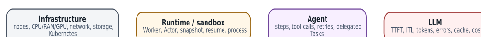

# Observability: четыре слоя и единая correlation identity

  
*Четыре слоя observability нельзя смешивать в один «лог агента»*

Наблюдаемость agent system должна позволять пройти путь от user goal до конкретного tool side effect и одновременно увидеть infrastructure bottleneck.

### Infrastructure layer

Node/Pod CPU, RAM, disk latency, network drops, GPU memory/utilization, Redis/PostgreSQL/object-store metrics, Kubernetes events. Это отвечает на вопрос «платформа физически здорова?».

### Runtime layer

Actor state, Worker assignment, resume/suspend duration, snapshot size/transfer, WorkerPool occupancy, scheduling wait. Substrate actor логически переживает разные Workers, поэтому logs должны иметь stable actor metadata, иначе история распадётся по Pod names.

### Agent layer

Step number, plan/route decision, tool name, sanitized arguments, result class, retry, child Task, approval state. Логи chain-of-thought не являются обязательным или желательным telemetry format; нужен структурированный event trail действий и решений без раскрытия скрытого reasoning.

### LLM layer

Provider/model/revision, prompt/output token counts, TTFT, ITL, queue time, error class, cache hit, request ID и cost estimate. Prompt content следует логировать выборочно/редактированно: observability storage сама может стать источником утечки secrets/PII.

### Correlation

Минимальные IDs: `trace_id`, user/job id, AX Task id, Substrate Actor UID, tool call id, model request id. Для multi-agent добавляется parent/root task. Один trace должен переживать suspend/resume и Worker relocation.

### SLO

Примеры SLO: time-to-Task-ready, resume p95, tool success rate, model TTFT p95, successful agent outcome rate, percentage actions requiring manual recovery. «Tokens/s» сам по себе не является SLO бизнеса.

### Источники и дальнейшее чтение

- [Substrate observability](https://github.com/agent-substrate/substrate/blob/main/docs/observability.md)
