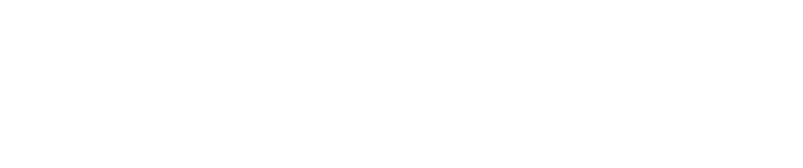

# Лабораторный стенд на Proxmox/KVM: Kind, k3s или kubeadm

  
*Базовый учебный стенд: один VM, воспроизводимый путь до работающего AX*

Для первой воспроизводимой установки выбираем **Kind внутри одной Debian/Ubuntu VM на Proxmox/KVM**, потому что Substrate current quickstart имеет автоматизированный Kind path и локально поднимает зависимые PostgreSQL/RustFS. Это учебный выбор, не production recommendation.

### Kind

Kind запускает Kubernetes nodes как Docker containers и сам использует kubeadm внутри node images. Плюсы: быстро удалить/создать cluster, повторяемость, удобно для CI/lab. Минусы: дополнительный слой container-in-VM, networking/storage отличаются от production, hardware/runtime integration сложнее.

### k3s

K3s - лёгкий conformant distribution в одном binary с разумными defaults; удобно для homelab/edge и небольших VM. Он уменьшает операционную стоимость, но скрывает часть деталей, которые полезно увидеть при изучении обычного Kubernetes. Для второго стенда это хороший вариант, особенно если ресурсы ограничены.

### kubeadm

Kubeadm даёт более «обычный» Kubernetes bootstrap и заставляет явно выбрать CNI, control-plane topology, storage и upgrades. Это лучше для обучения production mechanics и multi-node lab, но требует больше работы.

### Практический выбор

**Lab-1:** Proxmox → VM → Docker → Kind → Substrate → AX.  
**Lab-2 optional:** 3+ VM → kubeadm или k3s → Substrate → AX → separate inference node.

Если планируется microVM, Proxmox должен пробросить nested virtualization/KVM внутрь VM (`/dev/kvm` доступен guest). Для gVisor это требование мягче, хотя конкретный `runsc` platform тоже надо проверить.

### Минимальный размер VM

Не задаём универсальные числа, потому что версии и demo images меняются. Практический старт для control-plane lab без большой LLM: несколько vCPU, 12-16 GiB RAM и десятки GiB SSD. Локальный LLM лучше вынести на отдельную GPU VM/host и подключить API, иначе resource pressure смешает две задачи: изучение orchestration и benchmark inference.

### Источники и дальнейшее чтение

- [Substrate README quickstart](https://github.com/agent-substrate/substrate/blob/main/README.md)
- [Kind](https://kind.sigs.k8s.io/)
- [K3s](https://docs.k3s.io/)
- [kubeadm](https://kubernetes.io/docs/setup/production-environment/tools/kubeadm/)
