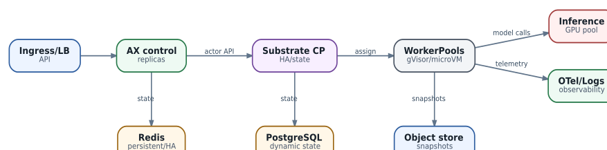

# Production engineering: HA, persistence, upgrades и DR

  
*Production-like topology: failure domains должны быть явными*

Production-like AX/Substrate нужно рассматривать как несколько независимых stateful planes, а не как один application Deployment.

### Что сохранять

**AX state:** manifests/status/events в Redis - определить persistence/replication/backup strategy и RPO.  
**Substrate dynamic state:** PostgreSQL - HA, PITR/backup, consistency с snapshot metadata.  
**Snapshot blobs:** object storage - durability, lifecycle, versioning/retention, throughput.  
**Container images:** registry - immutable digests и availability.  
**Secrets/identity:** Kubernetes/external secret store, CA/JWT/SPIFFE material.  
**Observability:** separate backend с retention.

### HA не равно «реплик больше»

API replicas требуют load balancing и shared state. Controllers требуют правильных consumer groups/locks/idempotency. PostgreSQL/Redis HA добавляет собственные failure modes. Object store должен выдерживать одновременно restore burst и checkpoints. WorkerPool availability зависит от Kubernetes nodes и image locality.

### Upgrade discipline

Для pre-1.0 компонентов:

1. Pin exact versions/images.
2. Read breaking release notes.
3. Test snapshot compatibility.
4. Upgrade lab/staging.
5. Create recovery point.
6. Upgrade control plane before/after workers согласно конкретной compatibility matrix.
7. Run create/suspend/resume/delete and egress tests.
8. Roll gradually.

### DR questions

Восстановление должно отвечать: можно ли поднять AX desired resources из backup, сопоставятся ли они с Substrate Actors, доступны ли snapshot URIs, совместимы ли sandbox assets, какие external side effects уже произошли. Документированный DR drill важнее наличия файлов backup.

### Capacity reserve

Нельзя держать WorkerPool и inference GPU на 100% average utilization. Resume burst, compaction, node drain и model load требуют headroom. Резерв задаётся через SLO/benchmark, а не фиксированными 20% для всех систем.
