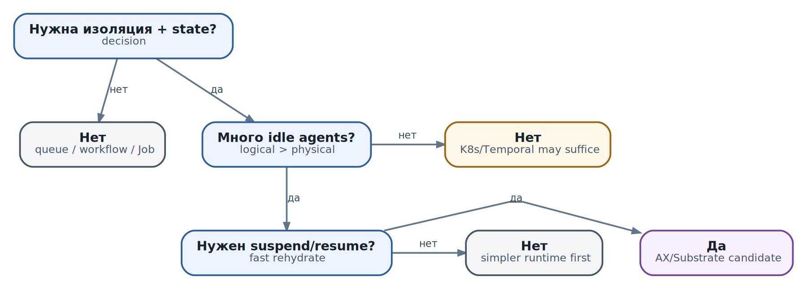

# Когда AX нужен, а когда проще другой инструмент

  
*Когда AX является разумным кандидатом, а когда это избыточный слой*

**Снимок главы:** **AX main `ac233282` · Substrate main `df78882` · проверено 2026-10-10**. AX и Substrate остаются pre-1.0 проектами; их собственные README предупреждают о возможных breaking changes. Решение о внедрении нужно принимать по закреплённой версии и результатам собственного pilot, а не по roadmap или headline claims.

После глав о production, capacity и troubleshooting выбор AX выглядит не как вопрос «нравится ли нам технология», а как обмен. Платформа добавляет изоляцию, декларативный lifecycle, stateful Actors и возможность отделить число логических агентов от числа физических Workers. Одновременно она добавляет control plane, state store, snapshot storage, networking, version compatibility, новые failure modes и on-call нагрузку.

Правильный вопрос звучит так: **какая доминирующая проблема workload-а уже не решается более простым runtime с приемлемым риском и стоимостью?** Если ответа нет, AX пока не нужен. Если ответ есть, нужно доказать, что именно AX/Substrate закрывает этот gap лучше сочетания уже используемых инструментов.

## Сначала определите слой задачи

Названия продуктов создают ложное ощущение прямой конкуренции. На практике они часто находятся на разных слоях и могут использоваться вместе.

| Слой | Главный вопрос | Типичные инструменты | Чего слой сам по себе не решает |
| --- | --- | --- | --- |
| Agent logic / harness | Как агент рассуждает, вызывает tools и хранит logical state? | LangGraph, AutoGen, CrewAI, собственный loop | Изоляцию untrusted code, Worker lifecycle и cluster capacity |
| Task distribution | Как доставить короткую работу свободному worker-у? | Celery, RQ, RabbitMQ/SQS consumers | Process snapshot и sandbox на задачу |
| Durable workflow | Как пережить crash, timer, approval и многошаговый business process? | Temporal и другие workflow engines | Безопасное выполнение произвольного кода внутри шага |
| Batch/container execution | Как запустить container до завершения? | Kubernetes Job/CronJob | Живой stateful process после остановки Pod |
| Distributed compute | Как распределить функции, actors и данные по cluster resources? | Ray, Spark, Dask | Agent-specific Workspace/Gateway и security boundary |
| Sandboxed agent runtime | Как изолировать, приостановить и восстановить stateful execution? | AX поверх Agent Substrate | Сам agent loop и durable business workflow верхнего уровня |

Поэтому «AX или LangGraph» обычно неверная постановка. LangGraph может реализовать agent orchestration внутри AX Task. Temporal может владеть business process, а опасный coding step выполнять через AX. Kubernetes продолжает управлять Pods самой платформы. Решение начинается с границы ответственности, а не со списка features.

## Разделите обязательные свойства и удобства

Перед сравнением напишите requirements без названий продуктов. Для каждого свойства укажите **must**, **should** или **not needed**, затем добавьте измеримый acceptance criterion.

| Ось | Вопрос | Пример проверяемого требования |
| --- | --- | --- |
| Trust | Кто создаёт код, prompt, skills и repository? | Код tenant-а не должен читать state другого tenant-а |
| Isolation | Достаточен process/container или нужен gVisor/microVM class? | Escape одного Task не даёт host credentials |
| State | Что должно пережить pause, node loss и upgrade? | Workspace и process state восстанавливаются с определённым RPO |
| Lifecycle | Нужен ли именно живой process suspend/resume? | Idle Task освобождает Worker и возобновляется за p95 SLO |
| Population | Сколько logical executions существует и сколько активно? | 100 000 Actors при не более 2 000 одновременно активных |
| Churn | Какова скорость create/resume/suspend/delete? | Burst в 500 wakeups не нарушает interactive SLO |
| Image diversity | Нужны ли разные ОС/runtime/toolchains? | Версионированные templates для Python, Go и coding images |
| Network policy | Нужна ли отдельная egress identity/policy на Task? | Разрешён только model и выбранный Git/MCP endpoint |
| Operations | Кто обновляет, наблюдает и восстанавливает платформу? | On-call локализует отказ и восстанавливает SLO за заданный MTTR |

Фраза «нужны stateful agents» недостаточна. State может означать row в PostgreSQL, event history workflow-а, файлы в object store, agent memory или RAM живого процесса. Только последний случай действительно приближает выбор к process snapshot/runtime; остальные часто дешевле хранить явно.

## Сигналы, что AX/Substrate действительно решает доминирующую проблему

- **Недоверенный или сгенерированный код является нормой.** Каждый Task требует самостоятельной sandbox, network boundary и scoped identity, а не общего trusted worker.
- **Workspace и process state дороги для повторного построения.** Агент должен продолжать с локальными файлами и runtime state, а cold restart регулярно нарушает latency или стоимость.
- **Логических агентов намного больше, чем одновременно активных.** Низкий duty cycle позволяет reclaim Workers через suspend/resume; без этого oversubscription не даёт экономии.
- **Task является естественной isolation/resource/lifecycle boundary.** Делегирование создаёт независимую работу, которой нужны отдельные limits, policy и audit.
- **Нужны heterogeneous images и повторяемые environments.** Workspace, Model, Gateway и Task удобно описывать декларативно и версионировать.
- **Population и churn неудобны для «Pod на каждый логический agent».** Важны быстрые state transitions и тёплый физический pool, а не только создание Jobs.
- **Команда готова эксплуатировать платформу.** Есть owners для AX, Substrate, Kubernetes, store, snapshot path, networking и security response.

Даже совместное выполнение трёх или четырёх сигналов не заменяет pilot. Например, suspend/resume полезен только если конкретный runtime, sockets, threads и filesystem корректно переживают checkpoint; глава 29 уже показала, почему `RUNNING` не равно полезному outcome.

## Красные флаги: когда AX пока избыточен или не подходит

- Работа stateless, короткая, deterministic и естественно завершается.
- Код trusted, одинаковый для всех задач, а state уже находится в DB/object store.
- Главная сложность - timers, approvals, compensation и audit business workflow, а не sandboxed execution.
- Нужно лишь построить agent loop, tool calling или graph; runtime cluster problem ещё не возник.
- Каждый agent постоянно активен: reclaim почти невозможен, поэтому logical-to-physical multiplexing не окупает snapshot overhead.
- Нагрузка мала и хорошо обслуживается одним service/worker pool; отдельный control plane увеличит MTTR.
- Нет команды, способной поддерживать Kubernetes, state store, snapshots, network policy и versioned upgrades.
- Обязательная hardware capability не поддерживается выбранным snapshot. Например, pinned Substrate API guide помечает передачу GPU devices в Actors как временно unsupported; наличие GPU на Worker node не означает доступ Actor-а к нему.
- Нужна стабильная public contract без готовности закреплять версии и принимать pre-1.0 breaking changes.

«В будущем будет миллион агентов» не является текущим требованием. Платформа, выбранная под гипотетический scale, может годами создавать реальную сложность для сотни задач.

## Когда Kubernetes Job проще и правильнее

Kubernetes Job моделирует one-off работу, которая запускается в Pod, завершается и имеет явное число successful completions. Он умеет parallelism, deadlines, retry/backoff, failure policy и cleanup. Для batch task это уже сильный lifecycle contract.

Выбирайте Job, если:

- результат можно записать во внешнее durable storage, а process state после завершения не нужен;
- startup container-а укладывается в latency budget;
- изоляция Pod/container соответствует threat model;
- задача имеет понятный terminal success/failure;
- повторный запуск с checkpoint или с начала допустим;
- команда уже умеет наблюдать и ограничивать Kubernetes workloads.

Важно различать Job suspension и Actor suspension. При suspend Job active Pods завершаются; приложение само должно сохранить progress. Это не snapshot RAM и filesystem живого процесса. Если explicit checkpoint достаточно, Job часто оказывается прозрачнее и переносимее.

## Когда worker queue дешевле

Queue + workers хорошо решает доставку множества однотипных сообщений к долгоживущим trusted processes. Broker обеспечивает buffering, workers масштабируются, а task state/result хранится отдельно. Celery, например, строится вокруг producer → broker → worker и поддерживает routing, retries, rate limits и monitoring.

Queue предпочтительнее, когда payload мал, execution короткое, code заранее развёрнут в worker image, а tenant isolation достигается разделением queues/workers или вообще не требуется. Она особенно удобна, когда web application уже использует broker и команда понимает delivery semantics.

Но queue не делает arbitrary payload безопасным. Worker обычно выполняет много задач в одном trust domain; memory leak, malicious code или dependency conflict могут затронуть соседнюю работу. Нельзя считать message acknowledgement доказательством exactly-once side effect: idempotency и action journal всё равно нужны.

## Когда durable workflow engine естественнее

Workflow engine нужен, если главная ценность - durable sequence: ждать событие или человека, выполнять timers, повторять отдельные Activities, хранить историю решений и возобновлять orchestration после crash. Temporal описывает Workflow Execution как durable execution, состояние и progress которого восстанавливаются из event history.

Это другой вид persistence, чем snapshot Actor-а:

| Вопрос | Workflow history | Actor snapshot |
| --- | --- | --- |
| Что сохраняется | Логические события и deterministic progress | Process memory/filesystem/runtime state |
| Что выполняется повторно | Workflow code replay, Activities по policy | Процесс продолжает с checkpoint |
| Сильная сторона | Дни/месяцы ожидания, timers, audit, compensation | Быстрый возврат сложного живого environment |
| Главный риск | Determinism/versioning workflow code и side effects Activities | Snapshot compatibility, storage, hidden external connections |

Часто правильная архитектура комбинирует их: Temporal владеет заказом, approval и retry policy, а Activity создаёт AX Task для untrusted coding/research step. Workflow хранит business truth; AX владеет sandboxed execution и его временным workspace.

## Agent framework находится внутри, а не вместо runtime

LangGraph и похожие framework-ы описывают state graph, agent loop, tool calls, streaming, persistence и human-in-the-loop на application layer. Они отвечают на вопрос «какой шаг выполнить дальше». AX отвечает на вопрос «где и с какими правами этот шаг/Task физически выполняется».

Варианты использования:

- LangGraph в обычном service, если code trusted и отдельная sandbox не нужна;
- один graph run внутри AX Task, если всё выполнение имеет общий trust/resource boundary;
- coordinator graph вне AX, создающий AX Tasks только для опасных или тяжёлых узлов;
- несколько framework-ов поверх единого AX runtime, если platform team стандартизирует execution, а application teams выбирают harness.

Не создавайте AX Task на каждый node graph автоматически. Task boundary оправдана, когда меняется authority, isolation, resource envelope, image или lifecycle. Reasoning step сам по себе такой границей не является.

## Когда Ray лучше

Ray Core предлагает distributed tasks и stateful actors с resource-aware scheduling. Он естественен для Python/ML compute, parallel functions, shared object references и stateful services, которым нужны CPU/GPU/custom resources и locality.

Ray Actor - dedicated stateful worker process, а не Substrate Actor с теми же snapshot, sandbox и oversubscription semantics. Выбирайте Ray, когда доминирует compute graph и data locality, код trusted, а parallel Python/ML ecosystem важнее per-agent workspace и security boundary.

Комбинация тоже возможна, но требует ясной границы. Например, AX Task изолирует untrusted planner, который отправляет ограниченное compute-задание trusted Ray service. Запуск полноценного Ray cluster внутри каждого Task обычно дублирует schedulers и усложняет capacity.

## Сравнительная матрица без ложной точности

| Кандидат | Оптимизирует | State/execution model | Хороший первый выбор |
| --- | --- | --- | --- |
| Service/Deployment | Постоянный API | Долгоживущие replicas, state обычно внешний | Один trusted agent service с предсказуемой нагрузкой |
| Kubernetes Job | Run-to-completion container | Pod пересоздаётся; progress сохраняет приложение | Batch, CI, deterministic processing |
| Worker queue | Доставка коротких tasks | Общие workers, broker, внешний result state | Trusted homogeneous background work |
| Workflow engine | Durable orchestration | Event history + Activities | Timers, approvals, compensation, long business flow |
| Agent framework | Agent logic | Graph/loop/checkpoints приложения | Построение reasoning/tool workflow |
| Ray | Distributed compute | Tasks, actors и object store | Parallel Python/ML и resource scheduling |
| AX/Substrate | Sandboxed stateful agent execution | Task/Workspace поверх suspendable Actors | Untrusted code, дорогой state, низкий duty cycle, большой churn |

Матрица не является scorecard. Security, durability и operations зависят от конкретной конфигурации. Например, Job с microVM runtime может дать сильную изоляцию, а плохо настроенный AX deployment - нет. Сравнивайте проверенные contracts своего окружения.

## Экономика: считать не только compute

AX может уменьшить idle compute благодаря multiplexing, но TCO включает больше компонентов:

- разработка и поддержка platform manifests, images и policies;
- control-plane/store/snapshot storage и network traffic;
- наблюдаемость, on-call, incident drills и upgrade rehearsals;
- security review, credential brokerage и tenant isolation;
- стоимость несовместимых snapshots и миграций templates;
- время application teams на изучение новых primitives;
- потери от более длинного MTTR на незрелой платформе.

Сравнивайте стоимость одного **успешного outcome в пределах SLO**, а не цену Worker-hour. Если suspend экономит compute, но restore tail уменьшает goodput или создаёт больше повторных model calls, экономия может исчезнуть.

## Пилот: доказать fit, а не продемонстрировать hello world

Хороший pilot использует один репрезентативный workload и один намеренно сложный workload. Он должен иметь exit criteria до начала, иначе любая запущенная demo объявляется успехом.

1. **Зафиксируйте baseline.** Измерьте текущий Job/queue/service: latency, goodput, cost, failure recovery и operator time.
2. **Опишите threat model.** Что именно недоверенно, какие secrets и destinations доступны, какой blast radius приемлем.
3. **Проверьте lifecycle.** Create, cold start, golden resume, Actor-owned resume, suspend, cancellation, delete и cleanup.
4. **Проверьте state.** Filesystem, memory, external DB, snapshot ownership, RPO и поведение несовместимой версии.
5. **Проверьте isolation.** Positive/negative egress, identity separation, cross-Task access и debug policy.
6. **Проведите capacity sweep.** Expected load, burst, saturation, recovery и потеря Worker/node.
7. **Проведите upgrade rehearsal.** AX/Substrate/runtime/image/store, rollback и старые snapshots.
8. **Дайте on-call сценарий.** Инженер, не строивший pilot, должен локализовать три заранее внесённых отказа.
9. **Сравните TCO.** Compute, storage, model/tool retries и engineering/operator hours.

Пример exit criteria: «AX принимается, если coding workspace resume p95 меньше 5 s, interactive goodput сохраняется при потере одного Worker node, запрещённый egress не проходит, snapshot compatibility описана, а стоимость успешной задачи при 5% duty cycle минимум на 25% ниже baseline». Конкретные числа должны исходить из бизнеса и SLO, а не из этого примера.

## Пять типовых решений

| Сценарий | Вероятный выбор | Почему |
| --- | --- | --- |
| Ночная конвертация документов | Kubernetes Job | Stateless run-to-completion, результат в object store |
| Фоновая отправка уведомлений | Worker queue | Короткие trusted tasks и естественный broker |
| Заказ с approvals и ожиданием дней | Workflow engine | Durable business state, timers и audit |
| Coding agents с большими workspaces, untrusted repos и длинными паузами | AX/Substrate candidate | Isolation, сохранение environment и низкий duty cycle |
| Параллельный trusted ML preprocessing/training | Ray/Kubernetes ML stack | Compute/data locality и GPU scheduling доминируют |

Смешанный сценарий не обязан иметь одного победителя. Заказ может жить в Temporal, planner - в LangGraph, untrusted execution - в AX, inference - в отдельном GPU service, а итоговые batch steps - в Jobs. Архитектура хороша, если каждый слой имеет одного owner-а truth и минимально необходимый contract с соседями.

## Путь внедрения с обратимыми шагами

1. Начните с process/service или Job и explicit external state.
2. Добавьте queue, если проблема стала в buffering и worker utilization.
3. Добавьте workflow engine, если retries/timers/approvals образовали самодельную state machine.
4. Вынесите только untrusted execution в sandboxed runtime.
5. Добавьте suspend/resume, когда measurements докажут дорогой rebuild и низкий duty cycle.
6. Стандартизируйте AX Tasks/Workspaces/Gateways, когда несколько команд повторяют один и тот же verified pattern.

Такой путь не означает, что AX всегда последний этап. Если threat model с первого дня требует строгой sandbox для пользовательского кода, runtime boundary нужна сразу. Принцип в другом: добавлять только тот слой, для которого уже существует проверяемая обязанность.

## Антипаттерны выбора платформы

- **Feature checklist без dominant problem.** Побеждает продукт с самым длинным списком, а не подходящим contract.
- **«Мы уже на Kubernetes, значит нужен AX».** Kubernetes является prerequisite, но не business case.
- **«Actors есть и в Ray, и в Substrate».** Одинаковое слово скрывает разные lifecycle и security semantics.
- **Framework вместо sandbox.** Agent orchestration не изолирует untrusted code автоматически.
- **Snapshot вместо durable workflow.** RAM checkpoint не заменяет event history, audit и compensation.
- **Пилот на пустом counter.** Он не проверяет реальные repositories, tools, snapshots и policies.
- **Сравнение только compute cost.** Игнорируются storage, network, upgrades, on-call и MTTR.
- **Решение по future scale.** Гипотетические миллионы Tasks оправдывают сегодняшнюю сложность.
- **Нет exit strategy.** Workload привязывается к platform state без export/rebuild path.

## Итог

AX/Substrate оправдан не потому, что workload использует LLM или называется агентом. Его сильная область - большое число sandboxed stateful executions с дорогим environment, низким duty cycle, самостоятельными policy boundaries и необходимостью suspend/resume. Kubernetes Job, queue, workflow engine, agent framework и Ray решают другие доминирующие задачи и часто должны оставаться вокруг AX, а не исчезать после его внедрения.

Выбирайте самый простой набор слоёв, который выполняет threat model, state contract и SLO. Затем доказывайте выбор representative pilot-ом, failure drills и полной стоимостью успешного outcome. Следующая глава соберёт типичные архитектурные ошибки, которые появляются, когда эти границы размываются: гигантский агент, state только в prompt, unlimited retries, shared credentials и Task на каждый reasoning step.

### Источники и дальнейшее чтение

- [AX concepts: Task, Workspace, Model и lifecycle на снимке ac233282](https://github.com/google/ax/blob/ac233282/docs/concepts.md)
- [AX README: scope и pre-1.0 warning на снимке ac233282](https://github.com/google/ax/blob/ac233282/README.md)
- [Substrate architecture: WorkerPool, Actor и suspend/resume](https://github.com/agent-substrate/substrate/blob/df788825e6fc13dd7aa5fd283c8f14bd4c818247/docs/architecture.md)
- [Substrate API guide: resource model и device limitations](https://github.com/agent-substrate/substrate/blob/df788825e6fc13dd7aa5fd283c8f14bd4c818247/docs/api-guide.md)
- [Kubernetes Jobs: run-to-completion, parallelism и failure policy](https://kubernetes.io/docs/concepts/workloads/controllers/job/)
- [Celery: task queue, broker и workers](https://docs.celeryq.dev/en/stable/getting-started/introduction.html)
- [Temporal: durable execution и event history](https://docs.temporal.io/temporal)
- [LangGraph: agent orchestration, persistence и human-in-the-loop](https://docs.langchain.com/oss/python/langgraph/overview)
- [Ray Core: distributed tasks и actors](https://docs.ray.io/en/latest/ray-core/key-concepts.html)
