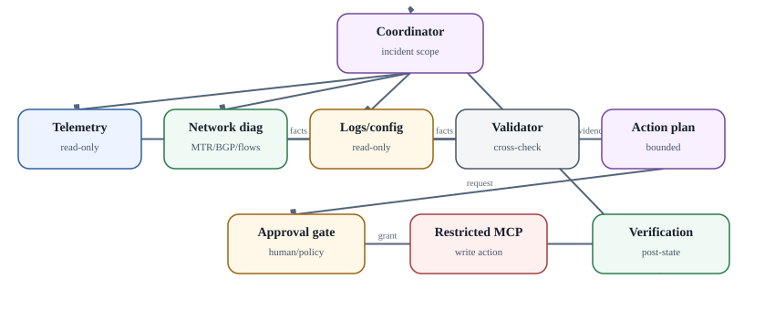

# Две референсные multi-agent архитектуры

  
*Практика: инфраструктурная диагностика с контролируемым изменением*

### Software engineering

Coordinator отвечает за decomposition, budgets и final synthesis. Researcher анализирует issue/repository, но не пишет. Implementer получает отдельный branch. Tester выполняет tests в sandbox и возвращает machine-readable результаты. Reviewer сверяет diff с goal и security rules. Human или отдельный policy gate выполняет merge/release.

Смысл разделения - не имитация команды людей, а разные capabilities. Если всем четырём ролям дать один token с admin-доступом к GitHub, архитектура теряет большую часть security value.

### Infrastructure / network operations

Этот сценарий лучше показывает production constraints. Telemetry collector собирает metrics/flows/logs. Network diagnostic agent анализирует MTR/BGP/routing state. Config analyst читает running config и change history. Validator сопоставляет независимые evidence. Planner формирует **структурированный** change request: device, commands/API, expected effect, rollback/preconditions. Approval service подтверждает exact request. Restricted MCP server выполняет только разрешённую операцию. Verification agent читает пост-состояние.

Write tool должен проверять target и arguments сам. Если approval разрешил `set local-pref 150 for policy X`, agent не должен суметь подменить target на policy Y в последнем tool call. Capability должна быть cryptographically or server-side bound to approved parameters либо пересверяться policy engine.

### Rollback

Rollback - отдельный plan, а не фраза «если плохо, верни назад». Нужны pre-change snapshot/config, measurable success condition, timeout observation и deterministic reverse action. Для BGP/network change это может быть staged route-map attach/detach и проверка traffic/route table, а не LLM improvisation.
