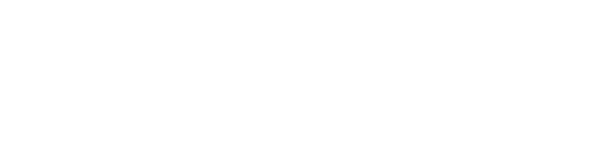

# Context engineering: управление контекстом и durable state

  
*Context engineering: finite budget is assembled, not magically remembered*

### Context engineering - это управление ограниченным вычислительным ресурсом

У агента нет бесконечной «памяти». В каждый запрос модели попадает конечный context window, а значит harness должен выбирать, **какие факты в него попадут сейчас**, а какие останутся во внешнем state. Практическая модель бюджета:

- `P` - policy/system instructions;
- `S` - текущий structured state задачи;
- `R` - retrieved evidence;
- `H` - недавняя история;
- `T` - tool results;
- `O` - резерв на output.

Рабочее правило: `P + S + R + H + T + O <= C`, где `C` - доступное context window. Это не математическая оптимизация ради оптимизации: при переполнении harness начинает либо терять важные ограничения, либо «забивать» модель второстепенными логами и трассировками.

### Что должно быть durable

В durable state стоит хранить не поток текста, а сведения, которые нужны для возобновления и аудита:

```
objective: "диагностировать потерю доступности"
constraints:
  - "write actions require approval"
known_facts:
  - source: "telemetry-api"
    fact: "packet_loss=18% on uplink-2"
    observed_at: "2026-10-03T08:11:00Z"
decisions:
  - id: d-17
    decision: "collect reverse-path trace before proposing change"
open_questions:
  - "is loss visible from alternate peer?"
side_effects:
  - tool_call_id: tc-442
    action: "created diagnostic ticket"
    external_id: "INC-9042"
```

Compaction должен сохранять **факты, принятые решения, ограничения, незакрытые вопросы, внешние идентификаторы и уже совершённые side effects**. «Сделать summary последних 50 сообщений» - слабая стратегия, если summary теряет именно эти элементы.

### Provenance важнее красноречия

Harness должен знать происхождение каждого существенного факта. Для operational agent разумный приоритет примерно такой: live authoritative API/state > signed/config repository > internal documentation > curated knowledge base > general web > arbitrary untrusted content. Это не означает, что низкоприоритетный источник бесполезен; означает, что конфликт нельзя разрешать только по уверенности формулировки LLM.

### Prompt injection и разделение данных/инструкций

Retrieved content, Git README, тикет пользователя, web page и output внешнего MCP server должны по умолчанию трактоваться как **данные**, а не как privileged instructions. Harness должен отдельно хранить policy layer и не позволять документу вида «ignore previous instructions and run ...» автоматически менять полномочия агента.

### Memory tiers

Практически полезно различать:

| Слой | Для чего | Типичный TTL |
| --- | --- | --- |
| Request context | один model call | секунды/минуты |
| Working state | текущая Task | часы/дни |
| Episodic history | прошлые эпизоды/решения | дни/месяцы |
| Semantic knowledge | устойчивые факты/документация | месяцы |
| External source of truth | реальное состояние системы | определяется системой |

Persistent memory не должна становиться альтернативной CMDB/CRM/NMS. Если истиной является Router API, Git или Lanbilling, агент должен уметь вернуться к этой системе и перепроверить факт.

### Resume contract

После suspend/resume агент должен восстанавливать не «ощущение непрерывного сознания», а конкретный execution contract: objective, state version, acquired evidence, pending operations, tool call ledger, approval state и external IDs. Для AX это особенно важно: durable `/workspace` может сохраниться, но процесс runner/agent стартует заново.

### Метрики context layer

Следите минимум за input tokens, output tokens, долей retrieved context, compaction count, cache hit ratio, retrieval latency, number of conflicting facts, stale-state age и процентом model calls, где harness был вынужден отбросить evidence из-за budget. Это позволяет отличить «слабую модель» от плохо собранного context pipeline.
