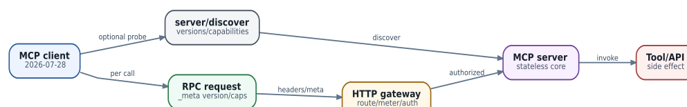

# MCP 2026: протокол, discovery, transport и trust boundaries

  
*MCP 2026-07-28: stateless request model and discovery*

### Сначала проверьте версию протокола

MCP быстро эволюционировал. Для этой книги reference point - спецификация **2026-07-28**. Она существенно отличается от ранних tutorial: core стал stateless, старый protocol-level session lifecycle удалён, version/capabilities передаются в request metadata, а server discovery вынесен в отдельный механизм. Поэтому пример с `initialize`, `initialized` и обязательным `Mcp-Session-Id` нельзя автоматически переносить на новый implementation.

### Логическая модель

MCP отвечает за стандартизированный обмен capability между host/client и server. Для эксплуатации полезно мыслить четырьмя независимыми слоями:

1. **Discovery** - какие servers/capabilities существуют.
2. **Description/schema** - какие tools/resources/prompts доступны и какие аргументы они принимают.
3. **Transport** - как именно request добирается до server.
4. **Authorization/policy** - имеет ли данный principal право выполнять действие сейчас.

Schema не является authorization. Наличие `delete_user(id)` в tool list не означает, что агенту следует разрешить его вызвать.

### Tools, resources и prompts

**Tool** - действие с потенциальным side effect. **Resource** - адресуемые данные/контент. **Prompt** - reusable prompt/template contract. Эти категории нужно различать при policy: чтение inventory resource и выполнение `commit_config` требуют принципиально разной authority.

### Discovery

В новой модели discovery должен позволять client определить server metadata/capabilities без старой stateful handshake. При этом self-reported metadata не следует использовать как доказательство доверия: имя server, description или advertised capability не удостоверяют identity.

### Transport и routing

При HTTP transport эксплуатационная цепочка выглядит не как «LLM вызывает MCP», а как `agent harness -> MCP client -> resolver/proxy -> authenticated HTTP/TLS -> MCP server -> target system`. На каждом переходе возможны собственные таймауты, DNS ошибки, proxy policy и credential scope.

### Authorization

Хороший policy layer проверяет одновременно principal, Task/tenant, tool, resource scope, arguments, time window, approval token и expected target state. Для write operation полезно связывать approval не с именем tool, а с **конкретным normalized action hash**: `tool + arguments + target + revision + expiry`.

### Multi-round interactions

Протокол поддерживает сценарии, где server во время выполнения запрашивает дополнительный ввод/подтверждение. Harness обязан ограничивать такие цепочки: max rounds, timeout, cumulative budget и допустимые request types. Иначе «один tool call» становится скрытым бесконечным workflow.

### Long-running work

Длительная операция должна иметь external operation/task identifier и наблюдаемый status. Не держите единственный HTTP request открытым часами, если target system предоставляет job model. Retry по timeout без idempotency key может создать дублирующий side effect.

### MCP server как часть threat model

MCP server может быть ошибочным, скомпрометированным или просто возвращать untrusted content. Он не должен получать больше network/credential authority, чем требуется его назначению. Особенно опасен «универсальный admin MCP», внутри которого десятки несвязанных полномочий выдаются одному process identity.

### MCP в AX Workspace

Workspace удобен как декларативная точка подключения MCP и skills, но это не отменяет network policy, secret scoping и runtime authorization. Нормальный acceptance test должен проверить: discovery, один read call, denied write without approval, allowed write with bounded approval, timeout, unavailable server, malformed output и audit correlation ID.
