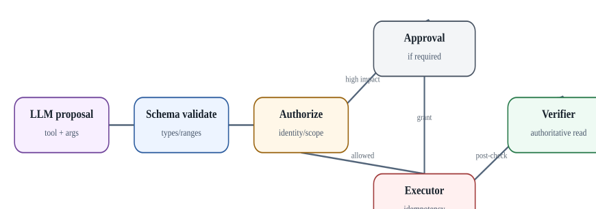
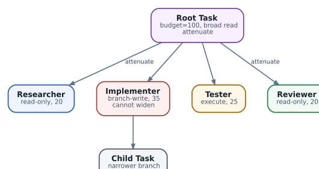

# Безопасное выполнение tools: idempotency, approvals и attenuation полномочий

  
*Safe tool execution: model proposal is only the first stage*

### Tool call - это маленькая транзакция, а не функция модели

Для production agent полезно разделять каждый потенциально изменяющий вызов на последовательность:

`proposal -> schema validation -> semantic validation -> authorization -> approval -> execution -> verification -> audit`.

LLM может сформировать proposal, но не должна сама определять, что proposal авторизован.

### Классы side effects

| Класс | Пример | Retry policy |
| --- | --- | --- |
| Pure/read | `show interface` | обычно безопасный retry |
| Idempotent write | `set desired_state=X` | retry с key/version |
| Create | создать ticket/VM | только с idempotency key |
| Destructive | delete/reset/reboot | explicit approval + precondition |
| Irreversible/external | отправка платежа/письма | strongest confirmation + ledger |

Самая неприятная ситуация - **timeout after commit**: client не получил ответ и не знает, произошло действие или нет. Решение - idempotency key, external operation ID и read-after-timeout reconciliation, а не слепой повтор.

### Preconditions

Write action следует привязывать к ожидаемому состоянию:

```
{
  "device": "edge-1",
  "operation": "replace_route_map",
  "expected_revision": "sha256:...",
  "desired_revision": "sha256:...",
  "approval_id": "apr-771",
  "idempotency_key": "task-91-step-8"
}
```

Если `expected_revision` уже не совпадает, агент должен вернуться в plan/approval, а не применять устаревшее решение.

### Authority attenuation

Coordinator не должен передавать child agent полный собственный credential. При delegation выдаётся более узкий capability: меньший set tools, меньший target scope, меньший TTL, меньший budget. Каждый следующий слой может **сужать**, но не расширять authority без нового внешнего решения policy engine.

### Approval должен быть связан с объектом действия

Плохой approval: «разрешаю агенту менять BGP в течение часа». Хороший: «разрешаю operation X на device Y с diff Z при current revision R, до 17:05, после чего обязательна verification V». Это превращает human-in-the-loop из психологической кнопки «OK» в технический control.

### Verification и compensation

После write читаем состояние из authoritative source и сравниваем с success condition. Rollback/compensating action готовятся **до** destructive step. У некоторых систем rollback не является inverse function, поэтому playbook должен учитывать реальные semantics target API.

### Circuit breakers

Harness должен иметь per-tool rate limit, max consecutive failures, global task budget, concurrency cap и emergency deny switch. Это защищает и от hallucination loop, и от реального degraded dependency.

### Audit record

Записывайте principal, Task/agent identity, normalized request, policy result, approval, idempotency key, start/end timestamps, external operation ID, result hash и verification result. Полный raw secret/token в audit попадать не должен.

  
*Authority attenuation: child may narrow scope, never silently widen it*
