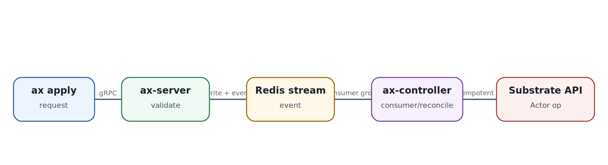
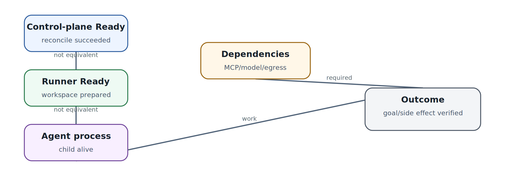

# AX control plane: state, event flow и operational truth

  
*Current AX control path: API and reconciliation are separable scaling domains*

### Почему одного API status недостаточно

В declarative control plane существует несколько разных истин: request принят API, desired state записан, event увиден controller, reconciliation выполнен, Substrate создал/возобновил Actor, runner жив, child process жив, Workspace готов, а конечная бизнес-задача действительно выполняется. Эти состояния нельзя сворачивать в один boolean `Ready`.

### Current-main controller split

В current `main` AX присутствует отдельный `ax-controller`, использующий Redis stream consumer group и `TaskReconciler` с Substrate client. Это отличается от старого `DESIGN.md`, где reconciliation описан как обязанность `ax-server`. В книге release baseline и current-main delta поэтому разведены явно.

### Redis как control state/event substrate

Если Redis используется для desired/status/event coordination, его persistence, eviction policy и memory pressure становятся control-plane safety issue. `allkeys-lru` для такого store - плохая идея: eviction control object может выглядеть как «случайная потеря Task». Production deployment должен знать, какие keys/streams durable, как устроены consumer groups и как выполняется recovery после restart.

### Conditions как timeline

`Pending`, `Running`, `Ready`, `WorkspaceReady`, `Suspended`, `Failed` полезны только вместе с reason/message/transition time/generation. Operator должен видеть, **какое поколение spec** породило status, иначе старый `Ready=True` может быть принят за подтверждение нового изменения.

### Liveness != progress

Runner может оставаться живым после выхода child command. Поэтому нужны две независимые группы сигналов:

- platform health: API/controller/Substrate/runner доступны;
- workload progress: child PID/state, heartbeat, last meaningful event, output/checkpoint age, task-specific success condition.

Progress watchdog особенно нужен автономным agent loops: process может не падать, но часами повторять одну ошибку.

### Controller backlog

Наблюдайте stream lag, oldest unprocessed event age, reconcile latency p50/p95/p99, retries per object, dead-letter/error count и Substrate API latency. При росте population сначала может ломаться не sandbox capacity, а serialized reconciliation path.

### Dependency updates

Workspace, Model, Gateway и Task должны иметь понятную propagation semantics. Если Task уже запущен, изменение shared object не обязано мгновенно и безопасно менять его runtime. В production лучше использовать versioned/immutable references и deliberate rollout, чем «магическое live mutation».

### Operational truth hierarchy

При инциденте идём сверху вниз: client request -> API persisted desired state -> controller event/reconcile -> Substrate Actor/Worker -> runner -> child process -> MCP/model dependency -> final external effect. Это снижает риск диагностировать LLM, когда на самом деле controller не обработал spec.

  
*State ownership: четыре хранилища отвечают за разные истины*

  
*Readiness hierarchy: each green light proves only its own layer*
