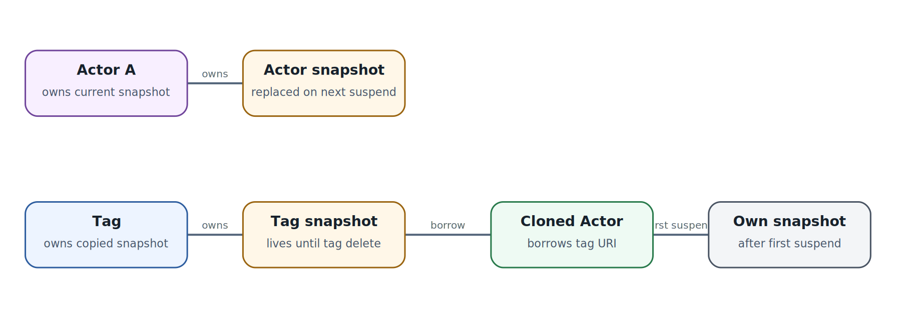

# Substrate snapshots: ownership, storage и совместимость

  
*Snapshot ownership: URI lifetime matters for clones and garbage collection*

### Snapshot - объект с владельцем и contract, а не просто файл

Substrate связывает snapshot с Actor/Tag и ActorTemplate identity. Для external storage полезно понимать логическую структуру пути: отдельные namespaces/atespaces, actor UID и snapshots, а также tag-owned copies. Storage layout - часть runtime contract, но приложение не должно напрямую модифицировать эти объекты.

### Кто владеет snapshot

У Actor есть текущий snapshot, который заменяется после следующего успешного suspend. Tag может удерживать собственную копию дольше lifecycle исходного Actor. Clone, созданный из Tag, способен временно использовать borrowed snapshot до своего первого успешного suspend, после чего получает собственный state lineage.

### Template compatibility

Snapshot содержит связь с ActorTemplate UID. При несовместимом template runtime может восстановить durable data, но выполнить fresh boot guest/process environment вместо полного memory resume. Это правильное поведение: восстановление RAM поверх другого runtime image может быть физически некорректным.

### Dirty state и consistency

Прежде чем считать snapshot консистентным, нужно понимать, что происходило с filesystem buffers, database clients, sockets и внешними транзакциями. Memory checkpoint может зафиксировать process в момент, когда удалённая транзакция уже committed, а локальный response ещё не обработан. Поэтому external side effects всё равно требуют idempotency ledger.

### Storage performance

Resume latency складывается не только из orchestration. Важны metadata lookup, object-store RTT, snapshot size, available bandwidth, decompression/page-fault strategy, worker locality и concurrent restores. Headline «sub-second resume» нельзя превращать в universal SLO без собственного benchmark.

### Integrity и encryption

Snapshot потенциально содержит secrets, plaintext tokens, retrieved data и process memory. Object storage должен обеспечивать encryption at rest, tenant isolation, integrity checking, scoped credentials и lifecycle deletion. Backup retention и snapshot retention - разные policies.

### Golden snapshot

Golden snapshot должен быть максимально детерминированным: runtime packages, runner, base workspace preparation. Long-lived user secrets лучше inject после restore/start, а не bake в golden image/snapshot. Иначе rotation становится дорогой, а compromise snapshot затрагивает весь population.

### Snapshot != backup

Snapshot оптимизирует runtime resume. Backup обеспечивает восстановление после потери control state/storage/cluster. Production DR должен отдельно сохранять declarative manifests, control-plane DB/Redis/PostgreSQL, object storage и внешние source-of-truth данные.
