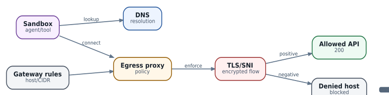

# Gateway и egress: DNS, TLS и проверка реальной доступности

  
*Gateway validation: test DNS, transport, TLS and application outcome separately*

### `GatewayReady` не означает, что приложение дошло до API

Network policy может быть syntactically valid и reconciled, но реальный connection ломается на DNS, route, TCP, TLS, SNI, proxy или application authorization. Поэтому readiness policy object - только один слой evidence.

### Hostname allowlist сложнее CIDR

Hostname policy требует решить, кто резолвит имя, как долго кешируются IP, что делать с несколькими A/AAAA, CDN rotation и DNS rebinding. Если enforcement происходит на IP layer, результат DNS должен корректно и безопасно обновлять allowed destinations. Если на L7/TLS layer - нужен корректный SNI/hostname matching.

### TLS chain

Минимальная диагностика из sandbox:

```
getent ahosts api.example.com
nc -vz api.example.com 443
openssl s_client -connect api.example.com:443 -servername api.example.com </dev/null
curl -sv https://api.example.com/health
```

Первые команды последовательно проверяют resolver, TCP reachability, TLS/SNI/certificate chain и HTTP/application. Это быстрее, чем сразу менять Gateway manifest.

### Negative tests обязательны

После разрешения `model.internal:443` проверьте не только успешный call туда, но и отсутствие доступа к запрещённому control endpoint, metadata service, RFC1918 ranges и произвольному Internet host. Security acceptance test должен доказывать и allow, и deny.

### Dependencies надо инвентаризировать

Agent image может обращаться не только к model API: Git, package mirrors, OAuth/OIDC, MCP servers, DNS, NTP, artifact registry, telemetry collector. Runtime package installation в production Task часто превращает tight egress policy в allow-all. Лучше собирать immutable images заранее.

### MCP gateway

Для большого числа external MCP/API endpoints полезен controlled egress proxy/gateway: central auth, destination allowlist, rate limits, audit, DLP и credential brokering. Тогда sandbox знает только один restricted endpoint, а не получает десятки raw secrets.

### Incident flow

Проверяйте: Gateway desired/status -> DNS result -> policy target -> route -> TCP -> TLS/SNI -> HTTP -> application auth -> MCP/model protocol. AX issue с hostname Gateway/TLS на ранней версии - хороший пример того, почему каждый слой нужно тестировать отдельно.
