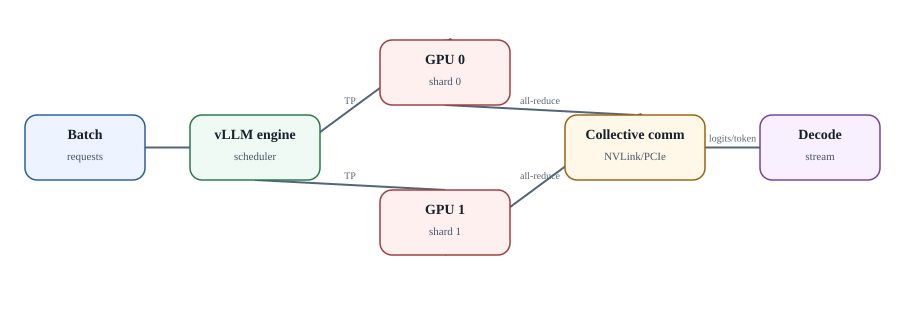

# Local inference sizing: память GPU, parallelism и эксплуатационные SLO

  
*Tensor parallelism: extra GPUs add communication, not just VRAM*

### VRAM - это не только веса модели

Приближённый бюджет GPU memory состоит из: weights + KV cache + activations/workspaces + CUDA/runtime allocations + fragmentation/reserve. Поэтому модель, чьи quantized weights «влезают в 24 GB», ещё не гарантирует нормальный serving при длинном context и concurrency.

### KV cache зависит от workload

KV pressure растёт с количеством одновременно активных sequences и их фактической длиной context. Для sizing собирайте распределение input/output tokens, а не один `max_model_len`. Если 99% запросов имеют 4k tokens, резервировать поведение как при 128k для каждого slot может быть слишком дорого.

### Tensor parallelism

Tensor parallel делит вычисления слоя между GPU и требует collective communication практически на каждом decode step. На NVLink/NVSwitch это одна экономика, на PCIe - другая. Добавление второй GPU может быть необходимо для capacity, но не обязано удваивать tokens/s и иногда ухудшает latency для небольшой модели.

### Pipeline и data parallel

Pipeline parallel полезен, когда модель не помещается на одном устройстве/TP domain, но вводит bubbles и complexity. Data parallel/replicas часто проще для независимых запросов, если модель целиком помещается на одной GPU. Выбор определяется model fit, topology и SLO.

### CPU fallback

`llama.cpp`/GGUF позволяет построить воспроизводимый CPU-only lab и аварийный low-throughput path. Но CPU fallback не следует считать равнозначным GPU production endpoint: TTFT и decode latency могут изменить поведение timeouts всего agent harness.

### vLLM knobs

Memory utilization, max model length, max concurrent sequences, batching/scheduling и parallelism flags должны документироваться **по конкретной версии vLLM**. Не копируйте tuning command из старой статьи без сверки `--help` и release docs.

### OpenAI-compatible != identical

Совместимость endpoint означает похожий API surface, но не гарантирует одинаковые параметры, tool-call semantics, structured output, token accounting или error codes. Model adapter должен иметь provider-specific capability tests.

### SLO сначала, GPU потом

Для agent platform определите: допустимый TTFT, p95 end-to-end model latency, target concurrent active generations, peak prompt tokens/s, output tokens/s, max queue delay и availability. Только после этого выбираются model size, quantization и GPU topology.

### Интеграция с AX

Model endpoint лучше предоставлять через стабильный internal service URL. Agent Task не должен знать физический GPU host. Observability связывает Task/Actor ID с inference request ID, чтобы можно было отличить «агент завис» от «10 секунд стоял в model queue».
