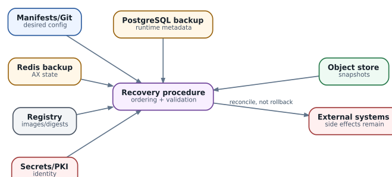

# Production security, secrets и disaster recovery

  
*Disaster recovery: backup sets are interdependent and external side effects remain*

### Классифицируйте secrets по назначению

Разделяйте control-plane credentials, model API keys, MCP/service credentials, registry pull secrets, user delegated tokens и infrastructure admin secrets. Один универсальный secret для всех Tasks уничтожает tenant isolation.

### Injection time имеет значение

Статический secret в image - худший вариант. Лучше short-lived credential при start/resume или on-demand exchange через broker/proxy. Тогда suspend длительностью сутки не означает, что проснувшийся agent продолжит использовать credential, срок/полномочия которого уже изменились.

### Rotation после resume

Harness должен предполагать, что credential после длительного сна истёк. Resume path включает refresh/re-auth, а не только повтор старого request. Ошибка `401` после resume должна маршрутизироваться в credential recovery, а не в бесконечный LLM retry.

### Tenant boundary

Namespace сам по себе не является полной multi-tenant security boundary. Нужны RBAC, service accounts/workload identity, NetworkPolicy/egress, sandbox isolation, secret scope, storage isolation и audit. Для hostile code выбирается более сильный sandbox class.

### Что резервировать

Минимальный backup set: pinned manifests/Helm values, AX control state, Substrate dynamic state database, snapshot/object storage, PKI/identity configuration, registry references и external system mappings. Git repositories и CRM/CMDB могут быть отдельными authoritative systems и не дублироваться без необходимости.

### RPO/RTO по слоям

Не задавайте одно RPO «для AX». Desired manifests могут иметь RPO почти ноль в Git, Redis/PostgreSQL - минуты, snapshots - часы, transient logs - вообще не восстанавливаться. RTO control plane и RTO каждого dormant Actor также разные.

### Recovery order

Типовой порядок: identity/PKI -> Kubernetes core -> durable DB/object storage -> Substrate control plane -> WorkerPools -> AX state/control plane -> model/MCP dependencies -> workload resume. Если начать поднимать Actors до восстановления policy/identity, можно получить функционально работающую, но небезопасную систему.

### External side effects не откатываются из backup

Восстановление Task к старому checkpoint не отменит уже созданный тикет, отправленное письмо или применённую сетевую конфигурацию. Поэтому ledger external actions и idempotency keys должны переживать disaster recovery.

### DR drills

Проверяйте как минимум: loss одного worker, loss Kubernetes node, restart Redis/PostgreSQL, temporary object-store outage, restore control plane в новый cluster, недоступный model endpoint и восстановление task state при уже совершённом external action.
