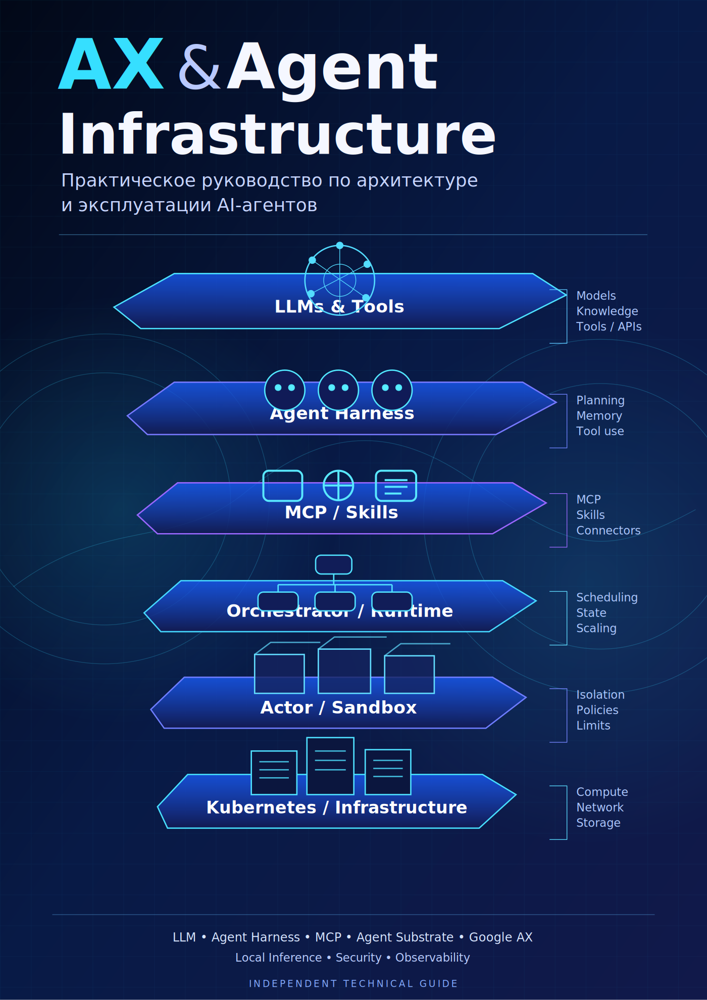

# AX & Agent Infrastructure

**Практическое руководство по архитектуре и эксплуатации AI-агентов.**

Это веб-версия инженерной книги о современной agent infrastructure: от LLM, agent loop и harness до MCP, multi-agent orchestration, sandboxing, Agent Substrate, Google AX, local inference, security и production operations.

Книга рассчитана на системных и сетевых инженеров, SRE/DevOps, архитекторов инфраструктуры, разработчиков agentic-платформ и технических руководителей. Основная перспектива - **как систему развернуть, ограничить, наблюдать, масштабировать и диагностировать**, а не как переписывать внутренний Go-код AX.

## Базовые версии

| Компонент | Baseline |
| --- | --- |
| Google AX | `v0.3.1` / `e70162a` |
| Agent Substrate | `v0.3.0` / `ccecc78` |
| MCP | `2026-07-28` |

В тексте отдельно различаются release baseline, изменения в `main` и roadmap, чтобы планируемые возможности не выдавались за уже реализованные.

## Как читать

Для последовательного освоения начните с [руководства по чтению](00-reading-guide.md) и двигайтесь по оглавлению. Для эксплуатационной задачи можно сразу перейти к AX, Substrate, security, local inference или troubleshooting.

## Публичная веб-версия

- [Читать книгу в GitBook](https://seriousbusiness-1.gitbook.io/ax-agent-infrastructure/)

GitBook синхронизирован с каталогом `docs/` ветки `main`. Репозиторий остаётся source of truth для исходных материалов.

## Печатная версия

- [PDF](https://github.com/5UN5H1N3/ax-agent-infrastructure-book/blob/main/book/AX_Agent_Infrastructure_Book_RU.pdf)
- [Исходный HTML](https://github.com/5UN5H1N3/ax-agent-infrastructure-book/blob/main/book/AX_Agent_Infrastructure_Book_RU.html)
- [GitHub repository](https://github.com/5UN5H1N3/ax-agent-infrastructure-book)

> Это независимое учебно-техническое издание. Оно не является официальной документацией Google, Google AX, Agent Substrate или других упомянутых проектов.
